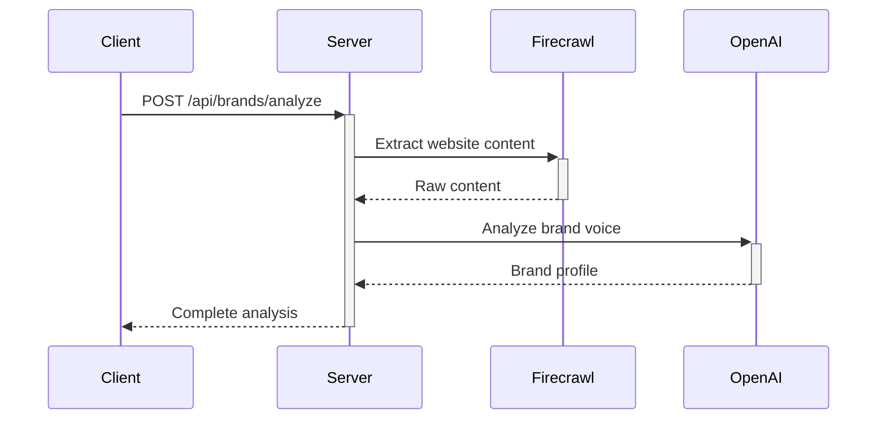
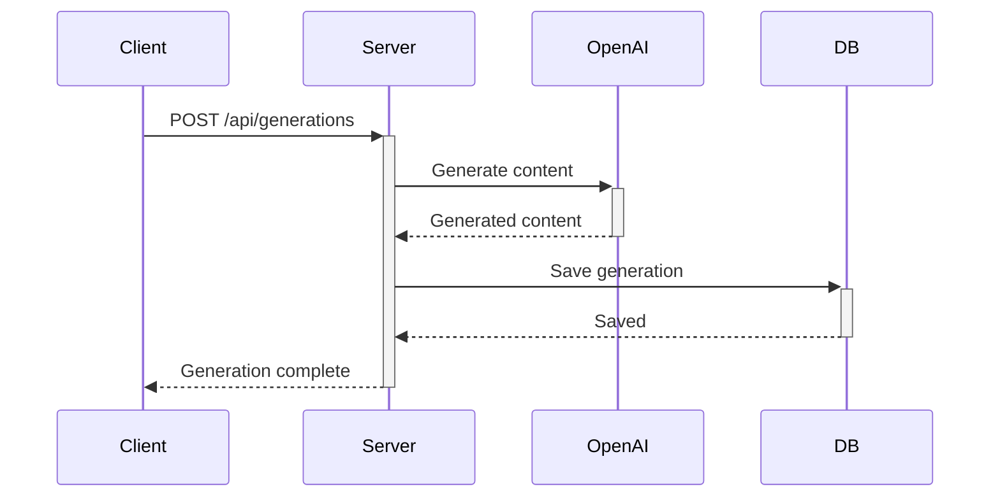
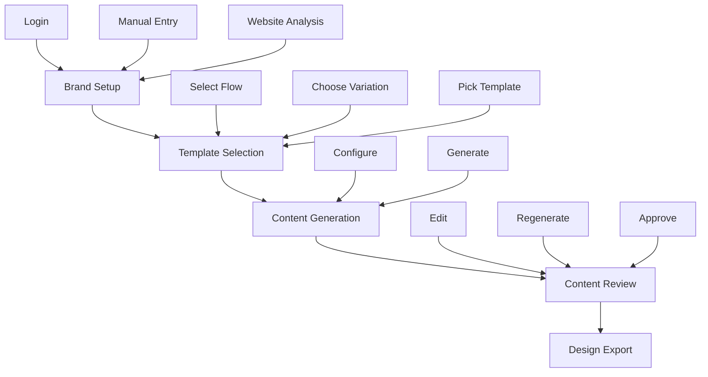
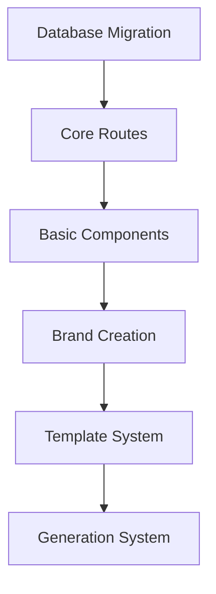

# 1. Product Overview

### 1.1 Vision Statement

An AI-powered email marketing platform that enables e-commerce businesses to generate brand-aligned email content through a sophisticated template system and AI content generation, with direct integration to design tools.

### 1.2 Core Features

1. **Brand Management**
    - Brand profile creation from website analysis
    - Voice & tone customization
    - Multi-language support
    - Profile editing and management
2. **Template System**
    
    ```tsx
    interface TemplateStructure {
      flows: {        // Email flows (e.g., Welcome Series)
        variations: { // Different approaches (e.g., Minimal Welcome)
          templates: {// Visual templates
            config: {} // Template variables and settings
          }
        }
      }
    }
    
    ```
    
3. **AI Content Generation**
    - Brand voice-aligned content
    - Multi-language generation
    - Section-based regeneration
    - Version history
4. **Content Management**
    - Content approval workflow
    - Version tracking
    - Language variants
    - Edit/Regenerate capabilities
5. **Design Integration**
    - Direct links to Figma/Canva templates
    - Visual preview system
    - Template categorization

### 1.3 Core User Flows

1. **Brand Setup**
    - Sign up/Sign in
    - Enter website URL
    - AI brand analysis
    - Customize brand profile
2. **Content Generation**
    - Select email flow
    - Choose variation
    - Pick visual template
    - Configure variables
    - Generate content
    - Edit/Regenerate sections
    - Approve final copy
3. **Design Handoff**
    - Review approved copy
    - Access design tool link
    - Begin visual design

### 1.4 Technical Stack

```json
{
  "frontend": {
    "framework": "Next.js 15",
    "ui": "shadcn/ui + Radix",
    "state": "React 19 hooks",
    "routing": "App Router"
  },
  "backend": {
    "database": "Neon (PostgreSQL)",
    "orm": "Drizzle",
    "auth": "Vercel Auth",
    "ai": "Vercel AI SDK"
  }
}

```

### 1.5 Data Models

```tsx
interface Brand {
  id: string;
  userId: string;
  name: string;
  websiteUrl: string;
  profile: BrandProfile;
}

interface BrandProfile {
  mission?: string;
  values: string[];
  voice: {
    toneAttributes: string[];
    emotions: { primary: string[] };
    writingStyle: { sentenceStructure: string };
  };
  customerAvatar: {
    demographics: {
      ageRange: string;
      primaryGender: string;
    };
    psychographics: {
      lifestyle: string[];
    };
  };
}

interface Generation {
  id: string;
  brandId: string;
  flowId: string;
  variationId: string;
  templateId: string;
  content: GeneratedContent;
  status: 'draft' | 'approved';
  version: number;
  language: string;
}

```

### 1.6 Success Metrics

1. **Core Metrics**
    - Brand profile creation success rate
    - Content generation success rate
    - Content approval rate
    - Time to first approved content
2. **Quality Metrics**
    - Brand voice accuracy
    - Generation completion rate
    - Edit/regeneration frequency
    - User satisfaction

### 1.7 MVP Constraints

1. **Technical**
    - Server Components by default
    - Type-safe database queries
    - Proper error handling
    - Performance optimization
2. **Functional**
    - Focus on email content generation
    - Limited to predefined templates
    - Basic brand profile management
    - Essential content versioning

This MVP specification aligns with the existing codebase structure and focuses on the core features needed for the initial release.

# 2. Technical Architecture

## 2.1 Core Systems

```tsx
interface SystemArchitecture {
  auth: {
    provider: 'Vercel Auth'
    patterns: 'Next.js middleware + session management'
    protection: 'Route-based + API protection'
  }

  database: {
    provider: 'Neon PostgreSQL'
    orm: 'Drizzle'
    schema: {
      users: 'Managed by Vercel Auth'
      brands: 'Brand profiles and settings'
      products: 'Manual + synced products'
      generations: 'Email content + versions'
    }
  }

  integrations: {
    ai: 'Vercel AI SDK + OpenAI'
    websiteAnalysis: 'Firecrawl API'
    productSync: 'Shopify API'
  }
}

```

## 2.2 Database Schema

```sql
-- Core tables
CREATE TABLE products (
  id UUID PRIMARY KEY DEFAULT gen_random_uuid(),
  brand_id UUID NOT NULL REFERENCES brands(id),
  name TEXT NOT NULL,
  description TEXT,
  price DECIMAL(10,2),
  image_url TEXT,
  external_id TEXT, -- For Shopify product ID
  sync_source TEXT, -- 'manual' or 'shopify'
  synced_at TIMESTAMP WITH TIME ZONE,
  created_at TIMESTAMP WITH TIME ZONE DEFAULT CURRENT_TIMESTAMP,
  updated_at TIMESTAMP WITH TIME ZONE DEFAULT CURRENT_TIMESTAMP
);

CREATE TABLE brands (
  id UUID PRIMARY KEY DEFAULT gen_random_uuid(),
  user_id UUID NOT NULL REFERENCES users(id),
  name TEXT NOT NULL,
  website_url TEXT NOT NULL,
  subscription_tier TEXT NOT NULL DEFAULT 'free',
  profile JSONB, -- Includes brand voice, style, etc.
  shopify_config JSONB, -- Optional Shopify connection details
  created_at TIMESTAMP WITH TIME ZONE DEFAULT CURRENT_TIMESTAMP,
  updated_at TIMESTAMP WITH TIME ZONE DEFAULT CURRENT_TIMESTAMP
);

CREATE TABLE generations (
  id UUID PRIMARY KEY DEFAULT gen_random_uuid(),
  brand_id UUID NOT NULL REFERENCES brands(id),
  flow_id TEXT NOT NULL,
  variation_id TEXT NOT NULL,
  template_id TEXT NOT NULL,
  content JSONB NOT NULL, -- Complete email content
  status TEXT NOT NULL DEFAULT 'draft',
  version INTEGER NOT NULL DEFAULT 1,
  language TEXT NOT NULL DEFAULT 'en',
  created_at TIMESTAMP WITH TIME ZONE DEFAULT CURRENT_TIMESTAMP
);

CREATE TABLE generation_versions (
  id UUID PRIMARY KEY DEFAULT gen_random_uuid(),
  generation_id UUID NOT NULL REFERENCES generations(id),
  content JSONB NOT NULL,  -- Complete snapshot of content
  created_at TIMESTAMP WITH TIME ZONE DEFAULT CURRENT_TIMESTAMP
);

```

## 2.3 Drizzle Schema

```tsx
// products.ts
export const products = pgTable('products', {
  id: uuid('id').primaryKey().defaultRandom(),
  brandId: uuid('brand_id').notNull().references(() => brands.id),
  name: text('name').notNull(),
  description: text('description'),
  price: decimal('price', { precision: 10, scale: 2 }),
  imageUrl: text('image_url'),
  externalId: text('external_id'),
  syncSource: text('sync_source'), // 'manual' | 'shopify'
  syncedAt: timestamp('synced_at', { withTimezone: true }),
  createdAt: timestamp('created_at', { withTimezone: true }).defaultNow(),
  updatedAt: timestamp('updated_at', { withTimezone: true }).defaultNow()
});

// Relationships
export const productsRelations = relations(products, ({ one }) => ({
  brand: one(brands, {
    fields: [products.brandId],
    references: [brands.id]
  })
}));

```

## 2.4 Type Definitions

```tsx
// types/product.ts
interface Product {
  id: string;
  brandId: string;
  name: string;
  description?: string;
  price?: number;
  imageUrl?: string;
  externalId?: string;
  syncSource?: 'manual' | 'shopify';
  syncedAt?: Date;
  createdAt: Date;
  updatedAt: Date;
}

// types/generation.ts
interface GeneratedContent {
  subject: string;
  preview: string;
  headline: string;
  body: string;
  cta: string;
  [key: string]: string; // Additional sections
}

interface Generation {
  id: string;
  brandId: string;
  flowId: string;
  variationId: string;
  templateId: string;
  content: GeneratedContent;
  status: 'draft' | 'approved';
  version: number;
  language: string;
  createdAt: Date;
}

```

## 2.5 API Routes Structure

```
app/
└── api/
    ├── brands/
    │   ├── analyze/
    │   └── [brandId]/
    │       ├── products/
    │       │   ├── route.ts         # Manual product CRUD
    │       │   └── sync/
    │       │       └── route.ts     # Shopify sync
    │       └── route.ts
    └── generations/
        ├── route.ts                 # Create/list generations
        └── [id]/
            ├── approve/
            ├── regenerate/
            └── route.ts             # Get/update generation

```

# 3. Features & Implementation

## 3.1 Brand Creation & Analysis

### Flow Implementation

```tsx
interface BrandCreationFlow {
  steps: [
    'websiteInput',    // Enter website URL
    'analysis',        // AI analysis running
    'profileReview',   // Review/edit profile
    'productSetup',    // Add/sync products
    'completion'       // Ready to use
  ]
}

```

### Website Analysis

```tsx
// lib/brand-analysis.ts
export async function analyzeBrand(websiteUrl: string) {
  // 1. Extract content
  const content = await fetch('/api/brands/analyze', {
    method: 'POST',
    body: JSON.stringify({ url: websiteUrl })
  });

  // 2. Generate brand profile
  const { profile } = await response.json();

  return {
    name: profile.name,
    mission: profile.mission,
    voice: {
      toneAttributes: profile.voice.toneAttributes,
      emotions: profile.voice.emotions,
      writingStyle: profile.writingStyle
    },
    customerAvatar: profile.customerAvatar
  };
}

```

### Product Management

```tsx
interface ProductManagement {
  methods: {
    manual: {
      create: '/api/brands/[brandId]/products',
      update: '/api/brands/[brandId]/products/[productId]',
      delete: '/api/brands/[brandId]/products/[productId]'
    },
    shopify: {
      connect: '/api/brands/[brandId]/products/sync/connect',
      sync: '/api/brands/[brandId]/products/sync',
      disconnect: '/api/brands/[brandId]/products/sync/disconnect'
    }
  }
}

```

## 3.2 Template System

### Template Structure

```tsx
interface TemplateSystem {
  flows: {
    id: string            // e.g., "welcome-series"
    name: string          // e.g., "Welcome Series"
    variations: {
      id: string          // e.g., "minimal-welcome"
      name: string        // e.g., "Minimal Welcome"
      templates: {
        id: string        // e.g., "template-1"
        previewImage: string
        config: {
          variables: TemplateVariable[]
          sections: TemplateSection[]
        }
      }[]
    }[]
  }[]
}

```

### Template Selection UI

```tsx
// components/template-flow.tsx
export function TemplateFlow({ brandId }: { brandId: string }) {
  const [selectedFlow, setSelectedFlow] = useState<string>();
  const [selectedVariation, setSelectedVariation] = useState<string>();
  const [selectedTemplate, setSelectedTemplate] = useState<string>();

  return (
    <div className="grid grid-cols-3 gap-6">
      <FlowSelector
        onSelect={setSelectedFlow}
        selected={selectedFlow}
      />
      {selectedFlow && (
        <VariationSelector
          flowId={selectedFlow}
          onSelect={setSelectedVariation}
          selected={selectedVariation}
        />
      )}
      {selectedVariation && (
        <TemplateSelector
          variationId={selectedVariation}
          onSelect={setSelectedTemplate}
          selected={selectedTemplate}
        />
      )}
    </div>
  );
}

```

## 3.3 Content Generation

### Generation Process

```tsx
interface GenerationProcess {
  steps: [
    'templateConfig',     // Set template variables
    'initialGeneration',  // Generate full content
    'review',            // Review all sections
    'sectionEdits',      // Edit/regenerate sections
    'approval'           // Approve final version
  ]
}

```

### Content Storage

```tsx
// Direct content save
async function saveGeneration(generationData: GenerationData) {
  const response = await fetch('/api/generations', {
    method: 'POST',
    body: JSON.stringify({
      brandId: generationData.brandId,
      flowId: generationData.flowId,
      variationId: generationData.variationId,
      templateId: generationData.templateId,
      content: generationData.content,
      language: generationData.language
    })
  });

  return response.json();
}

// Version creation
async function createVersion(generationId: string, content: GeneratedContent) {
  const response = await fetch(`/api/generations/${generationId}/versions`, {
    method: 'POST',
    body: JSON.stringify({ content })
  });

  return response.json();
}

```

## 3.4 Content Review & Approval

### Review Interface

```tsx
interface ReviewActions {
  approve: () => Promise<void>
  regenerateSection: (sectionId: string) => Promise<void>
  editSection: (sectionId: string, content: string) => Promise<void>
  viewVersions: () => Promise<GenerationVersion[]>
  openDesignTool: (tool: 'figma' | 'canva') => void
}

```

### Version Management

```tsx
interface VersionManagement {
  currentVersion: number
  versions: {
    id: string
    content: GeneratedContent
    timestamp: Date
  }[]
  actions: {
    create: () => Promise<void>
    restore: (versionId: string) => Promise<void>
    compare: (versionId1: string, versionId2: string) => Diff
  }
}

```

## 3.5 Data Flows

### Brand Analysis Flow



### Generation Flow



## 3.6 Error Handling

```tsx
// Global error types
type GenerationError =
  | 'INVALID_TEMPLATE'
  | 'GENERATION_FAILED'
  | 'BRAND_PROFILE_MISSING'
  | 'VALIDATION_FAILED'
  | 'VERSION_NOT_FOUND';

// Error handling
function handleGenerationError(error: GenerationError) {
  switch (error) {
    case 'INVALID_TEMPLATE':
      return 'Selected template configuration is invalid';
    case 'GENERATION_FAILED':
      return 'Failed to generate content. Please try again';
    case 'BRAND_PROFILE_MISSING':
      return 'Please complete your brand profile first';
    case 'VALIDATION_FAILED':
      return 'Generated content failed validation';
    default:
      return 'An unexpected error occurred';
  }
}

```

# 4. UI/UX Specifications

## 4.1 Brand Onboarding Flow

### Component Structure

```tsx
interface OnboardingComponents {
  layout: "src/app/(dashboard)/layout.tsx"
  pages: {
    brandCreator: "src/components/brand/brand-creator.tsx"
    brandEditor: "src/components/brand/brand-editor.tsx"
    productSetup: "src/components/brand/product-setup.tsx"
  }
}

// Core onboarding states
type OnboardingStep =
  | 'websiteInput'    // Enter website URL
  | 'analysis'        // AI analyzing website
  | 'profileReview'   // Review/edit profile
  | 'productSetup'    // Add/sync products
  | 'completion'      // Ready to use

```

### Step-by-Step UI Implementation

```tsx
// src/components/brand/brand-creator.tsx
export function BrandCreator() {
  return (
    <Card className="w-full max-w-4xl bg-background/90">
      <CardContent className="p-10">
        {/* Progress Steps */}
        <div className="flex justify-between mb-10">
          {steps.map((step, index) => (
            <div key={step.id} className="flex flex-col items-center">
              <motion.div
                className={cn(
                  "w-12 h-12 rounded-2xl flex items-center justify-center",
                  currentStep > index
                    ? "bg-primary"
                    : "bg-muted"
                )}
              >
                {step.icon}
              </motion.div>
              <span className="mt-2 text-sm">{step.label}</span>
            </div>
          ))}
        </div>

        {/* Step Content */}
        <AnimatePresence mode="wait">
          {currentStep === 'websiteInput' && <WebsiteInputStep />}
          {currentStep === 'analysis' && <AnalysisStep />}
          {currentStep === 'profileReview' && <ProfileReviewStep />}
          {currentStep === 'productSetup' && <ProductSetupStep />}
          {currentStep === 'completion' && <CompletionStep />}
        </AnimatePresence>
      </CardContent>
    </Card>
  )
}

```

## 4.2 Template System UI

### Template Flow Layout

```tsx
interface TemplateUIStructure {
  layout: {
    sidebar: "src/components/templates/sidebar.tsx"
    mainContent: "src/components/templates/template-flow.tsx"
    rightPanel: "src/components/templates/content-panel.tsx"
  }
  states: {
    selection: "configuring template"
    generation: "viewing generated content"
  }
}

// Visual hierarchy implementation
interface TemplateHierarchy {
  flows: {
    display: "Grid of clickable cards"
    preview: "Visual preview of flow type"
  }
  variations: {
    display: "Horizontal scrolling list"
    preview: "Variation description + example"
  }
  templates: {
    display: "Visual template grid"
    preview: "Full template preview modal"
  }
}

```

### Content Generation UI

```tsx
// src/components/templates/content-generator.tsx
export function ContentGenerator() {
  return (
    <div className="flex h-full">
      {/* Main Content Area */}
      <div className="flex-1 overflow-y-auto">
        {/* Generated Sections */}
        {sections.map(section => (
          <Section
            key={section.id}
            content={section.content}
            onRegenerate={() => regenerateSection(section.id)}
            onEdit={(content) => editSection(section.id, content)}
          />
        ))}
      </div>

      {/* Right Sidebar */}
      <div className="w-80 border-l">
        <VersionHistory versions={versions} />
        <LanguageSelector
          languages={availableLanguages}
          onSelect={setLanguage}
        />
        <ApprovalActions
          onApprove={handleApprove}
          onOpenDesign={openDesignTool}
        />
      </div>
    </div>
  )
}

```

## 4.3 Component Library Extensions

### Custom shadcn/ui Components

```tsx
// src/components/ui/tag-input.tsx
interface TagInputProps {
  tags: string[]
  onTagsChange: (tags: string[]) => void
  placeholder?: string
  className?: string
}

// src/components/ui/section-editor.tsx
interface SectionEditorProps {
  content: string
  onChange: (content: string) => void
  onRegenerate: () => void
  status: 'idle' | 'loading' | 'error'
}

// src/components/ui/version-slider.tsx
interface VersionSliderProps {
  versions: Version[]
  currentVersion: number
  onVersionChange: (version: number) => void
}

```

## 4.4 Responsive Design Specifications

### Breakpoint System

```tsx
const breakpoints = {
  sm: '640px',   // Mobile landscape
  md: '768px',   // Tablets
  lg: '1024px',  // Small laptops
  xl: '1280px',  // Laptops/Desktops
  '2xl': '1536px' // Large screens
}

// Responsive layout behaviors
interface ResponsiveLayout {
  sidebar: {
    sm: "hidden",
    md: "collapsible icon-only",
    lg: "expanded"
  }
  templateGrid: {
    sm: "1 column",
    md: "2 columns",
    lg: "3 columns"
  }
  contentPanel: {
    sm: "full screen modal",
    lg: "side panel"
  }
}

```

## 4.5 Motion & Interaction Design

```tsx
// Animation variants
const fadeInUp = {
  initial: { opacity: 0, y: 20 },
  animate: { opacity: 1, y: 0 },
  exit: { opacity: 0, y: -20 }
}

const slideIn = {
  initial: { opacity: 0, x: 20 },
  animate: { opacity: 1, x: 0 },
  exit: { opacity: 0, x: -20 }
}

// Loading states
interface LoadingStates {
  analysis: {
    type: "progress steps"
    indicator: "rotating + progress dots"
    messages: string[]
  }
  generation: {
    type: "section-by-section"
    indicator: "typing animation"
    progress: "section completion"
  }
}

```

## 4.6 Error & Empty States

```tsx
interface UIStates {
  errors: {
    validation: "Inline form errors"
    generation: "Error message + retry"
    network: "Toast notification"
  }
  empty: {
    noTemplates: {
      icon: "template icon"
      message: "No templates found"
      action: "Select another category"
    }
    noGenerations: {
      icon: "document icon"
      message: "No content generated yet"
      action: "Start with a template"
    }
  }
}

```

## 4.7 Key User Flows



# 5. API Specifications

## 5.1 Authentication Endpoints

```tsx
// app/api/auth/[...nextauth]/route.ts
interface AuthRoutes {
  signIn: 'POST /api/auth/signin'
  signUp: 'POST /api/auth/signup'
  signOut: 'POST /api/auth/signout'
  callback: 'GET/POST /api/auth/callback'
}

interface AuthResponse {
  user: {
    id: string
    email: string
    subscriptionTier: 'free' | 'pro'
  }
  session: {
    expires: string
    accessToken: string
  }
}

```

## 5.2 Brand Management

```tsx
interface BrandAPI {
  // Create brand from website analysis
  analyze: {
    endpoint: 'POST /api/brands/analyze'
    body: {
      websiteUrl: string
    }
    response: {
      brand: Brand
      profile: BrandProfile
    }
  }

  // Update brand profile
  update: {
    endpoint: 'PATCH /api/brands/:brandId'
    body: Partial<BrandProfile>
    response: {
      brand: Brand
    }
  }

  // Product management
  products: {
    create: {
      endpoint: 'POST /api/brands/:brandId/products'
      body: {
        name: string
        description?: string
        price?: number
        imageUrl?: string
      }
    }
    sync: {
      endpoint: 'POST /api/brands/:brandId/products/sync'
      body: {
        source: 'shopify'
        credentials: {
          shopUrl: string
          accessToken: string
        }
      }
    }
  }
}

```

## 5.3 Content Generation

```tsx
interface GenerationAPI {
  // Generate new content
  create: {
    endpoint: 'POST /api/generations'
    body: {
      brandId: string
      flowId: string
      variationId: string
      templateId: string
      variables: Record<string, any>
      language: string
    }
    response: {
      id: string
      content: GeneratedContent
      status: 'completed' | 'failed'
    }
  }

  // Regenerate specific section
  regenerateSection: {
    endpoint: 'POST /api/generations/:id/sections/:sectionId'
    response: {
      content: {
        [sectionId: string]: string
      }
    }
  }

  // Create new version
  createVersion: {
    endpoint: 'POST /api/generations/:id/versions'
    body: {
      content: GeneratedContent
    }
    response: {
      id: string
      version: number
      content: GeneratedContent
    }
  }

  // Approve generation
  approve: {
    endpoint: 'POST /api/generations/:id/approve'
    response: {
      id: string
      status: 'approved'
      approvedAt: string
    }
  }
}

```

## 5.4 Error Handling

```tsx
interface APIError {
  code: string
  message: string
  details?: Record<string, any>
}

// Error response format
interface ErrorResponse {
  error: {
    code: APIErrorCode
    message: string
    details?: unknown
  }
}

// Error codes
type APIErrorCode =
  | 'UNAUTHORIZED'
  | 'FORBIDDEN'
  | 'INVALID_REQUEST'
  | 'GENERATION_FAILED'
  | 'BRAND_NOT_FOUND'
  | 'TEMPLATE_NOT_FOUND'
  | 'VERSION_NOT_FOUND'
  | 'RATE_LIMITED'

```

## 5.5 API Implementation

```tsx
// app/api/generations/route.ts
export async function POST(request: Request) {
  try {
    // 1. Validate request
    const session = await auth();
    if (!session) {
      return new Response(
        JSON.stringify({ error: 'Unauthorized' }),
        { status: 401 }
      );
    }

    // 2. Parse body
    const body = await request.json();
    const { brandId, flowId, templateId, variables } = body;

    // 3. Get brand profile
    const brand = await db.query.brands.findFirst({
      where: eq(brands.id, brandId)
    });

    // 4. Generate content
    const content = await generateContent({
      brand,
      template: getTemplate(templateId),
      variables
    });

    // 5. Save generation
    const generation = await db
      .insert(generations)
      .values({
        brandId,
        flowId,
        templateId,
        content
      })
      .returning();

    return Response.json(generation);

  } catch (error) {
    console.error('Generation error:', error);
    return new Response(
      JSON.stringify({
        error: {
          code: 'GENERATION_FAILED',
          message: error.message
        }
      }),
      { status: 500 }
    );
  }
}

```

## 5.6 Rate Limiting

```tsx
// lib/rate-limit.ts
interface RateLimitConfig {
  generation: {
    free: {
      limit: 50,    // per month
      concurrent: 1  // at a time
    },
    pro: {
      limit: 500,   // per month
      concurrent: 3  // at a time
    }
  }
  brands: {
    free: {
      limit: 1      // active brand
    },
    pro: {
      limit: 5      // active brands
    }
  }
}

// Implementation
export async function checkRateLimit(
  userId: string,
  action: 'generation' | 'brand'
): Promise<boolean> {
  const user = await getUser(userId);
  const config = RateLimitConfig[action][user.subscriptionTier];

  const count = await db.query.generations.count({
    where: and(
      eq(generations.userId, userId),
      gte(generations.createdAt, startOfMonth(new Date()))
    )
  });

  return count < config.limit;
}

```

## 5.7 API Documentation Examples

```tsx
/**
 * Generate email content
 *
 * POST /api/generations
 *
 * Required body:
 * - brandId: string     Brand to generate for
 * - flowId: string      Selected flow (e.g., "welcome")
 * - templateId: string  Selected template
 * - variables: object   Template variables
 *
 * Optional:
 * - language: string    Target language (default: "en")
 *
 * Returns:
 * - id: string         Generation ID
 * - content: object    Generated content
 * - status: string     Generation status
 *
 * Errors:
 * - 401: Unauthorized
 * - 404: Brand/Template not found
 * - 429: Rate limited
 * - 500: Generation failed
 */

/**
 * Sync products from Shopify
 *
 * POST /api/brands/:brandId/products/sync
 *
 * Required body:
 * - shopUrl: string     Shopify shop URL
 * - accessToken: string Access token
 *
 * Returns:
 * - count: number      Products synced
 * - products: array    Synced products
 *
 * Errors:
 * - 401: Unauthorized
 * - 404: Brand not found
 * - 400: Invalid shop URL
 * - 500: Sync failed
 */

```

# 6. Testing & Deployment

## 6.1 Testing Strategy

```tsx
interface TestingStrategy {
  unitTests: {
    framework: 'Vitest'
    coverage: {
      statements: 80,
      branches: 70,
      functions: 80,
      lines: 80
    }
    focus: [
      'AI Content Generation',
      'Brand Analysis',
      'Template Processing',
      'Data Validation'
    ]
  }

  integrationTests: {
    framework: 'Playwright'
    coverage: [
      'User Flows',
      'API Integration',
      'Content Generation',
      'Error Handling'
    ]
  }

  e2eTests: {
    framework: 'Playwright'
    critical_paths: [
      'Brand Creation',
      'Template Selection',
      'Content Generation',
      'Content Approval'
    ]
  }
}

```

## 6.2 Test Examples

```tsx
// Unit Test - Brand Analysis
describe('Brand Analysis', () => {
  test('extracts website content correctly', async () => {
    const url = '<https://example.com>';
    const content = await extractWebsiteContent(url);

    expect(content).toHaveProperty('markdown');
    expect(content.markdown).not.toBeEmpty();
  });

  test('generates valid brand profile', async () => {
    const websiteContent = mockWebsiteContent();
    const profile = await analyzeBrand(websiteContent);

    expect(profile).toMatchSchema(BrandProfileSchema);
    expect(profile.voice.toneAttributes).toBeArray();
    expect(profile.customerAvatar).toBeDefined();
  });
});

// Integration Test - Generation Flow
test('complete generation flow', async () => {
  const brand = await createTestBrand();

  // 1. Select template
  const template = await selectTemplate('welcome', 'minimal');
  expect(template).toBeDefined();

  // 2. Generate content
  const generation = await generateContent({
    brandId: brand.id,
    templateId: template.id,
    variables: { discount: '20%' }
  });

  expect(generation.content).toHaveProperty('subject');
  expect(generation.content).toHaveProperty('body');

  // 3. Approve content
  const approved = await approveGeneration(generation.id);
  expect(approved.status).toBe('approved');
});

```

## 6.3 Deployment Configuration

```tsx
// next.config.js
/** @type {import('next').NextConfig} */
const nextConfig = {
  experimental: {
    serverActions: true,
    serverComponents: true
  },
  images: {
    domains: [
      'neon.tech',
      'vercel-storage.com'
    ]
  },
  async headers() {
    return [
      {
        source: '/api/:path*',
        headers: [
          { key: 'Access-Control-Allow-Credentials', value: 'true' },
          { key: 'Access-Control-Allow-Origin', value: '*' },
          { key: 'Access-Control-Allow-Methods', value: 'GET,POST,PATCH,DELETE' }
        ]
      }
    ];
  }
};

// Environment validation
const envSchema = {
  VERCEL_URL: z.string().optional(),
  NEXT_PUBLIC_APP_URL: z.string().url(),
  OPENAI_API_KEY: z.string().min(1),
  VERCEL_AUTH_SECRET: z.string().min(1),
  NEON_DATABASE_URL: z.string().min(1),
  FIRECRAWL_API_KEY: z.string().min(1)
};

```

## 6.4 CI/CD Pipeline

```yaml
# .github/workflows/main.yml
name: CI/CD

on:
  push:
    branches: [main]
  pull_request:
    branches: [main]

jobs:
  test:
    runs-on: ubuntu-latest
    steps:
      - uses: actions/checkout@v3
      - uses: pnpm/action-setup@v2
      - uses: actions/setup-node@v3
        with:
          node-version: 20
          cache: 'pnpm'

      - name: Install dependencies
        run: pnpm install

      - name: Run lint
        run: pnpm lint

      - name: Run type check
        run: pnpm type-check

      - name: Run tests
        run: pnpm test

  deploy:
    needs: test
    if: github.ref == 'refs/heads/main'
    runs-on: ubuntu-latest

    steps:
      - uses: actions/checkout@v3
      - uses: vercel/actions/deploy@v1
        with:
          vercel-token: ${{ secrets.VERCEL_TOKEN }}
          vercel-org-id: ${{ secrets.VERCEL_ORG_ID }}
          vercel-project-id: ${{ secrets.VERCEL_PROJECT_ID }}

```

## 6.5 Performance Monitoring

```tsx
interface MonitoringConfig {
  metrics: {
    generation: {
      // Content generation performance
      timing: {
        total: 'Total generation time',
        analysis: 'Brand analysis time',
        content: 'Content generation time'
      },
      success_rate: 'Generation success percentage',
      error_rate: 'Generation error percentage'
    },
    api: {
      // API performance
      latency: 'API response times',
      error_rate: 'API error rates',
      usage: 'API usage metrics'
    },
    user: {
      // User metrics
      completion_rate: 'Flow completion rate',
      time_to_value: 'Time to first generation',
      retention: 'User retention metrics'
    }
  }

  alerts: {
    error_spike: 'Sudden increase in errors',
    high_latency: 'Response time above threshold',
    api_quota: 'API quota usage warnings'
  }
}

```

## 6.6 Error Tracking

```tsx
// lib/error-tracking.ts
interface ErrorTracking {
  categories: {
    generation: 'AI generation errors',
    analysis: 'Brand analysis errors',
    validation: 'Data validation errors',
    api: 'External API errors'
  }

  severity: 'low' | 'medium' | 'high' | 'critical'

  context: {
    userId: string
    brandId?: string
    templateId?: string
    action: string
    metadata: Record<string, any>
  }
}

export function trackError(error: Error, context: ErrorContext) {
  console.error('Error:', {
    message: error.message,
    stack: error.stack,
    ...context
  });

  // Log to error tracking service
  if (process.env.NODE_ENV === 'production') {
    // Send to error tracking
  }
}

```

## 6.7 Deployment Checklist

```tsx
interface DeploymentChecklist {
  preDeployment: [
    'Run all tests',
    'Check type coverage',
    'Verify env variables',
    'Database migrations',
    'Build verification'
  ]

  security: [
    'Auth configuration',
    'API key rotation',
    'Rate limit setup',
    'CORS configuration'
  ]

  monitoring: [
    'Error tracking',
    'Performance monitoring',
    'Usage metrics',
    'Alert thresholds'
  ]

  postDeployment: [
    'Smoke tests',
    'API verification',
    'Auth flow testing',
    'Generation testing'
  ]
}

```

## 6.8 Database Migrations

```tsx
// drizzle/migrations/0001_initial.sql
interface MigrationStrategy {
  approach: 'Zero downtime deployments'
  steps: [
    'Backup current database',
    'Apply schema changes',
    'Run data migrations',
    'Verify integrity'
  ]

  rollback: {
    strategy: 'Automated rollback on failure'
    verification: 'Data integrity checks'
    cleanup: 'Remove temporary tables'
  }
}

// Migration execution
const migrationConfig = {
  migrationsFolder: './drizzle/migrations',
  validateOnStartup: true,
  backup: {
    enabled: true,
    storage: 'vercel-storage'
  }
};

```

# 8. Security (MVP Requirements)

## 8.1 Core Security Features

```tsx
interface MVPSecurity {
  auth: {
    provider: 'Vercel Auth',
    session: 'JWT in httpOnly cookies',
    protection: ['Protected Routes', 'API Routes']
  },

  validation: {
    input: {
      brand: BrandSchema,
      generation: GenerationSchema,
      products: ProductSchema
    },
    output: {
      sanitization: 'HTML/markdown sanitization for generated content'
    }
  },

  rateLimit: {
    generation: {
      free: '50/month',
      pro: '500/month'
    }
  },

  dataAccess: {
    rls: {
      brands: 'user can only access own brands',
      generations: 'user can only access own generations'
    }
  }
}

```

## 8.2 MVP Implementation

```tsx
// 1. Protected API route example
export async function POST(request: Request) {
  // Auth check (from starter kit)
  const session = await auth();
  if (!session) {
    return new Response('Unauthorized', { status: 401 });
  }

  // Input validation
  const body = await request.json();
  const result = GenerationSchema.safeParse(body);
  if (!result.success) {
    return new Response('Invalid input', { status: 400 });
  }

  // Rate limit check
  const canGenerate = await checkRateLimit(session.user.id);
  if (!canGenerate) {
    return new Response('Rate limit exceeded', { status: 429 });
  }

  // Proceed with generation...
}

// 2. Basic rate limiting
async function checkRateLimit(userId: string): Promise<boolean> {
  const key = `generate:${userId}:${new Date().getMonth()}`;
  const count = await db.get(key) || 0;

  const user = await getUser(userId);
  const limit = user.subscriptionTier === 'pro' ? 500 : 50;

  return count < limit;
}

```

# Migration Plan

## 1. Current Starter Kit

```tsx
interface StarterKit {
  auth: 'Vercel Auth with JWT',
  database: 'Neon DB with Drizzle',
  components: 'shadcn/ui set',
  routes: {
    auth: ['/sign-in', '/sign-up'],
    dashboard: ['/dashboard/*'],
    public: ['/']
  }
}

```

## 2. Migration Steps in Order

### Step 1: Database Schema

```sql
-- First migration
ALTER TABLE users ADD COLUMN subscription_tier TEXT NOT NULL DEFAULT 'free';

-- Create core tables
CREATE TABLE brands (
  id UUID PRIMARY KEY DEFAULT uuid_generate_v4(),
  user_id UUID NOT NULL REFERENCES users(id),
  name TEXT NOT NULL,
  website_url TEXT NOT NULL,
  profile JSONB,
  created_at TIMESTAMPTZ DEFAULT NOW(),
  updated_at TIMESTAMPTZ DEFAULT NOW()
);

CREATE TABLE generations (
  id UUID PRIMARY KEY DEFAULT uuid_generate_v4(),
  brand_id UUID NOT NULL REFERENCES brands(id),
  flow_id TEXT NOT NULL,
  variation_id TEXT NOT NULL,
  template_id TEXT NOT NULL,
  content JSONB NOT NULL,
  status TEXT NOT NULL DEFAULT 'draft',
  language TEXT NOT NULL DEFAULT 'en',
  created_at TIMESTAMPTZ DEFAULT NOW()
);

CREATE TABLE generation_versions (
  id UUID PRIMARY KEY DEFAULT uuid_generate_v4(),
  generation_id UUID NOT NULL REFERENCES generations(id),
  content JSONB NOT NULL,
  created_at TIMESTAMPTZ DEFAULT NOW()
);

-- Add RLS policies
ALTER TABLE brands ENABLE ROW LEVEL SECURITY;
ALTER TABLE generations ENABLE ROW LEVEL SECURITY;
ALTER TABLE generation_versions ENABLE ROW LEVEL SECURITY;

CREATE POLICY brand_access ON brands FOR ALL USING (user_id = auth.uid());

```

### Step 2: Add Required Routes

```tsx
// app/dashboard/brands/page.tsx
// app/dashboard/templates/page.tsx
// app/dashboard/history/page.tsx

const newRoutes = {
  'app/dashboard/brands/page.tsx': 'Brand management',
  'app/dashboard/brands/new/page.tsx': 'Brand creation',
  'app/dashboard/brands/[brandId]/page.tsx': 'Brand details',
  'app/dashboard/templates/page.tsx': 'Template selection',
  'app/dashboard/templates/[templateId]/page.tsx': 'Template config',
  'app/dashboard/history/page.tsx': 'Generation history'
};

```

### Step 3: Add Core Components

```tsx
const newComponents = {
  // Brand Management
  'components/brands/brand-creator': {
    purpose: 'Brand creation wizard',
    dependencies: ['TagInput', 'Card', 'Button']
  },
  'components/brands/website-analyzer': {
    purpose: 'Website analysis UI',
    dependencies: ['Card', 'Progress']
  },

  // Template System
  'components/templates/template-flow': {
    purpose: 'Template selection UI',
    dependencies: ['Card', 'Grid']
  },

  // Generation
  'components/generation/content-editor': {
    purpose: 'Content editing UI',
    dependencies: ['Card', 'Input', 'Button']
  }
};

```

### Step 4: Add API Routes

```tsx
const newAPIRoutes = {
  // Brand APIs
  'app/api/brands/route.ts': {
    methods: ['GET', 'POST'],
    purpose: 'Brand CRUD'
  },
  'app/api/brands/analyze/route.ts': {
    methods: ['POST'],
    purpose: 'Website analysis'
  },

  // Generation APIs
  'app/api/generations/route.ts': {
    methods: ['GET', 'POST'],
    purpose: 'Content generation'
  },
  'app/api/generations/[id]/route.ts': {
    methods: ['GET', 'PATCH', 'DELETE'],
    purpose: 'Generation management'
  }
};

```

### Step 5: Update Layout

```tsx
// app/(dashboard)/layout.tsx
const updatedNav = [
  {
    name: 'Brands',
    href: '/dashboard/brands',
    icon: Building
  },
  {
    name: 'Templates',
    href: '/dashboard/templates',
    icon: Mail
  },
  {
    name: 'History',
    href: '/dashboard/history',
    icon: Clock
  }
];

```

### Step 6: Add Required Libraries

```tsx
// package.json additions
const newDependencies = {
  '@vercel/ai': 'latest',
  'openai': '^4.0.0',
  '@markdoc/markdoc': '^0.3.0'
};

```

## 3. Build Sequence



## 4. Implementation Order

1. Database First
    
    ```bash
    # Run migrations
    pnpm db:migrate
    
    # Verify schema
    pnpm db:studio
    
    ```
    
2. Add Routes & Basic Components
    
    ```bash
    # Create route structure
    mkdir -p app/dashboard/{brands,templates,history}
    touch app/dashboard/brands/page.tsx
    touch app/dashboard/templates/page.tsx
    touch app/dashboard/history/page.tsx
    
    ```
    
3. Brand System
    
    ```bash
    # Create brand components
    mkdir -p components/brands
    touch components/brands/brand-creator.tsx
    touch components/brands/website-analyzer.tsx
    
    ```
    
4. Template System
    
    ```bash
    # Create template components
    mkdir -p components/templates
    touch components/templates/template-flow.tsx
    touch components/templates/template-config.tsx
    
    ```
    
5. Generation System
    
    ```bash
    # Create generation components
    mkdir -p components/generation
    touch components/generation/content-editor.tsx
    touch components/generation/version-history.tsx
    
    ```