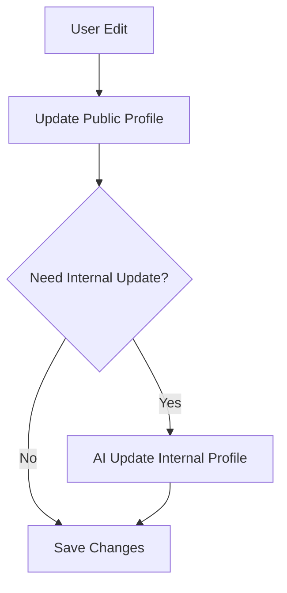
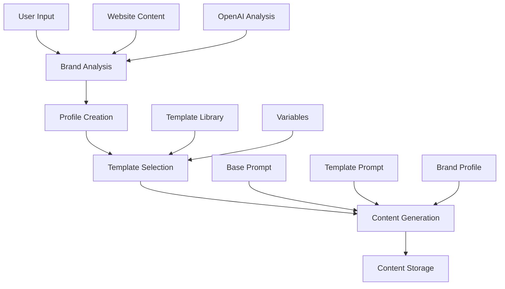
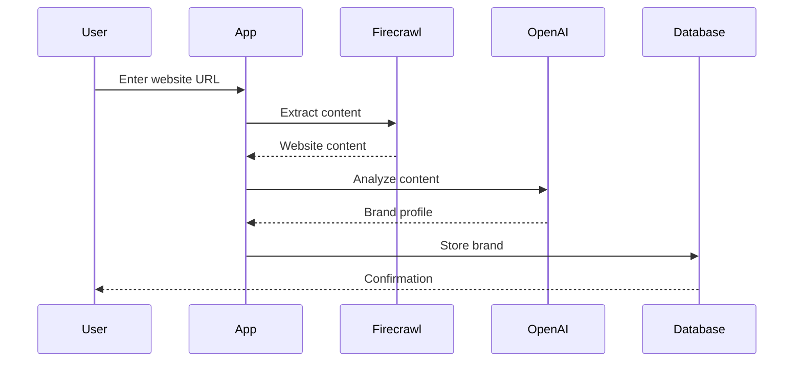
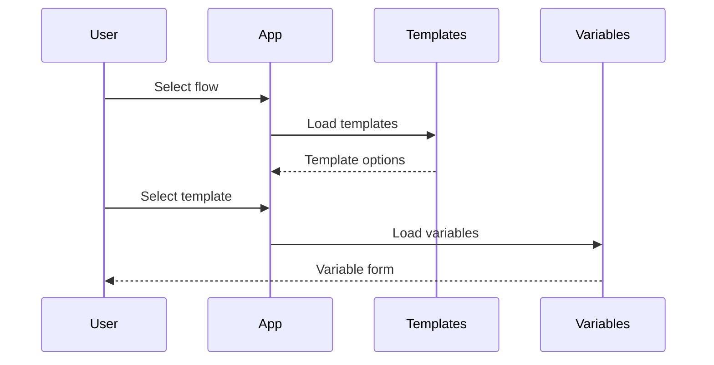
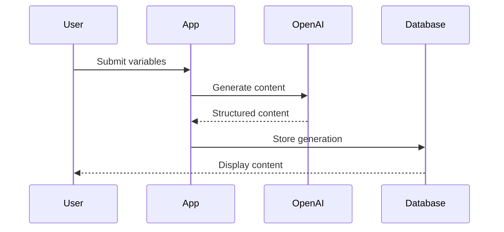
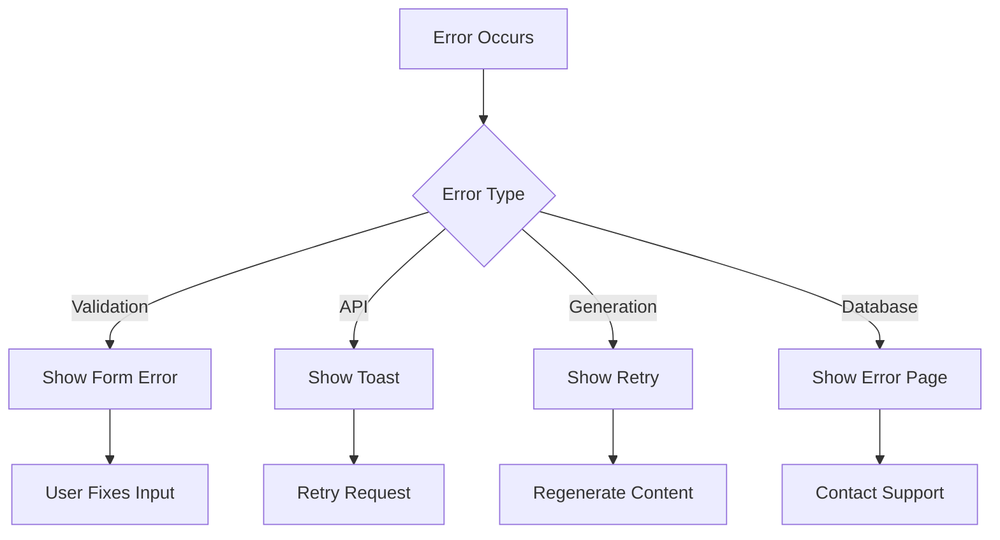

Project Path: project-email-saas-11-nov

Source Tree:

```
project-email-saas-11-nov
├── documentation
│   ├── brand-analysis.md
│   ├── ai-generation.md
│   ├── notes-and-ideas
│   │   ├── brand-document-approach.md
│   │   └── template-system.md
│   └── data-flow.md
├── tsconfig.node.json
├── index.html
├── tailwind.config.js
├── tsconfig.app.json
├── setup.sql
├── supabase
│   ├── migrations
│   │   └── 001_initial_schema.sql
│   └── config.toml
├── package-lock.json
├── package.json
├── tsconfig.json
├── eslint.config.js
├── vite.config.ts
├── postcss.config.js
└── src
    ├── App.tsx
    ├── main.tsx
    ├── types
    │   ├── template.ts
    │   ├── brand-analysis.ts
    │   ├── database.ts
    │   └── supabase.ts
    ├── contexts
    │   └── AuthContext.tsx
    ├── utils
    │   ├── cn.ts
    │   ├── auth-errors.ts
    │   └── error-handlers.ts
    ├── index.css
    ├── components
    │   ├── TemplateFlow.tsx
    │   ├── ui
    │   │   └── dropdown-menu.tsx
    │   ├── CreateBrandModal.tsx
    │   ├── PublicRoute.tsx
    │   ├── auth
    │   │   ├── LoginPage.tsx
    │   │   ├── SignupPage.tsx
    │   │   └── AuthCallback.tsx
    │   ├── TagInput.tsx
    │   ├── DeleteBrandModal.tsx
    │   ├── GeneratedContent.tsx
    │   ├── MainApp.tsx
    │   ├── PrivateRoute.tsx
    │   ├── ConfigPanel.tsx
    │   ├── BrandsPage.tsx
    │   ├── History.tsx
    │   ├── BrandDetailsModal.tsx
    │   ├── TemplatePreview.tsx
    │   ├── sidebar.tsx
    │   ├── MultiSelect.tsx
    │   └── Select.tsx
    ├── vite-env.d.ts
    ├── lib
    │   ├── errors.ts
    │   ├── clients.ts
    │   ├── setup-db.ts
    │   ├── api.ts
    │   ├── generate.ts
    │   ├── supabase.ts
    │   └── db.ts
    └── data
        ├── templates.ts
        ├── prompts.ts
        └── prompts
            ├── base.ts
            └── templates
                ├── welcome.ts
                └── founder.ts

```

`/Users/d.andrews/project-email-saas-11-nov/documentation/brand-analysis.md`:

```md
# Brand Analysis System Documentation

## Overview

The brand analysis system automatically extracts and analyzes website content to create comprehensive brand profiles. This system consists of two main components:

1. Content Extraction
2. Brand Profile Analysis

## Content Extraction (`src/lib/api.ts`)

### Process

```typescript
export async function extractWebsiteContent(websiteUrl: string): Promise<WebsiteContent> {
  // 1. Clean and validate URL
  let url = websiteUrl.trim().toLowerCase();
  
  // 2. Make Firecrawl API request
  const response = await fetch('https://api.firecrawl.dev/v1/crawl', {
    method: 'POST',
    headers: {
      'Authorization': `Bearer ${import.meta.env.VITE_FIRECRAWL_API_KEY}`
    },
    body: JSON.stringify({
      url,
      maxDepth: 1,
      limit: 3,
      scrapeOptions: {
        formats: ['markdown'],
        onlyMainContent: true
      }
    })
  });

  // 3. Poll for results
  const jobId = result.id;
  while (attempts < maxAttempts) {
    const statusResult = await pollStatus(jobId);
    if (statusResult.status === 'completed') {
      return cleanContent(statusResult.data);
    }
  }
}
```

### Content Cleaning

The system removes:
- URLs and links
- Navigation elements
- Empty lines
- Common UI patterns

## Brand Analysis (`src/lib/api.ts`)

### Process

```typescript
export async function analyzeBrand(websiteContent: WebsiteContent): Promise<BrandProfile> {
  const completion = await openai.chat.completions.create({
    model: "gpt-4-turbo-preview",
    messages: [
      {
        role: "system",
        content: `You are a brand analysis expert...`
      },
      {
        role: "user",
        content: websiteContent.markdown
      }
    ],
    functions: [{
      name: "analyzeBrandProfile",
      parameters: {
        type: "object",
        properties: {
          mission: { type: "string" },
          values: { type: "array" },
          voice: {
            type: "object",
            properties: {
              toneAttributes: { type: "array" },
              emotions: { type: "object" },
              writingStyle: { type: "object" }
            }
          },
          customerAvatar: {
            type: "object",
            properties: {
              demographics: { type: "object" },
              psychographics: { type: "object" }
            }
          }
        }
      }
    }],
    function_call: { name: "analyzeBrandProfile" }
  });
}
```

### Brand Profile Structure

```typescript
interface BrandProfile {
  mission?: string;
  values: string[];
  usps: string[];
  voice: {
    toneAttributes: string[];
    emotions: {
      primary: string[];
    };
    writingStyle: {
      sentenceStructure: string;
    };
  };
  customerAvatar: {
    demographics: {
      ageRange: string;
      primaryGender: string;
    };
    psychographics: {
      lifestyle: string[];
    };
  };
}
```

## Database Integration

### Schema (`setup.sql`)

```sql
CREATE TABLE IF NOT EXISTS brands (
  id UUID PRIMARY KEY DEFAULT uuid_generate_v4(),
  user_id UUID NOT NULL,
  name TEXT NOT NULL,
  website_url TEXT NOT NULL,
  is_active BOOLEAN NOT NULL DEFAULT true,
  profile JSONB,
  created_at TIMESTAMPTZ NOT NULL DEFAULT NOW(),
  updated_at TIMESTAMPTZ NOT NULL DEFAULT NOW()
);
```

### Profile Storage

The brand profile is stored as JSONB, allowing:
- Flexible schema evolution
- Complex querying
- Efficient storage

## Error Handling

The system includes robust error handling for:

1. **Content Extraction**
   - Invalid URLs
   - Inaccessible websites
   - Timeout issues
   - Rate limiting

2. **Brand Analysis**
   - Insufficient content
   - API failures
   - Invalid responses

3. **Database Operations**
   - Validation errors
   - Constraint violations
   - Connection issues

## Usage Example

```typescript
// 1. Extract website content
const websiteContent = await extractWebsiteContent('https://example.com');

// 2. Analyze brand
const brandProfile = await analyzeBrand(websiteContent);

// 3. Create brand
const brand = await createBrand({
  userId: currentUser.id,
  name: new URL(websiteUrl).hostname,
  websiteUrl,
  profile: brandProfile
});
```

## Best Practices

1. **Content Extraction**
   - Use appropriate depth and limits
   - Filter irrelevant content
   - Handle timeouts gracefully

2. **Brand Analysis**
   - Provide clear analysis instructions
   - Validate all profile fields
   - Maintain consistent tone analysis

3. **Error Handling**
   - Implement retries for transient failures
   - Provide clear error messages
   - Log errors for debugging

4. **Database Operations**
   - Validate data before insertion
   - Use transactions where appropriate
   - Handle concurrent updates
```

`/Users/d.andrews/project-email-saas-11-nov/documentation/ai-generation.md`:

```md
# AI Generation System Documentation

## Overview

The AI generation system uses a structured approach to generate email content based on templates and brand profiles. The system consists of several key components:

1. Base Prompts
2. Template-specific Prompts
3. Section-based Content Generation
4. Content Parsing and Validation

## System Components

### 1. Base Prompt (`src/data/prompts/base.ts`)

The base prompt provides foundational instructions for the AI model:

```typescript
export const basePrompt: BasePrompt = {
  system: `You are an expert email marketing copywriter...`,
  style: `Write in a clear, concise style...`,
  formatting: `Subject lines: 30-50 characters...`
};
```

This establishes:
- AI's role and expertise
- Writing style guidelines
- Formatting requirements

### 2. Template Prompts (`src/data/prompts/templates/`)

Each template type (welcome, founder, etc.) has specific prompts:

```typescript
// welcome.ts
export const welcomePrompts: Record<string, TemplatePrompt> = {
  'minimal-welcome': {
    id: 'minimal-welcome',
    template: `...`,
    sections: [
      {
        id: 'subject',
        name: 'Subject Line',
        type: 'text',
        required: true
      },
      // ...
    ],
    variables: [
      {
        id: 'discountCode',
        name: 'Discount Code',
        type: 'text',
        required: true
      },
      // ...
    ]
  }
};
```

### 3. Content Generation (`src/lib/generate.ts`)

The generation process:

```typescript
export async function generateEmailContent(
  brand: Brand,
  template: TemplatePrompt,
  variables: Record<string, any>,
  language: string = 'en'
): Promise<GeneratedContent> {
  // 1. Combine base prompt with template
  const systemMessage = template.customSystem 
    ? `${basePrompt.system}\n\n${template.customSystem}`
    : basePrompt.system;

  // 2. Create function schema from template sections
  const functionSchema = {
    name: 'formatEmailContent',
    parameters: {
      type: 'object',
      properties: template.sections.reduce((acc, section) => {
        // Define schema based on section type
      }, {})
    }
  };

  // 3. Make OpenAI request
  const completion = await openai.chat.completions.create({
    model: "gpt-4-turbo-preview",
    messages: [
      { role: "system", content: systemMessage },
      { role: "user", content: userMessage }
    ],
    functions: [functionSchema],
    function_call: { name: 'formatEmailContent' }
  });

  // 4. Parse and validate response
  const content = JSON.parse(completion.choices[0].message.function_call?.arguments || '');
}
```

## Data Flow

1. **Template Selection**
   - User selects email flow (welcome, founder, etc.)
   - System loads corresponding template prompt

2. **Variable Input**
   - User provides template-specific variables
   - Variables are validated against template requirements

3. **Generation Process**
   ```mermaid
   graph TD
     A[Template + Variables] --> B[Combine with Base Prompt]
     B --> C[Create Function Schema]
     C --> D[OpenAI API Call]
     D --> E[Parse Response]
     E --> F[Validate Sections]
     F --> G[Return Content]
   ```

4. **Content Structure**
   - Content is generated in sections (subject, preview, body, etc.)
   - Each section follows template-defined format
   - Sections are validated for required fields

## Types and Interfaces

### Template Types (`src/types/template.ts`)

```typescript
interface TemplateSection {
  id: string;
  name: string;
  type: 'text' | 'list' | 'product_list';
  required?: boolean;
}

interface TemplatePrompt {
  id: string;
  template: string;
  sections: TemplateSection[];
  variables: TemplateVariable[];
  customSystem?: string;
}
```

### Generated Content (`src/types/template.ts`)

```typescript
interface GeneratedContent {
  subject: string;
  preview: string;
  headline: string;
  body: string;
  cta: string;
  [key: string]: any; // Additional sections
}
```

## Error Handling

The system includes comprehensive error handling:

1. **Validation Errors**
   - Missing required sections
   - Invalid content format
   - Variable validation

2. **API Errors**
   - OpenAI API failures
   - Rate limiting
   - Token limits

3. **Content Quality**
   - Length requirements
   - Format compliance
   - Brand voice alignment

## Usage Example

```typescript
// 1. Select template
const template = welcomePrompts['minimal-welcome'];

// 2. Prepare variables
const variables = {
  discountCode: 'WELCOME10',
  discountAmount: '10%'
};

// 3. Generate content
const content = await generateEmailContent(
  brand,
  template,
  variables,
  'en'
);

// 4. Access sections
console.log(content.subject);    // Email subject
console.log(content.body);       // Main content
console.log(content.cta);        // Call to action
```

## Best Practices

1. **Template Design**
   - Keep sections focused and specific
   - Include clear formatting instructions
   - Define required vs optional sections

2. **Variable Management**
   - Validate all variables before generation
   - Provide clear descriptions and examples
   - Use appropriate variable types

3. **Content Quality**
   - Include brand voice guidelines
   - Specify length requirements
   - Define formatting rules

4. **Error Handling**
   - Validate all inputs
   - Handle API failures gracefully
   - Provide clear error messages
```

`/Users/d.andrews/project-email-saas-11-nov/documentation/notes-and-ideas/brand-document-approach.md`:

```md
# Brand Document Approach: Comprehensive vs. Simple

## Current Challenge

We're balancing between two approaches for brand analysis:

### Original Comprehensive Approach
- Ingested more data (reviews, homepage, product pages)
- Created detailed brand document with:
  - Nuanced insights
  - Detailed examples
  - Comprehensive tone and voice
  - Multiple variables
- Generated higher quality content (potentially)

### Current Simple Approach
- Limited page scraping (3 pages)
- Simplified brand profile
- Easier user editing
- More straightforward implementation

## The Editing Problem

The comprehensive approach presents challenges:
1. **User Editing Complexity**
   - Long-form brand documents are hard to edit
   - Many interconnected variables
   - Changes in one area affect others

2. **UI/UX Considerations**
   - How to present complex document for editing?
   - Which variables should be editable?
   - How to maintain document coherence?

## Potential Solutions

### 1. Layered Editing Approach
```typescript
interface BrandDocument {
  // User-editable surface layer
  publicProfile: {
    mission: string;
    values: string[];
    tone: string[];
  };
  
  // AI-generated detailed layer
  internalProfile: {
    detailedAnalysis: string;
    examples: string[];
    contextualGuidelines: string;
  };
}
```

### 2. Smart Update System
- User edits simplified version
- AI automatically updates detailed document
- Maintains coherence between layers

### 3. Progressive Disclosure
- Start with simple profile
- Allow users to "unlock" more detailed sections
- AI helps maintain consistency

## Implementation Considerations

1. **Data Storage**
```sql
CREATE TABLE brand_profiles (
  id UUID PRIMARY KEY,
  brand_id UUID NOT NULL,
  public_profile JSONB,
  internal_profile JSONB,
  version INT
);
```

2. **Update Flow**


3. **Content Generation**
- Use both profiles for generation
- Prioritize user-edited values
- Fall back to AI analysis

## Next Steps

1. **Testing**
   - Compare content quality between approaches
   - Measure user editing experience
   - Analyze generation speed/cost

2. **Hybrid Approach**
   - Start with simple profile
   - Add complexity based on user needs
   - Keep editing intuitive
```

`/Users/d.andrews/project-email-saas-11-nov/documentation/notes-and-ideas/template-system.md`:

```md
# Template System Analysis

## Template Variable Format

Current approach uses double curly braces for variables:
```
{{variableName}}
```

### Advantages
1. **Familiar Syntax**
   - Common in template engines (Mustache, Handlebars)
   - Developers recognize pattern
   - Clear variable boundaries

2. **Easy Parsing**
   - Simple regex for extraction
   - Clear start/end markers
   - Low chance of false positives

### Implementation

```typescript
function parseTemplate(template: string, variables: Record<string, any>): string {
  return template.replace(
    /\{\{(\w+)\}\}/g,
    (_, key) => variables[key] || ''
  );
}
```

## Template Management

### Current Structure
```typescript
// welcome.ts
export const welcomePrompts: Record<string, TemplatePrompt> = {
  'minimal-welcome': {
    id: 'minimal-welcome',
    template: `...`,
    sections: [...],
    variables: [...]
  }
};
```

### Scalability
1. **Adding New Templates**
   - Create new file following pattern
   - Export template configuration
   - System automatically integrates

2. **Template Discovery**
```typescript
// templates/index.ts
import { welcomePrompts } from './welcome';
import { founderPrompts } from './founder';

export const allPrompts = {
  ...welcomePrompts,
  ...founderPrompts
};
```

### Validation System
```typescript
interface TemplateValidation {
  validateTemplate(template: TemplatePrompt): boolean;
  validateVariables(variables: Record<string, any>, template: TemplatePrompt): boolean;
}
```

## Best Practices

1. **Template Organization**
```
src/
  templates/
    welcome/
      minimal.ts
      visual.ts
    founder/
      story.ts
      mission.ts
    index.ts
```

2. **Variable Naming**
   - Use camelCase
   - Descriptive names
   - Consistent across templates

3. **Template Maintenance**
   - Version templates
   - Document changes
   - Test with various inputs

## Future Considerations

1. **Template Versioning**
```typescript
interface VersionedTemplate extends TemplatePrompt {
  version: string;
  deprecated?: boolean;
  migrateTo?: string;
}
```

2. **Dynamic Loading**
- Load templates on demand
- Cache frequently used
- Hot reload during development

3. **Template Analytics**
- Track usage
- Measure success rates
- Identify improvement areas
```

`/Users/d.andrews/project-email-saas-11-nov/documentation/data-flow.md`:

```md
# Data Flow Documentation

## Overview

This document outlines the complete data flow in the application, from user input to content generation and storage.

## System Architecture



## Data Flow Steps

### 1. Brand Creation



### 2. Template Selection



### 3. Content Generation



## Data Models

### Brand Profile

```typescript
interface BrandProfile {
  mission?: string;
  values: string[];
  usps: string[];
  voice: VoiceProfile;
  customerAvatar: CustomerAvatar;
}

interface VoiceProfile {
  toneAttributes: string[];
  emotions: {
    primary: string[];
  };
  writingStyle: {
    sentenceStructure: string;
  };
}

interface CustomerAvatar {
  demographics: Demographics;
  psychographics: Psychographics;
}
```

### Template Structure

```typescript
interface Template {
  id: string;
  name: string;
  sections: Section[];
  variables: Variable[];
  prompt: string;
}

interface Section {
  id: string;
  type: 'text' | 'list' | 'product_list';
  required: boolean;
}

interface Variable {
  id: string;
  type: string;
  required: boolean;
  validation?: ValidationRule[];
}
```

### Generated Content

```typescript
interface GeneratedContent {
  id: string;
  brandId: string;
  templateId: string;
  content: {
    subject: string;
    preview: string;
    sections: Record<string, any>;
  };
  metadata: {
    generatedAt: Date;
    language: string;
    version: number;
  };
}
```

## Database Schema

```sql
-- Brands table
CREATE TABLE brands (
  id UUID PRIMARY KEY,
  user_id UUID NOT NULL,
  profile JSONB,
  created_at TIMESTAMPTZ
);

-- Generations table
CREATE TABLE generations (
  id UUID PRIMARY KEY,
  brand_id UUID NOT NULL,
  template_id TEXT NOT NULL,
  content JSONB,
  created_at TIMESTAMPTZ
);

-- Generation versions table
CREATE TABLE generation_versions (
  id UUID PRIMARY KEY,
  generation_id UUID NOT NULL,
  content JSONB,
  created_at TIMESTAMPTZ
);
```

## State Management

### Brand State

```typescript
interface BrandState {
  currentBrand: Brand | null;
  brands: Brand[];
  loading: boolean;
  error: Error | null;
}

// Actions
type BrandAction =
  | { type: 'SET_CURRENT_BRAND'; payload: Brand }
  | { type: 'UPDATE_BRAND_PROFILE'; payload: BrandProfile }
  | { type: 'SET_ERROR'; payload: Error };
```

### Generation State

```typescript
interface GenerationState {
  currentTemplate: Template | null;
  variables: Record<string, any>;
  content: GeneratedContent | null;
  versions: GenerationVersion[];
}

// Actions
type GenerationAction =
  | { type: 'SET_TEMPLATE'; payload: Template }
  | { type: 'UPDATE_VARIABLES'; payload: Record<string, any> }
  | { type: 'SET_CONTENT'; payload: GeneratedContent };
```

## Error Handling

### Error Types

```typescript
type ErrorType =
  | 'VALIDATION_ERROR'
  | 'API_ERROR'
  | 'GENERATION_ERROR'
  | 'DATABASE_ERROR';

interface AppError {
  type: ErrorType;
  message: string;
  details?: Record<string, any>;
}
```

### Error Handling Flow



## Performance Considerations

1. **Caching**
   - Template caching
   - Brand profile caching
   - Generated content caching

2. **Optimization**
   - Lazy loading templates
   - Pagination for generations
   - Debounced API calls

3. **Resource Management**
   - Connection pooling
   - Rate limiting
   - Token optimization

## Security

1. **Authentication**
   - JWT tokens
   - Role-based access
   - Session management

2. **Data Protection**
   - Input sanitization
   - Output encoding
   - CORS policies

3. **API Security**
   - Rate limiting
   - API key rotation
   - Request validation
```

`/Users/d.andrews/project-email-saas-11-nov/tsconfig.node.json`:

```json
{
  "compilerOptions": {
    "target": "ES2022",
    "lib": ["ES2023"],
    "module": "ESNext",
    "skipLibCheck": true,

    /* Bundler mode */
    "moduleResolution": "bundler",
    "allowImportingTsExtensions": true,
    "isolatedModules": true,
    "moduleDetection": "force",
    "noEmit": true,

    /* Linting */
    "strict": true,
    "noUnusedLocals": true,
    "noUnusedParameters": true,
    "noFallthroughCasesInSwitch": true
  },
  "include": ["vite.config.ts"]
}

```

`/Users/d.andrews/project-email-saas-11-nov/index.html`:

```html
<!doctype html>
<html lang="en">
  <head>
    <meta charset="UTF-8" />
    <link rel="icon" type="image/svg+xml" href="/vite.svg" />
    <meta name="viewport" content="width=device-width, initial-scale=1.0" />
    <title>Vite + React + TS</title>
  </head>
  <body>
    <div id="root"></div>
    <script type="module" src="/src/main.tsx"></script>
  </body>
</html>

```

`/Users/d.andrews/project-email-saas-11-nov/tailwind.config.js`:

```js
/** @type {import('tailwindcss').Config} */
export default {
  content: ['./index.html', './src/**/*.{js,ts,jsx,tsx}'],
  theme: {
    extend: {
      colors: {
        sidebar: {
          DEFAULT: 'hsl(var(--sidebar-background))',
          foreground: 'hsl(var(--sidebar-foreground))',
          primary: 'hsl(var(--sidebar-primary))',
          'primary-foreground': 'hsl(var(--sidebar-primary-foreground))',
          accent: 'hsl(var(--sidebar-accent))',
          'accent-foreground': 'hsl(var(--sidebar-accent-foreground))',
          border: 'hsl(var(--sidebar-border))',
          ring: 'hsl(var(--sidebar-ring))',
        },
        dark: {
          50: '#1A1A1A',
          100: '#141414',
          200: '#1E1E1E',
          300: '#2A2A2A',
        }
      },
    },
  },
  plugins: [
    require('@tailwindcss/typography'),
  ],
}
```

`/Users/d.andrews/project-email-saas-11-nov/tsconfig.app.json`:

```json
{
  "compilerOptions": {
    "target": "ES2020",
    "useDefineForClassFields": true,
    "lib": ["ES2020", "DOM", "DOM.Iterable"],
    "module": "ESNext",
    "skipLibCheck": true,

    /* Bundler mode */
    "moduleResolution": "bundler",
    "allowImportingTsExtensions": true,
    "isolatedModules": true,
    "moduleDetection": "force",
    "noEmit": true,
    "jsx": "react-jsx",

    /* Linting */
    "strict": true,
    "noUnusedLocals": true,
    "noUnusedParameters": true,
    "noFallthroughCasesInSwitch": true
  },
  "include": ["src"]
}

```

`/Users/d.andrews/project-email-saas-11-nov/setup.sql`:

```sql
-- Enable UUID extension
CREATE EXTENSION IF NOT EXISTS "uuid-ossp";

-- Create enum types
DO $$ BEGIN
  CREATE TYPE subscription_tier AS ENUM ('free', 'pro', 'enterprise');
EXCEPTION
  WHEN duplicate_object THEN null;
END $$;

-- Create users table if not exists
CREATE TABLE IF NOT EXISTS users (
  id UUID PRIMARY KEY DEFAULT uuid_generate_v4(),
  email TEXT NOT NULL UNIQUE,
  first_name TEXT,
  last_name TEXT,
  profile_image_url TEXT,
  created_at TIMESTAMPTZ NOT NULL DEFAULT NOW(),
  subscription_tier subscription_tier NOT NULL DEFAULT 'free',
  CONSTRAINT email_valid CHECK (email ~* '^[A-Za-z0-9._%+-]+@[A-Za-z0-9.-]+\.[A-Za-z]{2,}$')
);

-- Create brands table if not exists
CREATE TABLE IF NOT EXISTS brands (
  id UUID PRIMARY KEY DEFAULT uuid_generate_v4(),
  user_id UUID NOT NULL,
  name TEXT NOT NULL,
  website_url TEXT NOT NULL,
  is_active BOOLEAN NOT NULL DEFAULT true,
  profile JSONB,
  created_at TIMESTAMPTZ NOT NULL DEFAULT NOW(),
  updated_at TIMESTAMPTZ NOT NULL DEFAULT NOW(),
  CONSTRAINT website_url_valid CHECK (website_url ~* '^https?://.*'),
  FOREIGN KEY (user_id) REFERENCES users(id) ON DELETE CASCADE
);

-- Create indexes
CREATE INDEX IF NOT EXISTS idx_brands_user_id ON brands(user_id);

-- Create updated_at trigger function if not exists
CREATE OR REPLACE FUNCTION update_updated_at_column()
RETURNS TRIGGER AS $$
BEGIN
  NEW.updated_at = NOW();
  RETURN NEW;
END;
$$ language 'plpgsql';

-- Create trigger if not exists
DROP TRIGGER IF EXISTS update_brands_updated_at ON brands;
CREATE TRIGGER update_brands_updated_at
  BEFORE UPDATE ON brands
  FOR EACH ROW
  EXECUTE FUNCTION update_updated_at_column();

-- Enable RLS
ALTER TABLE users ENABLE ROW LEVEL SECURITY;
ALTER TABLE brands ENABLE ROW LEVEL SECURITY;

-- Create RLS policies
DROP POLICY IF EXISTS "Users can view own profile" ON users;
CREATE POLICY "Users can view own profile"
  ON users FOR SELECT
  USING (auth.uid() = id);

DROP POLICY IF EXISTS "Users can update own profile" ON users;
CREATE POLICY "Users can update own profile"
  ON users FOR UPDATE
  USING (auth.uid() = id);

DROP POLICY IF EXISTS "Users can view own brands" ON brands;
CREATE POLICY "Users can view own brands"
  ON brands FOR SELECT
  USING (auth.uid() = user_id);

DROP POLICY IF EXISTS "Users can create brands" ON brands;
CREATE POLICY "Users can create brands"
  ON brands FOR INSERT
  WITH CHECK (auth.uid() = user_id);

DROP POLICY IF EXISTS "Users can update own brands" ON brands;
CREATE POLICY "Users can update own brands"
  ON brands FOR UPDATE
  USING (auth.uid() = user_id);

DROP POLICY IF EXISTS "Users can delete own brands" ON brands;
CREATE POLICY "Users can delete own brands"
  ON brands FOR DELETE
  USING (auth.uid() = user_id);
```

`/Users/d.andrews/project-email-saas-11-nov/supabase/migrations/001_initial_schema.sql`:

```sql
//this migration worked and is our current database setup

-- Enable UUID extension
CREATE EXTENSION IF NOT EXISTS "uuid-ossp";

-- Drop existing tables first to avoid dependency issues
DROP TABLE IF EXISTS generation_versions CASCADE;
DROP TABLE IF EXISTS generations CASCADE;
DROP TABLE IF EXISTS brands CASCADE;
DROP TABLE IF EXISTS users CASCADE;

-- Drop existing types if they exist
DROP TYPE IF EXISTS generation_status;
DROP TYPE IF EXISTS subscription_tier;

-- Create enum types
CREATE TYPE subscription_tier AS ENUM ('free', 'pro', 'enterprise');
CREATE TYPE generation_status AS ENUM ('completed', 'failed', 'processing');

-- Create users table
CREATE TABLE IF NOT EXISTS users (
  id UUID PRIMARY KEY DEFAULT uuid_generate_v4(),
  email TEXT NOT NULL UNIQUE,
  first_name TEXT,
  last_name TEXT,
  profile_image_url TEXT,
  created_at TIMESTAMPTZ NOT NULL DEFAULT NOW(),
  subscription_tier subscription_tier NOT NULL DEFAULT 'free',
  CONSTRAINT email_valid CHECK (email ~* '^[A-Za-z0-9._%+-]+@[A-Za-z0-9.-]+\.[A-Za-z]{2,}$')
);

-- Create brands table
CREATE TABLE IF NOT EXISTS brands (
  id UUID PRIMARY KEY DEFAULT uuid_generate_v4(),
  user_id UUID NOT NULL,
  name TEXT NOT NULL,
  website_url TEXT NOT NULL,
  is_active BOOLEAN NOT NULL DEFAULT true,
  profile JSONB,
  created_at TIMESTAMPTZ NOT NULL DEFAULT NOW(),
  updated_at TIMESTAMPTZ NOT NULL DEFAULT NOW(),
  CONSTRAINT website_url_valid CHECK (website_url ~* '^https?://.*'),
  FOREIGN KEY (user_id) REFERENCES users(id) ON DELETE CASCADE
);

-- Create generations table
CREATE TABLE IF NOT EXISTS generations (
  id UUID PRIMARY KEY DEFAULT uuid_generate_v4(),
  brand_id UUID NOT NULL,
  flow_id TEXT NOT NULL,
  variation_id TEXT NOT NULL,
  template_id TEXT NOT NULL,
  variables JSONB NOT NULL DEFAULT '{}'::jsonb,
  content JSONB NOT NULL,
  status generation_status NOT NULL DEFAULT 'processing',
  created_at TIMESTAMPTZ NOT NULL DEFAULT NOW(),
  FOREIGN KEY (brand_id) REFERENCES brands(id) ON DELETE CASCADE
);

-- Create generation versions table
CREATE TABLE IF NOT EXISTS generation_versions (
  id UUID PRIMARY KEY DEFAULT uuid_generate_v4(),
  generation_id UUID NOT NULL,
  content JSONB NOT NULL,
  created_at TIMESTAMPTZ NOT NULL DEFAULT NOW(),
  FOREIGN KEY (generation_id) REFERENCES generations(id) ON DELETE CASCADE
);

-- Create indexes
CREATE INDEX IF NOT EXISTS idx_brands_user_id ON brands(user_id);
CREATE INDEX IF NOT EXISTS idx_generations_brand_id ON generations(brand_id);
CREATE INDEX IF NOT EXISTS idx_generation_versions_generation_id ON generation_versions(generation_id);

-- Create updated_at trigger function
CREATE OR REPLACE FUNCTION update_updated_at_column()
RETURNS TRIGGER AS $$
BEGIN
  NEW.updated_at = NOW();
  RETURN NEW;
END;
$$ language 'plpgsql';

-- Create triggers
DROP TRIGGER IF EXISTS update_brands_updated_at ON brands;
CREATE TRIGGER update_brands_updated_at
  BEFORE UPDATE ON brands
  FOR EACH ROW
  EXECUTE FUNCTION update_updated_at_column();

-- Enable RLS
ALTER TABLE users ENABLE ROW LEVEL SECURITY;
ALTER TABLE brands ENABLE ROW LEVEL SECURITY;
ALTER TABLE generations ENABLE ROW LEVEL SECURITY;
ALTER TABLE generation_versions ENABLE ROW LEVEL SECURITY;

-- Create service role policy for users table
DROP POLICY IF EXISTS "Service role can manage all users" ON users;
CREATE POLICY "Service role can manage all users"
ON users FOR ALL
TO service_role
USING (true)
WITH CHECK (true);

-- Create authenticated user policies for users table
DROP POLICY IF EXISTS "Users can view own profile" ON users;
CREATE POLICY "Users can view own profile"
ON users FOR SELECT
TO authenticated
USING (auth.uid() = id);

DROP POLICY IF EXISTS "Users can update own profile" ON users;
CREATE POLICY "Users can update own profile"
ON users FOR UPDATE
TO authenticated
USING (auth.uid() = id)
WITH CHECK (auth.uid() = id);

-- Brand policies
DROP POLICY IF EXISTS "Users can manage own brands" ON brands;
CREATE POLICY "Users can manage own brands"
ON brands FOR ALL
TO authenticated
USING (auth.uid() = user_id)
WITH CHECK (auth.uid() = user_id);

-- Generation policies
DROP POLICY IF EXISTS "Users can view own generations" ON generations;
CREATE POLICY "Users can view own generations"
ON generations FOR SELECT
TO authenticated
USING (
  EXISTS (
    SELECT 1 FROM brands
    WHERE brands.id = generations.brand_id
    AND brands.user_id = auth.uid()
  )
);

DROP POLICY IF EXISTS "Users can create generations" ON generations;
CREATE POLICY "Users can create generations"
ON generations FOR INSERT
TO authenticated
WITH CHECK (
  EXISTS (
    SELECT 1 FROM brands
    WHERE brands.id = brand_id
    AND brands.user_id = auth.uid()
  )
);

DROP POLICY IF EXISTS "Users can update own generations" ON generations;
CREATE POLICY "Users can update own generations"
ON generations FOR UPDATE
TO authenticated
USING (
  EXISTS (
    SELECT 1 FROM brands
    WHERE brands.id = generations.brand_id
    AND brands.user_id = auth.uid()
  )
);

-- Generation versions policies
DROP POLICY IF EXISTS "Users can view own generation versions" ON generation_versions;
CREATE POLICY "Users can view own generation versions"
ON generation_versions FOR SELECT
TO authenticated
USING (
  EXISTS (
    SELECT 1 FROM generations g
    JOIN brands b ON b.id = g.brand_id
    WHERE g.id = generation_versions.generation_id
    AND b.user_id = auth.uid()
  )
);

-- Service role policies
DROP POLICY IF EXISTS "Service role can manage all brands" ON brands;
CREATE POLICY "Service role can manage all brands"
ON brands FOR ALL
TO service_role
USING (true)
WITH CHECK (true);

DROP POLICY IF EXISTS "Service role can manage all generations" ON generations;
CREATE POLICY "Service role can manage all generations"
ON generations FOR ALL
TO service_role
USING (true)
WITH CHECK (true);

DROP POLICY IF EXISTS "Service role can manage all versions" ON generation_versions;
CREATE POLICY "Service role can manage all versions"
ON generation_versions FOR ALL
TO service_role
USING (true)
WITH CHECK (true);
```

`/Users/d.andrews/project-email-saas-11-nov/supabase/config.toml`:

```toml
# A string used to distinguish different Supabase projects on the same host. Defaults to the working
# directory name when running `supabase init`.
project_id = "typeshare"

[api]
# Port to use for the API URL.
port = 54321
# Schemas to expose in your API. Tables, views and stored procedures in this schema will get API
# endpoints. public and storage are always included.
schemas = ["public", "storage"]
# Extra schemas to add to the search_path of every request. public is always included.
extra_search_path = ["public", "extensions"]
# The maximum number of rows returns from a view, table, or stored procedure. Limits payload size
# for accidental or malicious requests.
max_rows = 1000

[db]
# Port to use for the local database URL.
port = 54322
# The database major version to use. This has to be the same as your remote database's. Run `SHOW
# server_version;` on the remote database to check.
major_version = 15

[studio]
# Port to use for Supabase Studio.
port = 54323

[auth]
# The base URL of your website. Used as an allow-list for redirects and for constructing URLs used
# in emails.
site_url = "http://localhost:5173"
# A list of *exact* URLs that auth providers are permitted to redirect to post authentication.
additional_redirect_urls = ["http://localhost:5173"]
# How long tokens are valid for, in seconds. Defaults to 3600 (1 hour), maximum 604,800 seconds (one
# week).
jwt_expiry = 3600
# Allow/disallow new user signups to your project.
enable_signup = true

[auth.email]
# Allow/disallow new user signups via email to your project.
enable_signup = true
# If enabled, a user will be required to confirm any email change on both the old, and new email
# addresses. If disabled, only the new email is required to confirm.
double_confirm_changes = true
# If enabled, users need to confirm their email address before signing in.
enable_confirmations = false

[auth.external.google]
enabled = true
client_id = "1028548682994-aqvvs8qk0m7e1i0jqf4vn1a3lm0kkm4n.apps.googleusercontent.com"
secret = "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"
# Overrides the default auth redirectUrl.
redirect_uri = "http://localhost:5173/auth/callback"
```

`/Users/d.andrews/project-email-saas-11-nov/vite.config.ts`:

```ts
import { defineConfig } from 'vite';
import react from '@vitejs/plugin-react';

// https://vitejs.dev/config/
export default defineConfig({
  plugins: [react()],
});

```

`/Users/d.andrews/project-email-saas-11-nov/postcss.config.js`:

```js
export default {
  plugins: {
    tailwindcss: {},
    autoprefixer: {},
  },
};

```

`/Users/d.andrews/project-email-saas-11-nov/src/App.tsx`:

```tsx
import React from 'react';
import { BrowserRouter as Router, Routes, Route } from 'react-router-dom';
import { AuthProvider } from './contexts/AuthContext';
import { PrivateRoute } from './components/PrivateRoute';
import { PublicRoute } from './components/PublicRoute';
import { LoginPage } from './components/auth/LoginPage';
import { SignupPage } from './components/auth/SignupPage';
import { AuthCallback } from './components/auth/AuthCallback';
import { MainApp } from './components/MainApp';

export function App() {
  return (
    <Router>
      <AuthProvider>
        <Routes>
          <Route path="/login" element={
            <PublicRoute>
              <LoginPage />
            </PublicRoute>
          } />
          <Route path="/signup" element={
            <PublicRoute>
              <SignupPage />
            </PublicRoute>
          } />
          <Route path="/auth/callback" element={<AuthCallback />} />
          <Route path="/*" element={
            <PrivateRoute>
              <MainApp />
            </PrivateRoute>
          } />
        </Routes>
      </AuthProvider>
    </Router>
  );
}
```

`/Users/d.andrews/project-email-saas-11-nov/src/main.tsx`:

```tsx
import { StrictMode } from 'react';
import { createRoot } from 'react-dom/client';
import { App } from './App';
import './index.css';

const rootElement = document.getElementById('root');
if (!rootElement) throw new Error('Failed to find the root element');

createRoot(rootElement).render(
  <StrictMode>
    <App />
  </StrictMode>
);
```

`/Users/d.andrews/project-email-saas-11-nov/src/types/template.ts`:

```ts
import type { Json } from './supabase';

export interface BasePrompt {
  system: string;
  formatting: string;
  style: string;
}

export interface TemplateSection {
  id: string;
  name: string;
  description: string;
  type: 'text' | 'list' | 'product_list';
  required?: boolean;
}

export interface TemplateVariable {
  id: string;
  name: string;
  description: string;
  type: 'text' | 'number' | 'list';
  placeholder?: string;
  required?: boolean;
  options?: string[]; // For list type variables
}

export interface TemplatePrompt {
  id: string;
  name: string;
  description: string;
  template: string;
  sections: TemplateSection[];
  variables: TemplateVariable[];
  customSystem?: string;
}

export interface TemplateConfig {
  id: string;
  templateId: string;
  variationId: string;
  prompt: TemplatePrompt;
}

export interface GeneratedContent {
  subject: string;
  preview: string;
  headline: string;
  subheadline: string;
  body: string;
  cta: string;
  storeBenefits: string[];
  bestSellers: {
    title: string;
    description: string;
  }[];
  reviews?: string;
  [key: string]: any; // Allow for dynamic sections
}

export interface EmailFlow {
  id: string;
  title: string;
  description: string;
  variations: FlowVariation[];
}

export interface FlowVariation {
  id: string;
  title: string;
  description: string;
  templates: EmailTemplate[];
}

export interface EmailTemplate {
  id: string;
  title: string;
  description: string;
  image: string;
}
```

`/Users/d.andrews/project-email-saas-11-nov/src/types/brand-analysis.ts`:

```ts
export interface WebsiteContent {
  markdown: string;
  title?: string;
  description?: string;
}

export interface BrandProfile {
  mission?: string;
  values: string[];
  usps: string[];
  voice: {
    toneAttributes: string[];
    emotions: {
      primary: string[];
    };
    writingStyle: {
      sentenceStructure: string;
    };
  };
  customerAvatar: {
    demographics: {
      ageRange: string;
      primaryGender: string;
    };
    psychographics: {
      lifestyle: string[];
    };
  };
}

export interface FirecrawlResponse {
  success: boolean;
  error?: string;
  data?: {
    markdown?: string;
    title?: string;
    description?: string;
  };
}
```

`/Users/d.andrews/project-email-saas-11-nov/src/types/database.ts`:

```ts
import { Json } from './supabase';

export interface User {
  id: string;
  email: string;
  name: string | null;
  createdAt: Date;
  subscriptionTier: 'free' | 'pro' | 'enterprise';
}

export interface BrandProfile {
  mission?: string;
  values: string[];
  usps: string[];
  voice: {
    toneAttributes: string[];
    emotions: {
      primary: string[];
    };
    writingStyle: {
      sentenceStructure: string;
    };
  };
  customerAvatar: {
    demographics: {
      ageRange: string;
      primaryGender: string;
    };
    psychographics: {
      lifestyle: string[];
    };
  };
}

export interface Brand {
  id: string;
  userId: string;
  name: string;
  websiteUrl: string;
  isActive: boolean;
  createdAt: Date;
  updatedAt: Date;
  profile?: BrandProfile;
}

export interface Generation {
  id: string;
  brandId: string;
  flowId: string;
  variationId: string;
  templateId: string;
  variables: Json;
  content: Json;
  status: 'completed' | 'failed' | 'processing';
  createdAt: Date;
}

export interface GenerationVersion {
  id: string;
  generationId: string;
  content: Json;
  createdAt: Date;
}
```

`/Users/d.andrews/project-email-saas-11-nov/src/types/supabase.ts`:

```ts
export type Json =
  | string
  | number
  | boolean
  | null
  | { [key: string]: Json | undefined }
  | Json[]

export interface Database {
  public: {
    Tables: {
      brands: {
        Row: {
          id: string
          user_id: string
          name: string
          website_url: string
          is_active: boolean
          created_at: string
          updated_at: string
          profile: Json | null
        }
        Insert: {
          id?: string
          user_id: string
          name: string
          website_url: string
          is_active?: boolean
          created_at?: string
          updated_at?: string
          profile?: Json | null
        }
        Update: {
          id?: string
          user_id?: string
          name?: string
          website_url?: string
          is_active?: boolean
          created_at?: string
          updated_at?: string
          profile?: Json | null
        }
      }
      campaigns: {
        Row: {
          id: string
          brand_id: string
          name: string
          status: 'draft' | 'active' | 'completed'
          created_at: string
          updated_at: string
          content: Json | null
        }
        Insert: {
          id?: string
          brand_id: string
          name: string
          status?: 'draft' | 'active' | 'completed'
          created_at?: string
          updated_at?: string
          content?: Json | null
        }
        Update: {
          id?: string
          brand_id?: string
          name?: string
          status?: 'draft' | 'active' | 'completed'
          created_at?: string
          updated_at?: string
          content?: Json | null
        }
      }
      users: {
        Row: {
          id: string
          email: string
          name: string | null
          created_at: string
          subscription_tier: 'free' | 'pro' | 'enterprise'
        }
        Insert: {
          id: string
          email: string
          name?: string | null
          created_at?: string
          subscription_tier?: 'free' | 'pro' | 'enterprise'
        }
        Update: {
          id?: string
          email?: string
          name?: string | null
          created_at?: string
          subscription_tier?: 'free' | 'pro' | 'enterprise'
        }
      }
    }
    Views: {
      [_ in never]: never
    }
    Functions: {
      [_ in never]: never
    }
    Enums: {
      [_ in never]: never
    }
  }
}
```

`/Users/d.andrews/project-email-saas-11-nov/src/contexts/AuthContext.tsx`:

```tsx
import React, { createContext, useContext, useEffect, useState } from 'react';
import { supabase, adminClient } from '../lib/supabase';
import type { User as DbUser } from '../types/database';
import type { User } from '@supabase/supabase-js';
import { handleDatabaseError } from '../utils/error-handlers';

interface AuthContextType {
  currentUser: User | null;
  userData: DbUser | null;
  loading: boolean;
  error: string | null;
  signIn: (email: string, password: string) => Promise<void>;
  signUp: (email: string, password: string) => Promise<void>;
  signInWithGoogle: () => Promise<void>;
  logout: () => Promise<void>;
}

const AuthContext = createContext<AuthContextType | undefined>(undefined);

export function useAuth() {
  const context = useContext(AuthContext);
  if (context === undefined) {
    throw new Error('useAuth must be used within an AuthProvider');
  }
  return context;
}

export function AuthProvider({ children }: { children: React.ReactNode }) {
  const [currentUser, setCurrentUser] = useState<User | null>(null);
  const [userData, setUserData] = useState<DbUser | null>(null);
  const [loading, setLoading] = useState(true);
  const [error, setError] = useState<string | null>(null);

  useEffect(() => {
    const initAuth = async () => {
      try {
        // Get initial session
        const { data: { session }, error: sessionError } = await supabase.auth.getSession();
        
        if (sessionError) {
          throw sessionError;
        }

        setCurrentUser(session?.user ?? null);
        
        // Listen for auth changes
        const { data: { subscription } } = supabase.auth.onAuthStateChange((_, session) => {
          setCurrentUser(session?.user ?? null);
        });

        return () => {
          subscription.unsubscribe();
        };
      } catch (err) {
        console.error('Auth initialization error:', err);
        setError('Failed to initialize authentication');
      } finally {
        setLoading(false);
      }
    };

    initAuth();
  }, []);

  // Fetch user data whenever currentUser changes
  useEffect(() => {
    const fetchUserData = async () => {
      if (!currentUser) {
        setUserData(null);
        return;
      }

      try {
        setError(null);
        // First try to get existing user
        const { data, error } = await supabase
          .from('users')
          .select()
          .eq('id', currentUser.id)
          .single();

        if (error) {
          if (error.code === 'PGRST116') { // User doesn't exist
            // Create new user using admin client
            const { data: newUser, error: createError } = await adminClient
              .from('users')
              .insert({
                id: currentUser.id,
                email: currentUser.email,
                first_name: currentUser.user_metadata.full_name?.split(' ')[0] || '',
                last_name: currentUser.user_metadata.full_name?.split(' ').slice(1).join(' ') || '',
                subscription_tier: 'free'
              })
              .select()
              .single();

            if (createError) throw createError;
            setUserData(transformUserData(newUser));
          } else {
            throw error;
          }
        } else {
          setUserData(transformUserData(data));
        }
      } catch (err) {
        const errorMessage = handleDatabaseError(err);
        console.error('Error fetching/creating user data:', err);
        setError(errorMessage);
        setUserData(null);
      }
    };

    fetchUserData();
  }, [currentUser]);

  function transformUserData(data: any): DbUser {
    return {
      id: data.id,
      email: data.email,
      name: [data.first_name, data.last_name].filter(Boolean).join(' '),
      createdAt: new Date(data.created_at),
      subscriptionTier: data.subscription_tier,
    };
  }

  async function signUp(email: string, password: string) {
    try {
      setError(null);
      const { error } = await supabase.auth.signUp({
        email,
        password,
        options: {
          emailRedirectTo: `${window.location.origin}/auth/callback`
        }
      });

      if (error) throw error;
    } catch (err) {
      const errorMessage = handleDatabaseError(err);
      setError(errorMessage);
      throw err;
    }
  }

  async function signIn(email: string, password: string) {
    try {
      setError(null);
      const { error } = await supabase.auth.signInWithPassword({
        email,
        password
      });

      if (error) throw error;
    } catch (err) {
      const errorMessage = handleDatabaseError(err);
      setError(errorMessage);
      throw err;
    }
  }

  async function signInWithGoogle() {
    try {
      setError(null);
      const { error } = await supabase.auth.signInWithOAuth({
        provider: 'google',
        options: {
          redirectTo: `${window.location.origin}/auth/callback`
        }
      });

      if (error) throw error;
    } catch (err) {
      const errorMessage = handleDatabaseError(err);
      setError(errorMessage);
      throw err;
    }
  }

  async function logout() {
    try {
      setError(null);
      const { error } = await supabase.auth.signOut();
      if (error) throw error;
    } catch (err) {
      const errorMessage = handleDatabaseError(err);
      setError(errorMessage);
      throw err;
    }
  }

  const value = {
    currentUser,
    userData,
    loading,
    error,
    signIn,
    signUp,
    signInWithGoogle,
    logout
  };

  if (loading) {
    return (
      <div className="min-h-screen flex items-center justify-center bg-dark-100">
        <div className="text-center">
          <div className="w-8 h-8 border-2 border-blue-500 border-t-transparent rounded-full animate-spin mx-auto mb-4"></div>
          <div className="text-white/60">Loading...</div>
        </div>
      </div>
    );
  }

  return (
    <AuthContext.Provider value={value}>
      {error && (
        <div className="fixed top-4 right-4 bg-red-500/10 text-red-500 px-4 py-2 rounded-lg shadow-lg z-50">
          {error}
        </div>
      )}
      {children}
    </AuthContext.Provider>
  );
}
```

`/Users/d.andrews/project-email-saas-11-nov/src/utils/cn.ts`:

```ts
import { clsx, type ClassValue } from 'clsx';
import { twMerge } from 'tailwind-merge';

export function cn(...inputs: ClassValue[]) {
  return twMerge(clsx(inputs));
}
```

`/Users/d.andrews/project-email-saas-11-nov/src/utils/auth-errors.ts`:

```ts
export function getAuthErrorMessage(code: string): string {
  switch (code) {
    case 'auth/operation-not-allowed':
      return 'This authentication method is not enabled. Please contact support.';
    case 'auth/email-already-in-use':
      return 'An account with this email already exists.';
    case 'auth/invalid-email':
      return 'Please enter a valid email address.';
    case 'auth/weak-password':
      return 'Password should be at least 6 characters long.';
    case 'auth/user-not-found':
      return 'No account found with this email.';
    case 'auth/wrong-password':
      return 'Incorrect password.';
    case 'auth/invalid-credential':
      return 'Invalid email or password. Please try again.';
    case 'auth/popup-closed-by-user':
      return 'Sign in was cancelled. Please try again.';
    case 'auth/network-request-failed':
      return 'Network error. Please check your internet connection.';
    case 'auth/too-many-requests':
      return 'Too many failed attempts. Please try again later.';
    case 'auth/user-disabled':
      return 'This account has been disabled. Please contact support.';
    default:
      return 'An error occurred during authentication. Please try again.';
  }
}
```

`/Users/d.andrews/project-email-saas-11-nov/src/utils/error-handlers.ts`:

```ts
import { AuthError } from '@supabase/supabase-js';

export function handleDatabaseError(error: unknown): string {
  if (error instanceof AuthError) {
    switch (error.status) {
      case 400:
        return 'Invalid request. Please check your input.';
      case 401:
        return 'Authentication failed. Please sign in again.';
      case 403:
        return 'You do not have permission to perform this action.';
      case 404:
        return 'The requested resource was not found.';
      case 409:
        return 'This operation conflicts with an existing resource.';
      case 422:
        return 'Invalid input data. Please check your submission.';
      case 429:
        return 'Too many requests. Please try again later.';
      case 500:
        return 'Server error. Please try again later.';
      default:
        return error.message || 'An unexpected error occurred';
    }
  }

  if (error instanceof Error) {
    if (error.message.includes('Failed to fetch')) {
      return 'Network error. Please check your internet connection.';
    }
    if (error.message.includes('timeout')) {
      return 'Request timed out. Please try again.';
    }
    return error.message;
  }

  return 'An unexpected error occurred';
}

export function isNetworkError(error: unknown): boolean {
  if (error instanceof Error) {
    return error.message.includes('Failed to fetch') || 
           error.message.includes('Network request failed') ||
           error.message.includes('timeout');
  }
  return false;
}

export function shouldRetry(error: unknown): boolean {
  if (error instanceof AuthError) {
    return [500, 502, 503, 504].includes(error.status);
  }
  return isNetworkError(error);
}

export async function withRetry<T>(
  operation: () => Promise<T>,
  maxRetries: number = 3,
  delay: number = 1000
): Promise<T> {
  let lastError: unknown;
  
  for (let attempt = 0; attempt < maxRetries; attempt++) {
    try {
      return await operation();
    } catch (error) {
      lastError = error;
      
      if (!shouldRetry(error) || attempt === maxRetries - 1) {
        throw error;
      }
      
      await new Promise(resolve => setTimeout(resolve, delay * Math.pow(2, attempt)));
    }
  }
  
  throw lastError;
}
```

`/Users/d.andrews/project-email-saas-11-nov/src/index.css`:

```css
@tailwind base;
@tailwind components;
@tailwind utilities;

@layer base {
  :root {
    --sidebar-background: 0 0% 10%;
    --sidebar-foreground: 240 4.8% 95.9%;
    --sidebar-primary: 224.3 76.3% 48%;
    --sidebar-primary-foreground: 0 0% 100%;
    --sidebar-accent: 240 3.7% 15.9%;
    --sidebar-accent-foreground: 240 4.8% 95.9%;
    --sidebar-border: 240 3.7% 15.9%;
    --sidebar-ring: 217.2 91.2% 59.8%;
  }

  body {
    @apply bg-[#1A1A1A] text-white antialiased overflow-hidden;
  }

  /* Hide scrollbars but maintain functionality */
  .scrollbar-hide {
    -ms-overflow-style: none;
    scrollbar-width: none;
  }

  .scrollbar-hide::-webkit-scrollbar {
    display: none;
  }

  /* Custom scrollbar styling */
  .scrollbar-thin {
    scrollbar-width: thin;
    scrollbar-color: rgba(255, 255, 255, 0.1) transparent;
  }

  .scrollbar-thin::-webkit-scrollbar {
    width: 6px;
    height: 6px;
  }

  .scrollbar-thin::-webkit-scrollbar-track {
    @apply bg-transparent;
  }

  .scrollbar-thin::-webkit-scrollbar-thumb {
    @apply bg-white/10 rounded-full;
  }

  .scrollbar-thin::-webkit-scrollbar-thumb:hover {
    @apply bg-white/20;
  }
}
```

`/Users/d.andrews/project-email-saas-11-nov/src/components/TemplateFlow.tsx`:

```tsx
import React, { useState, useRef, useEffect } from 'react';
import { cn } from '../utils/cn';
import { emailFlows, campaigns } from '../data/templates';
import { ConfigPanel } from './ConfigPanel';
import { Maximize2 } from 'lucide-react';
import { TemplatePreview } from './TemplatePreview';
import { GeneratedContent } from './GeneratedContent';
import { Select } from './Select';
import { generateEmailContent, generateSectionContent } from '../lib/generate';
import type { Brand } from '../types/database';
import type { EmailFlow, Campaign, TemplatePrompt } from '../types/template';
import { welcomePrompts } from '../data/prompts/templates/welcome';
import { founderPrompts } from '../data/prompts/templates/founder';

interface TemplateFlowProps {
  brands: Brand[];
}

// Combine all template prompts
const templatePrompts: Record<string, TemplatePrompt> = {
  ...welcomePrompts,
  ...founderPrompts
};

export function TemplateFlow({ brands }: TemplateFlowProps) {
  const [activeTab, setActiveTab] = useState<'flows' | 'campaigns'>('flows');
  const [selectedBrand, setSelectedBrand] = useState<string>('');
  const [selectedFlow, setSelectedFlow] = useState<string | null>(null);
  const [selectedVariant, setSelectedVariant] = useState<string | null>(null);
  const [selectedTemplate, setSelectedTemplate] = useState<string | null>(null);
  const [showPreview, setShowPreview] = useState(false);
  const [viewState, setViewState] = useState<'selection' | 'generation'>('selection');
  const [versions, setVersions] = useState<Array<{ id: string; content: string; timestamp: Date }>>([]);
  const [error, setError] = useState<string | null>(null);

  const scrollContainerRef = useRef<HTMLDivElement>(null);

  // Set default brand when brands are loaded
  useEffect(() => {
    if (brands.length > 0 && !selectedBrand) {
      setSelectedBrand(brands[0].id);
    }
  }, [brands]);

  const items = activeTab === 'flows' ? emailFlows : campaigns;
  const currentFlow = items.find(f => f.id === selectedFlow);
  const currentVariant = currentFlow?.variations.find(v => v.id === selectedVariant);
  const currentTemplate = currentVariant?.templates.find(t => t.id === selectedTemplate);
  const currentPrompt = currentTemplate ? templatePrompts[currentTemplate.id] : null;
  const currentBrand = brands.find(b => b.id === selectedBrand);

  const brandOptions = brands.map(brand => ({
    value: brand.id,
    label: brand.name
  }));

  const handleFlowSelect = (flowId: string) => {
    if (selectedFlow === flowId) {
      setSelectedFlow(null);
      setSelectedVariant(null);
      setSelectedTemplate(null);
    } else {
      setSelectedFlow(flowId);
      setSelectedVariant(null);
      setSelectedTemplate(null);
    }
  };

  const handleVariantSelect = (variantId: string) => {
    if (selectedVariant === variantId) {
      setSelectedVariant(null);
      setSelectedTemplate(null);
    } else {
      setSelectedVariant(variantId);
      const variant = currentFlow?.variations.find(v => v.id === variantId);
      if (variant?.templates.length) {
        setSelectedTemplate(variant.templates[0].id);
      }
    }
  };

  const handleTemplateSelect = (templateId: string) => {
    setSelectedTemplate(templateId);
    setViewState('selection');
    setVersions([]);
    setError(null);
  };

  const handleGenerate = async (variables: Record<string, any>) => {
    if (!selectedBrand || !currentPrompt || !currentBrand) {
      return;
    }

    try {
      setError(null);
      const content = await generateEmailContent(
        currentBrand,
        currentPrompt,
        variables,
        'en'
      );

      setVersions(prev => [{
        id: Date.now().toString(),
        content: JSON.stringify(content),
        timestamp: new Date()
      }, ...prev]);

      setViewState('generation');
    } catch (error) {
      console.error('Generation error:', error);
      setError(error instanceof Error ? error.message : 'Failed to generate content');
    }
  };

  const handleSectionRegenerate = async (sectionId: string, language: string) => {
    if (!selectedBrand || !currentPrompt || !currentBrand || versions.length === 0) {
      return;
    }

    try {
      const currentContent = JSON.parse(versions[0].content);
      const newSectionContent = await generateSectionContent(
        currentBrand,
        currentPrompt,
        sectionId,
        language
      );

      const updatedContent = {
        ...currentContent,
        ...newSectionContent
      };

      setVersions(prev => [{
        id: Date.now().toString(),
        content: JSON.stringify(updatedContent),
        timestamp: new Date()
      }, ...prev]);

    } catch (error) {
      console.error('Section regeneration error:', error);
      setError(error instanceof Error ? error.message : 'Failed to regenerate section');
    }
  };

  return (
    <div className="flex flex-1 h-screen overflow-hidden">
      {/* Main Content Area */}
      <div className="flex-1 overflow-y-auto bg-dark-100 scrollbar-hide">
        {/* Header */}
        <div className="sticky top-0 z-10 bg-dark-100 border-b border-white/10">
          <div className="px-6 py-4 flex items-center justify-between">
            <div className="flex items-center gap-6">
              <div className="flex gap-4">
                <button
                  onClick={() => setActiveTab('flows')}
                  className={cn(
                    "px-4 py-2 rounded-lg text-sm font-medium transition-colors",
                    activeTab === 'flows' 
                      ? "bg-white/10 text-white" 
                      : "text-white/60 hover:text-white hover:bg-white/5"
                  )}
                >
                  Email Flows
                </button>
                <button
                  onClick={() => setActiveTab('campaigns')}
                  className={cn(
                    "px-4 py-2 rounded-lg text-sm font-medium transition-colors",
                    activeTab === 'campaigns' 
                      ? "bg-white/10 text-white" 
                      : "text-white/60 hover:text-white hover:bg-white/5"
                  )}
                >
                  Campaigns
                </button>
              </div>
              
              <div className="w-48">
                <Select
                  options={brandOptions}
                  value={selectedBrand}
                  onChange={setSelectedBrand}
                  placeholder="Select brand..."
                />
              </div>
            </div>
          </div>
        </div>

        <div className="p-6 space-y-8">
          {error && (
            <div className="bg-red-500/10 text-red-400 px-4 py-3 rounded-lg text-sm">
              {error}
            </div>
          )}

          {/* Templates Grid */}
          <div className="space-y-1">
            <h2 className="text-sm font-medium text-white/60 mb-4">
              {activeTab === 'flows' ? 'Email Flow Templates' : 'Campaign Templates'}
            </h2>
            <div 
              ref={scrollContainerRef}
              className="overflow-x-auto pb-4 scrollbar-hide"
            >
              <div className="flex gap-4 p-2">
                {items.map((item) => (
                  <button
                    key={item.id}
                    onClick={() => handleFlowSelect(item.id)}
                    className={cn(
                      "flex-shrink-0 w-72 aspect-square bg-dark-200 rounded-lg p-4 text-left transition-all relative group hover:bg-dark-300 snap-start",
                      selectedFlow === item.id && "outline outline-2 outline-offset-2 outline-blue-500"
                    )}
                  >
                    <div className="h-full flex flex-col">
                      <h3 className="text-sm font-medium text-white mb-1">{item.title}</h3>
                      <p className="text-xs text-white/60 mb-4">{item.description}</p>
                      <div className="mt-auto">
                        <span className="inline-flex px-2 py-0.5 rounded-full bg-white/10 text-xs text-white/80">
                          {item.variations.length} templates
                        </span>
                      </div>
                    </div>
                  </button>
                ))}
              </div>
            </div>
          </div>

          {/* Variants Grid */}
          {selectedFlow && (
            <div className="space-y-1 mt-8">
              <h2 className="text-sm font-medium text-white/60 mb-4">Templates</h2>
              <div className="overflow-x-auto pb-4 scrollbar-hide">
                <div className="flex gap-4 p-2">
                  {currentFlow?.variations.map((variant) => (
                    <button
                      key={variant.id}
                      onClick={() => handleVariantSelect(variant.id)}
                      className={cn(
                        "flex-shrink-0 w-72 aspect-square bg-dark-200 rounded-lg p-4 text-left transition-all relative group hover:bg-dark-300 snap-start",
                        selectedVariant === variant.id && "outline outline-2 outline-offset-2 outline-blue-500"
                      )}
                    >
                      <div className="h-full flex flex-col">
                        <h3 className="text-sm font-medium text-white mb-1">{variant.title}</h3>
                        <p className="text-xs text-white/60 mb-4">{variant.description}</p>
                        <div className="mt-auto">
                          <span className="inline-flex px-2 py-0.5 rounded-full bg-white/10 text-xs text-white/80">
                            {variant.templates.length} variants
                          </span>
                        </div>
                      </div>
                    </button>
                  ))}
                </div>
              </div>
            </div>
          )}

          {/* Visual Templates */}
          {selectedVariant && (
            <div className="space-y-1 mt-8">
              <h2 className="text-sm font-medium text-white/60 mb-4">Variants</h2>
              <div className="overflow-x-auto pb-4 scrollbar-hide">
                <div className="flex gap-6 p-2">
                  {currentVariant?.templates.map((template) => (
                    <div
                      key={template.id}
                      className={cn(
                        'flex-shrink-0 w-72 aspect-[9/16] rounded-lg overflow-hidden relative group snap-start cursor-pointer',
                        selectedTemplate === template.id && "outline outline-2 outline-offset-2 outline-blue-500"
                      )}
                      onClick={() => handleTemplateSelect(template.id)}
                    >
                      
                      <div 
                        className="absolute inset-0 bg-gradient-to-b from-transparent to-black/80 opacity-0 group-hover:opacity-100 transition-opacity"
                      >
                        <button 
                          onClick={(e) => {
                            e.stopPropagation();
                            setShowPreview(true);
                          }}
                          className="absolute top-1/2 left-1/2 -translate-x-1/2 -translate-y-1/2 w-10 h-10 bg-white/10 rounded-full flex items-center justify-center hover:bg-white/20"
                        >
                          <Maximize2 className="w-5 h-5 text-white" />
                        </button>
                        <div className="absolute bottom-0 left-0 right-0 p-4">
                          <h3 className="text-sm font-medium text-white mb-1">
                            {template.title}
                          </h3>
                          <p className="text-xs text-white/80">
                            {template.description}
                          </p>
                        </div>
                      </div>
                    </div>
                  ))}
                </div>
              </div>
            </div>
          )}
        </div>
      </div>

      {/* Right Panel - Config or Generated Content */}
      {(selectedTemplate || viewState === 'generation') && (
        <div className="border-l border-white/10">
          {viewState === 'selection' ? (
            <ConfigPanel 
              template={currentPrompt}
              onGenerate={handleGenerate}
            />
          ) : (
            <GeneratedContent 
              selectedBrand={currentBrand?.name || ''}
              versions={versions}
              sections={currentPrompt?.sections || []}
              onRegenerate={handleSectionRegenerate}
              onBack={() => setViewState('selection')}
              availableLanguages={currentBrand?.profile?.languages || ['en']}
            />
          )}
        </div>
      )}

      {/* Template Preview Modal */}
      {showPreview && currentTemplate && (
        <TemplatePreview 
          template={currentTemplate} 
          onClose={() => setShowPreview(false)} 
        />
      )}
    </div>
  );
}
```

`/Users/d.andrews/project-email-saas-11-nov/src/components/ui/dropdown-menu.tsx`:

```tsx
import * as React from "react"
import * as DropdownMenuPrimitive from "@radix-ui/react-dropdown-menu"
import { cn } from "../../utils/cn"

const DropdownMenu = DropdownMenuPrimitive.Root
const DropdownMenuTrigger = DropdownMenuPrimitive.Trigger
const DropdownMenuGroup = DropdownMenuPrimitive.Group
const DropdownMenuSub = DropdownMenuPrimitive.Sub
const DropdownMenuRadioGroup = DropdownMenuPrimitive.RadioGroup

const DropdownMenuContent = React.forwardRef<
  React.ElementRef<typeof DropdownMenuPrimitive.Content>,
  React.ComponentPropsWithoutRef<typeof DropdownMenuPrimitive.Content>
>(({ className, sideOffset = 4, ...props }, ref) => (
  <DropdownMenuPrimitive.Portal>
    <DropdownMenuPrimitive.Content
      ref={ref}
      sideOffset={sideOffset}
      className={cn(
        "z-50 min-w-[8rem] overflow-hidden rounded-md border border-white/10 bg-dark-200 p-1 text-white shadow-md data-[state=open]:animate-in data-[state=closed]:animate-out data-[state=closed]:fade-out-0 data-[state=open]:fade-in-0 data-[state=closed]:zoom-out-95 data-[state=open]:zoom-in-95 data-[side=bottom]:slide-in-from-top-2 data-[side=left]:slide-in-from-right-2 data-[side=right]:slide-in-from-left-2 data-[side=top]:slide-in-from-bottom-2",
        className
      )}
      {...props}
    />
  </DropdownMenuPrimitive.Portal>
))
DropdownMenuContent.displayName = DropdownMenuPrimitive.Content.displayName

const DropdownMenuItem = React.forwardRef<
  React.ElementRef<typeof DropdownMenuPrimitive.Item>,
  React.ComponentPropsWithoutRef<typeof DropdownMenuPrimitive.Item>
>(({ className, ...props }, ref) => (
  <DropdownMenuPrimitive.Item
    ref={ref}
    className={cn(
      "relative flex cursor-default select-none items-center rounded-sm px-2 py-1.5 text-sm outline-none transition-colors focus:bg-white/10 focus:text-white data-[disabled]:pointer-events-none data-[disabled]:opacity-50",
      className
    )}
    {...props}
  />
))
DropdownMenuItem.displayName = DropdownMenuPrimitive.Item.displayName

export {
  DropdownMenu,
  DropdownMenuTrigger,
  DropdownMenuContent,
  DropdownMenuItem,
  DropdownMenuGroup,
  DropdownMenuSub,
  DropdownMenuRadioGroup,
}
```

`/Users/d.andrews/project-email-saas-11-nov/src/components/CreateBrandModal.tsx`:

```tsx
import React, { useState } from 'react';
import { motion } from 'framer-motion';
import { Globe, Zap, AlertCircle, X } from 'lucide-react';
import { cn } from '../utils/cn';
import { extractWebsiteContent, analyzeBrand } from '../lib/api';
import type { BrandProfile } from '../types/database';

const analysisStages = [
  'Analyzing website content',
  'Identifying brand voice',
  'Extracting brand information',
  'Creating brand profile'
];

interface CreateBrandModalProps {
  onClose: () => void;
  onSuccess: (websiteUrl: string, profile: BrandProfile) => Promise<void>;
}

export function CreateBrandModal({ onClose, onSuccess }: CreateBrandModalProps) {
  const [websiteUrl, setWebsiteUrl] = useState('');
  const [currentStage, setCurrentStage] = useState(0);
  const [isAnalyzing, setIsAnalyzing] = useState(false);
  const [error, setError] = useState('');
  const [isClosing, setIsClosing] = useState(false);

  const handleClose = () => {
    if (isAnalyzing) return;
    setIsClosing(true);
    setTimeout(onClose, 150);
  };

  const handleSubmit = async (e: React.FormEvent) => {
    e.preventDefault();
    
    if (!websiteUrl.trim()) {
      setError('Please enter a website URL');
      return;
    }

    try {
      setError('');
      setIsAnalyzing(true);

      // Stage 1: Extract website content
      setCurrentStage(0);
      console.log('Starting content extraction...');
      const websiteContent = await extractWebsiteContent(websiteUrl);
      console.log('Content extracted successfully');

      // Stage 2: Analyze brand voice
      setCurrentStage(1);
      await new Promise(resolve => setTimeout(resolve, 1000));

      // Stage 3: Extract brand information
      setCurrentStage(2);
      console.log('Starting brand analysis...');
      const brandProfile = await analyzeBrand(websiteContent);
      console.log('Brand analysis completed:', brandProfile);

      // Stage 4: Create brand in database
      setCurrentStage(3);
      await onSuccess(websiteUrl, brandProfile);
      
      // Don't close the modal - the parent will handle showing the brand details
      setIsAnalyzing(false);

    } catch (err) {
      console.error('Brand creation error:', err);
      if (err instanceof Error) {
        setError(err.message);
      } else {
        setError('An unexpected error occurred');
      }
      setIsAnalyzing(false);
      setCurrentStage(0);
    }
  };

  return (
    <div 
      className={cn(
        "fixed inset-0 bg-black/50 backdrop-blur-sm flex items-center justify-center z-50 p-4",
        "transition-opacity duration-150",
        isClosing ? "opacity-0" : "opacity-100"
      )}
      onClick={handleClose}
    >
      <motion.div 
        className={cn(
          "bg-dark-200 w-full max-w-lg rounded-xl shadow-2xl",
          "transition-all duration-150",
          isClosing ? "opacity-0 scale-95" : "opacity-100 scale-100"
        )}
        onClick={e => e.stopPropagation()}
        initial={{ opacity: 0, scale: 0.95 }}
        animate={{ opacity: 1, scale: 1 }}
        transition={{
          type: "spring",
          stiffness: 300,
          damping: 30
        }}
      >
        {/* Header */}
        <div className="flex items-center justify-between p-6 border-b border-white/10">
          <h2 className="text-xl font-semibold text-white">Create New Brand</h2>
          <button 
            onClick={handleClose}
            disabled={isAnalyzing}
            className="p-2 text-white/60 hover:text-white/80 rounded-full hover:bg-white/5 disabled:opacity-50 disabled:cursor-not-allowed"
          >
            <X className="w-5 h-5" />
          </button>
        </div>

        {/* Content */}
        <div className="p-6">
          <form onSubmit={handleSubmit} className="space-y-6">
            {!isAnalyzing ? (
              <>
                <div className="space-y-2">
                  <label className="block text-sm font-medium text-white/80">
                    Website URL
                  </label>
                  <div className="relative">
                    <div className="absolute inset-y-0 left-3 flex items-center pointer-events-none">
                      <Globe className="w-5 h-5 text-white/40" />
                    </div>
                    <input
                      type="url"
                      value={websiteUrl}
                      onChange={(e) => setWebsiteUrl(e.target.value)}
                      className={cn(
                        "w-full pl-10 pr-4 py-2 bg-white/5 border border-white/10 rounded-lg",
                        "text-white placeholder-white/40",
                        "focus:outline-none focus:ring-2 focus:ring-blue-500/50 focus:border-transparent",
                        "transition-colors"
                      )}
                      placeholder="https://example.com"
                    />
                  </div>
                  <p className="text-sm text-white/40">
                    Enter your website URL to automatically analyze your brand
                  </p>
                </div>

                {error && (
                  <motion.div 
                    className="flex items-center gap-2 text-red-400 bg-red-400/10 p-3 rounded-lg"
                    initial={{ opacity: 0, y: -10 }}
                    animate={{ opacity: 1, y: 0 }}
                  >
                    <AlertCircle className="w-4 h-4 flex-shrink-0" />
                    <p className="text-sm">{error}</p>
                  </motion.div>
                )}

                <button
                  type="submit"
                  className={cn(
                    "w-full px-4 py-2 rounded-lg",
                    "bg-blue-500 hover:bg-blue-400 text-white",
                    "transition-colors flex items-center justify-center gap-2"
                  )}
                >
                  <Zap className="w-4 h-4" />
                  Analyze Website
                </button>
              </>
            ) : (
              <div className="py-8">
                <div className="flex flex-col items-center justify-center space-y-4">
                  <motion.div
                    animate={{
                      rotate: [0, 360],
                    }}
                    transition={{
                      duration: 2,
                      repeat: Infinity,
                      ease: "linear"
                    }}
                  >
                    <div className="w-12 h-12 rounded-full border-2 border-white/10 border-t-blue-500" />
                  </motion.div>
                  
                  <div className="text-center space-y-2">
                    <p className="text-lg font-medium text-white">
                      {analysisStages[currentStage]}
                    </p>
                    <p className="text-sm text-white/60">
                      This may take a few moments
                    </p>
                  </div>

                  <div className="w-full max-w-xs flex justify-center gap-2 mt-4">
                    {analysisStages.map((_, index) => (
                      <motion.div
                        key={index}
                        className={cn(
                          "w-2 h-2 rounded-full",
                          index <= currentStage ? "bg-blue-500" : "bg-white/20"
                        )}
                        animate={{
                          scale: index === currentStage ? [1, 1.3, 1] : 1,
                        }}
                        transition={{
                          duration: 0.5,
                          repeat: index === currentStage ? Infinity : 0,
                          repeatType: "reverse"
                        }}
                      />
                    ))}
                  </div>
                </div>
              </div>
            )}
          </form>
        </div>
      </motion.div>
    </div>
  );
}
```

`/Users/d.andrews/project-email-saas-11-nov/src/components/PublicRoute.tsx`:

```tsx
import React from 'react';
import { Navigate } from 'react-router-dom';
import { useAuth } from '../contexts/AuthContext';

export function PublicRoute({ children }: { children: React.ReactNode }) {
  const { currentUser, loading } = useAuth();

  if (loading) {
    return (
      <div className="min-h-screen flex items-center justify-center bg-[#1A1A1A]">
        <div className="text-center">
          <div className="w-8 h-8 border-2 border-blue-500 border-t-transparent rounded-full animate-spin mx-auto mb-4"></div>
          <div className="text-white/60">Loading...</div>
        </div>
      </div>
    );
  }

  return currentUser ? <Navigate to="/" /> : <>{children}</>;
}
```

`/Users/d.andrews/project-email-saas-11-nov/src/components/auth/LoginPage.tsx`:

```tsx
import React, { useState } from 'react';
import { useAuth } from '../../contexts/AuthContext';
import { useNavigate, Link } from 'react-router-dom';
import { Mail } from 'lucide-react';
import { cn } from '../../utils/cn';
import { AuthError } from '@supabase/supabase-js';

export function LoginPage() {
  const [email, setEmail] = useState('');
  const [password, setPassword] = useState('');
  const [error, setError] = useState('');
  const [loading, setLoading] = useState(false);
  const { signIn, signInWithGoogle } = useAuth();
  const navigate = useNavigate();

  function getAuthErrorMessage(error: AuthError) {
    switch (error.code) {
      case 'email_not_confirmed':
        return 'Please check your email to confirm your account before signing in.';
      case 'invalid_credentials':
        return 'Invalid email or password. Please try again.';
      case 'user_not_found':
        return 'No account found with this email.';
      case 'too_many_requests':
        return 'Too many attempts. Please try again later.';
      default:
        return error.message || 'An error occurred during sign in. Please try again.';
    }
  }

  async function handleSubmit(e: React.FormEvent) {
    e.preventDefault();
    
    try {
      setError('');
      setLoading(true);
      await signIn(email, password);
      navigate('/');
    } catch (err) {
      if ((err as any).__isAuthError) {
        setError(getAuthErrorMessage(err as AuthError));
      } else {
        setError('Failed to sign in. Please check your credentials and try again.');
      }
      console.error(err);
    } finally {
      setLoading(false);
    }
  }

  async function handleGoogleSignIn() {
    try {
      setError('');
      setLoading(true);
      await signInWithGoogle();
      navigate('/');
    } catch (err) {
      if ((err as any).__isAuthError) {
        setError(getAuthErrorMessage(err as AuthError));
      } else {
        setError('Failed to sign in with Google. Please try again.');
      }
      console.error(err);
    } finally {
      setLoading(false);
    }
  }

  return (
    <div className="min-h-screen flex items-center justify-center bg-[#1A1A1A] p-4">
      <div className="max-w-md w-full space-y-8">
        <div className="text-center">
          <Mail className="mx-auto h-12 w-12 text-white/60" />
          <h2 className="mt-6 text-3xl font-bold text-white">Sign in to your account</h2>
          <p className="mt-2 text-sm text-white/60">
            Or{' '}
            <Link to="/signup" className="font-medium text-blue-500 hover:text-blue-400">
              create a new account
            </Link>
          </p>
        </div>

        <form className="mt-8 space-y-6" onSubmit={handleSubmit}>
          {error && (
            <div className="bg-red-500/10 text-red-500 p-3 rounded-md text-sm">
              {error}
            </div>
          )}

          <div className="space-y-4 rounded-md">
            <div>
              <label htmlFor="email" className="sr-only">
                Email address
              </label>
              <input
                id="email"
                name="email"
                type="email"
                autoComplete="email"
                required
                value={email}
                onChange={(e) => setEmail(e.target.value)}
                className={cn(
                  "appearance-none relative block w-full px-3 py-2",
                  "border border-white/10 rounded-lg bg-white/5",
                  "text-white placeholder-white/40",
                  "focus:outline-none focus:ring-2 focus:ring-blue-500 focus:border-transparent",
                  "sm:text-sm"
                )}
                placeholder="Email address"
              />
            </div>

            <div>
              <label htmlFor="password" className="sr-only">
                Password
              </label>
              <input
                id="password"
                name="password"
                type="password"
                autoComplete="current-password"
                required
                value={password}
                onChange={(e) => setPassword(e.target.value)}
                className={cn(
                  "appearance-none relative block w-full px-3 py-2",
                  "border border-white/10 rounded-lg bg-white/5",
                  "text-white placeholder-white/40",
                  "focus:outline-none focus:ring-2 focus:ring-blue-500 focus:border-transparent",
                  "sm:text-sm"
                )}
                placeholder="Password"
              />
            </div>
          </div>

          <div className="flex items-center justify-between">
            <div className="text-sm">
              <Link to="/forgot-password" className="font-medium text-blue-500 hover:text-blue-400">
                Forgot your password?
              </Link>
            </div>
          </div>

          <div>
            <button
              type="submit"
              disabled={loading}
              className={cn(
                "group relative w-full flex justify-center py-2 px-4",
                "border border-transparent rounded-lg text-sm font-medium",
                "text-white bg-blue-500 hover:bg-blue-400",
                "focus:outline-none focus:ring-2 focus:ring-offset-2 focus:ring-blue-500",
                "disabled:opacity-50 disabled:cursor-not-allowed"
              )}
            >
              Sign in
            </button>
          </div>

          <div className="relative">
            <div className="absolute inset-0 flex items-center">
              <div className="w-full border-t border-white/10"></div>
            </div>
            <div className="relative flex justify-center text-sm">
              <span className="px-2 bg-[#1A1A1A] text-white/60">Or continue with</span>
            </div>
          </div>

          <div>
            <button
              type="button"
              onClick={handleGoogleSignIn}
              disabled={loading}
              className={cn(
                "w-full flex items-center justify-center gap-3 px-4 py-2",
                "border border-white/10 rounded-lg text-sm font-medium",
                "text-white hover:bg-white/5",
                "focus:outline-none focus:ring-2 focus:ring-offset-2 focus:ring-blue-500",
                "disabled:opacity-50 disabled:cursor-not-allowed"
              )}
            >
              <svg className="h-5 w-5" viewBox="0 0 24 24">
                <path
                  d="M22.56 12.25c0-.78-.07-1.53-.2-2.25H12v4.26h5.92c-.26 1.37-1.04 2.53-2.21 3.31v2.77h3.57c2.08-1.92 3.28-4.74 3.28-8.09z"
                  fill="#4285F4"
                />
                <path
                  d="M12 23c2.97 0 5.46-.98 7.28-2.66l-3.57-2.77c-.98.66-2.23 1.06-3.71 1.06-2.86 0-5.29-1.93-6.16-4.53H2.18v2.84C3.99 20.53 7.7 23 12 23z"
                  fill="#34A853"
                />
                <path
                  d="M5.84 14.09c-.22-.66-.35-1.36-.35-2.09s.13-1.43.35-2.09V7.07H2.18C1.43 8.55 1 10.22 1 12s.43 3.45 1.18 4.93l2.85-2.22.81-.62z"
                  fill="#FBBC05"
                />
                <path
                  d="M12 5.38c1.62 0 3.06.56 4.21 1.64l3.15-3.15C17.45 2.09 14.97 1 12 1 7.7 1 3.99 3.47 2.18 7.07l3.66 2.84c.87-2.6 3.3-4.53 6.16-4.53z"
                  fill="#EA4335"
                />
              </svg>
              Google
            </button>
          </div>
        </form>
      </div>
    </div>
  );
}
```

`/Users/d.andrews/project-email-saas-11-nov/src/components/auth/SignupPage.tsx`:

```tsx
import React, { useState } from 'react';
import { useAuth } from '../../contexts/AuthContext';
import { useNavigate, Link } from 'react-router-dom';
import { Mail, AlertCircle } from 'lucide-react';
import { cn } from '../../utils/cn';

export function SignupPage() {
  const [email, setEmail] = useState('');
  const [password, setPassword] = useState('');
  const [confirmPassword, setConfirmPassword] = useState('');
  const [error, setError] = useState('');
  const [loading, setLoading] = useState(false);
  const { signUp, signInWithGoogle } = useAuth();
  const navigate = useNavigate();

  async function handleSubmit(e: React.FormEvent) {
    e.preventDefault();
    
    if (password !== confirmPassword) {
      return setError('Passwords do not match');
    }

    if (password.length < 6) {
      return setError('Password must be at least 6 characters');
    }

    try {
      setError('');
      setLoading(true);
      await signUp(email, password);
      // Don't navigate here - wait for email confirmation
      setError('Please check your email to confirm your account before signing in.');
    } catch (err: any) {
      console.error('Signup error:', err);
      if (err.message?.includes('email_address_not_authorized')) {
        setError('Email signup is not enabled. Please try signing in with Google.');
      } else if (err.message?.includes('password')) {
        setError('Password must be at least 6 characters long');
      } else {
        setError(err.message || 'Failed to create an account');
      }
    } finally {
      setLoading(false);
    }
  }

  async function handleGoogleSignIn() {
    try {
      setError('');
      setLoading(true);
      await signInWithGoogle();
    } catch (err: any) {
      console.error('Google signin error:', err);
      setError(err.message || 'Failed to sign in with Google');
    } finally {
      setLoading(false);
    }
  }

  return (
    <div className="min-h-screen flex items-center justify-center bg-[#1A1A1A] p-4">
      <div className="max-w-md w-full space-y-8">
        <div className="text-center">
          <Mail className="mx-auto h-12 w-12 text-white/60" />
          <h2 className="mt-6 text-3xl font-bold text-white">Create an account</h2>
          <p className="mt-2 text-sm text-white/60">
            Or{' '}
            <Link to="/login" className="font-medium text-blue-500 hover:text-blue-400">
              sign in to your account
            </Link>
          </p>
        </div>

        <form className="mt-8 space-y-6" onSubmit={handleSubmit}>
          {error && (
            <div className="flex items-center gap-2 p-3 rounded-md bg-red-500/10 text-red-500">
              <AlertCircle className="w-4 h-4 flex-shrink-0" />
              <p className="text-sm">{error}</p>
            </div>
          )}

          <div className="space-y-4 rounded-md">
            <div>
              <label htmlFor="email" className="sr-only">
                Email address
              </label>
              <input
                id="email"
                name="email"
                type="email"
                autoComplete="email"
                required
                value={email}
                onChange={(e) => setEmail(e.target.value)}
                className={cn(
                  "appearance-none relative block w-full px-3 py-2",
                  "border border-white/10 rounded-lg bg-white/5",
                  "text-white placeholder-white/40",
                  "focus:outline-none focus:ring-2 focus:ring-blue-500 focus:border-transparent",
                  "sm:text-sm"
                )}
                placeholder="Email address"
              />
            </div>

            <div>
              <label htmlFor="password" className="sr-only">
                Password
              </label>
              <input
                id="password"
                name="password"
                type="password"
                autoComplete="new-password"
                required
                value={password}
                onChange={(e) => setPassword(e.target.value)}
                className={cn(
                  "appearance-none relative block w-full px-3 py-2",
                  "border border-white/10 rounded-lg bg-white/5",
                  "text-white placeholder-white/40",
                  "focus:outline-none focus:ring-2 focus:ring-blue-500 focus:border-transparent",
                  "sm:text-sm"
                )}
                placeholder="Password"
              />
            </div>

            <div>
              <label htmlFor="confirm-password" className="sr-only">
                Confirm Password
              </label>
              <input
                id="confirm-password"
                name="confirm-password"
                type="password"
                autoComplete="new-password"
                required
                value={confirmPassword}
                onChange={(e) => setConfirmPassword(e.target.value)}
                className={cn(
                  "appearance-none relative block w-full px-3 py-2",
                  "border border-white/10 rounded-lg bg-white/5",
                  "text-white placeholder-white/40",
                  "focus:outline-none focus:ring-2 focus:ring-blue-500 focus:border-transparent",
                  "sm:text-sm"
                )}
                placeholder="Confirm password"
              />
            </div>
          </div>

          <div>
            <button
              type="submit"
              disabled={loading}
              className={cn(
                "group relative w-full flex justify-center py-2 px-4",
                "border border-transparent rounded-lg text-sm font-medium",
                "text-white bg-blue-500 hover:bg-blue-400",
                "focus:outline-none focus:ring-2 focus:ring-offset-2 focus:ring-blue-500",
                "disabled:opacity-50 disabled:cursor-not-allowed"
              )}
            >
              {loading ? 'Creating account...' : 'Sign up'}
            </button>
          </div>

          <div className="relative">
            <div className="absolute inset-0 flex items-center">
              <div className="w-full border-t border-white/10"></div>
            </div>
            <div className="relative flex justify-center text-sm">
              <span className="px-2 bg-[#1A1A1A] text-white/60">Or continue with</span>
            </div>
          </div>

          <div>
            <button
              type="button"
              onClick={handleGoogleSignIn}
              disabled={loading}
              className={cn(
                "w-full flex items-center justify-center gap-3 px-4 py-2",
                "border border-white/10 rounded-lg text-sm font-medium",
                "text-white hover:bg-white/5",
                "focus:outline-none focus:ring-2 focus:ring-offset-2 focus:ring-blue-500",
                "disabled:opacity-50 disabled:cursor-not-allowed"
              )}
            >
              <svg className="h-5 w-5" viewBox="0 0 24 24">
                <path
                  d="M22.56 12.25c0-.78-.07-1.53-.2-2.25H12v4.26h5.92c-.26 1.37-1.04 2.53-2.21 3.31v2.77h3.57c2.08-1.92 3.28-4.74 3.28-8.09z"
                  fill="#4285F4"
                />
                <path
                  d="M12 23c2.97 0 5.46-.98 7.28-2.66l-3.57-2.77c-.98.66-2.23 1.06-3.71 1.06-2.86 0-5.29-1.93-6.16-4.53H2.18v2.84C3.99 20.53 7.7 23 12 23z"
                  fill="#34A853"
                />
                <path
                  d="M5.84 14.09c-.22-.66-.35-1.36-.35-2.09s.13-1.43.35-2.09V7.07H2.18C1.43 8.55 1 10.22 1 12s.43 3.45 1.18 4.93l2.85-2.22.81-.62z"
                  fill="#FBBC05"
                />
                <path
                  d="M12 5.38c1.62 0 3.06.56 4.21 1.64l3.15-3.15C17.45 2.09 14.97 1 12 1 7.7 1 3.99 3.47 2.18 7.07l3.66 2.84c.87-2.6 3.3-4.53 6.16-4.53z"
                  fill="#EA4335"
                />
              </svg>
              Continue with Google
            </button>
          </div>
        </form>
      </div>
    </div>
  );
}
```

`/Users/d.andrews/project-email-saas-11-nov/src/components/auth/AuthCallback.tsx`:

```tsx
import { useEffect, useState } from 'react';
import { useNavigate } from 'react-router-dom';
import { supabase } from '../../lib/supabase';

export function AuthCallback() {
  const navigate = useNavigate();
  const [error, setError] = useState<string | null>(null);

  useEffect(() => {
    const handleCallback = async () => {
      try {
        const { data: { session }, error: sessionError } = await supabase.auth.getSession();
        
        if (sessionError) {
          console.error('Session error:', sessionError);
          throw sessionError;
        }

        if (session?.user) {
          // Try to create user if they don't exist
          const { error: upsertError } = await supabase
            .from('users')
            .upsert({
              id: session.user.id,
              email: session.user.email,
              first_name: session.user.user_metadata.full_name?.split(' ')[0] || '',
              last_name: session.user.user_metadata.full_name?.split(' ').slice(1).join(' ') || '',
              subscription_tier: 'free'
            })
            .select()
            .single();

          if (upsertError && upsertError.code !== '23505') { // Ignore unique violation
            console.error('User upsert error:', upsertError);
            throw upsertError;
          }

          navigate('/', { replace: true });
        } else {
          console.error('No session found in callback');
          navigate('/login', { replace: true });
        }
      } catch (err) {
        console.error('Auth callback error:', err);
        setError('An error occurred during authentication. Please try again.');
        setTimeout(() => navigate('/login', { replace: true }), 3000);
      }
    };

    handleCallback();
  }, [navigate]);

  if (error) {
    return (
      <div className="min-h-screen flex items-center justify-center bg-[#1A1A1A]">
        <div className="text-center">
          <div className="text-red-400 mb-2">{error}</div>
          <div className="text-sm text-white/60">Redirecting to login...</div>
        </div>
      </div>
    );
  }

  return (
    <div className="min-h-screen flex items-center justify-center bg-[#1A1A1A]">
      <div className="text-center">
        <div className="w-8 h-8 border-2 border-blue-500 border-t-transparent rounded-full animate-spin mx-auto mb-4"></div>
        <div className="text-white/60">Completing sign in...</div>
      </div>
    </div>
  );
}
```

`/Users/d.andrews/project-email-saas-11-nov/src/components/TagInput.tsx`:

```tsx
import React, { useState, useRef, KeyboardEvent } from 'react';
import { X } from 'lucide-react';
import { cn } from '../utils/cn';

interface TagInputProps {
  tags: string[];
  onTagsChange: (newTags: string[]) => void;
  placeholder?: string;
  className?: string;
  readOnly?: boolean;
}

export function TagInput({ tags, onTagsChange, placeholder, className, readOnly = false }: TagInputProps) {
  const [inputValue, setInputValue] = useState('');
  const inputRef = useRef<HTMLInputElement>(null);

  const handleKeyDown = (e: KeyboardEvent<HTMLInputElement>) => {
    if (e.key === 'Enter' && inputValue.trim()) {
      e.preventDefault();
      if (!tags.includes(inputValue.trim())) {
        onTagsChange([...tags, inputValue.trim()]);
      }
      setInputValue('');
    } else if (e.key === 'Backspace' && !inputValue && tags.length > 0) {
      onTagsChange(tags.slice(0, -1));
    }
  };

  const removeTag = (tagToRemove: string) => {
    if (readOnly) return;
    onTagsChange(tags.filter(tag => tag !== tagToRemove));
  };

  const handleContainerClick = () => {
    if (!readOnly) {
      inputRef.current?.focus();
    }
  };

  return (
    <div
      onClick={handleContainerClick}
      className={cn(
        "flex flex-wrap gap-2 p-2 rounded-lg transition-colors",
        !readOnly && "focus-within:ring-2 focus-within:ring-blue-500 focus-within:border-transparent",
        readOnly ? "bg-transparent" : "bg-white/5 border border-white/10",
        readOnly && "cursor-default",
        "min-h-[42px]",
        className
      )}
    >
      {tags.map((tag) => (
        <span
          key={tag}
          className={cn(
            "inline-flex items-center px-2 py-1 rounded-full text-sm",
            "bg-blue-500/20 text-blue-300"
          )}
        >
          {tag}
          {!readOnly && (
            <button
              type="button"
              onClick={(e) => {
                e.stopPropagation();
                removeTag(tag);
              }}
              className="ml-1 hover:text-blue-200 focus:outline-none"
            >
              <X className="w-3 h-3" />
            </button>
          )}
        </span>
      ))}
      {!readOnly && (
        <input
          ref={inputRef}
          type="text"
          value={inputValue}
          onChange={(e) => setInputValue(e.target.value)}
          onKeyDown={handleKeyDown}
          placeholder={tags.length === 0 ? placeholder : ''}
          className="flex-1 min-w-[120px] bg-transparent border-0 focus:ring-0 p-1 text-white placeholder-white/40 text-sm"
        />
      )}
    </div>
  );
}
```

`/Users/d.andrews/project-email-saas-11-nov/src/components/DeleteBrandModal.tsx`:

```tsx
import React, { useState } from 'react';
import { Trash2 } from 'lucide-react';
import { cn } from '../utils/cn';
import { deleteBrand } from '../lib/db';
import type { Brand } from '../types/database';

interface DeleteBrandModalProps {
  brand: Brand;
  onClose: () => void;
  onConfirm: () => void;
}

export function DeleteBrandModal({ brand, onClose, onConfirm }: DeleteBrandModalProps) {
  const [isDeleting, setIsDeleting] = useState(false);
  const [isClosing, setIsClosing] = useState(false);

  const handleClose = () => {
    if (isDeleting) return;
    setIsClosing(true);
    setTimeout(onClose, 150);
  };

  const handleDelete = async () => {
    try {
      setIsDeleting(true);
      await deleteBrand(brand.id);
      setIsClosing(true);
      setTimeout(onConfirm, 150);
    } catch (error) {
      console.error('Failed to delete brand:', error);
      setIsDeleting(false);
    }
  };

  return (
    <div 
      className={cn(
        "fixed inset-0 bg-black/50 backdrop-blur-sm flex items-center justify-center z-50 p-4",
        "transition-opacity duration-150",
        isClosing ? "opacity-0" : "opacity-100"
      )}
      onClick={handleClose}
    >
      <div 
        className={cn(
          "bg-dark-200 w-full max-w-md rounded-lg shadow-2xl",
          "transition-all duration-150",
          isClosing ? "opacity-0 scale-95" : "opacity-100 scale-100"
        )}
        onClick={e => e.stopPropagation()}
      >
        <div className="p-6">
          <div className="w-12 h-12 rounded-full bg-red-500/10 flex items-center justify-center mb-4">
            <Trash2 className="w-6 h-6 text-red-500" />
          </div>
          
          <h2 className="text-xl font-semibold text-white mb-2">
            Delete {brand.name}?
          </h2>
          
          <p className="text-white/60 mb-6">
            This action cannot be undone. All brand data, including templates and generations, will be permanently deleted.
          </p>

          <div className="flex gap-3">
            <button
              onClick={handleClose}
              disabled={isDeleting}
              className={cn(
                "flex-1 px-4 py-2 rounded-lg text-sm font-medium",
                "text-white/60 hover:text-white bg-white/5 hover:bg-white/10",
                "transition-colors",
                "disabled:opacity-50 disabled:cursor-not-allowed"
              )}
            >
              Cancel
            </button>
            <button
              onClick={handleDelete}
              disabled={isDeleting}
              className={cn(
                "flex-1 px-4 py-2 rounded-lg text-sm font-medium",
                "bg-red-500 hover:bg-red-600 text-white",
                "transition-colors",
                "disabled:opacity-50 disabled:cursor-not-allowed"
              )}
            >
              {isDeleting ? 'Deleting...' : 'Delete Brand'}
            </button>
          </div>
        </div>
      </div>
    </div>
  );
}
```

`/Users/d.andrews/project-email-saas-11-nov/src/components/GeneratedContent.tsx`:

```tsx
import React, { useState, useEffect } from 'react';
import { RefreshCw, Copy, ArrowLeft, Pencil, ExternalLink, ChevronLeft, ChevronRight } from 'lucide-react';
import { cn } from '../utils/cn';
import type { TemplateSection } from '../types/template';

const LANGUAGES = [
  { code: 'en', label: 'English' },
  { code: 'nl', label: 'Dutch' },
  { code: 'de', label: 'German' },
  { code: 'fr', label: 'French' },
  { code: 'es', label: 'Spanish' },
  { code: 'it', label: 'Italian' },
];

interface Version {
  id: string;
  content: string;
  timestamp: Date;
}

interface GeneratedContentProps {
  selectedBrand: string;
  versions: Version[];
  sections: TemplateSection[];
  onRegenerate: (sectionId: string, language: string) => Promise<void>;
  onBack: () => void;
  availableLanguages: string[];
}

interface SectionVersion {
  content: string;
  timestamp: Date;
}

interface SectionHistory {
  versions: SectionVersion[];
  currentIndex: number;
}

export function GeneratedContent({ 
  selectedBrand, 
  versions, 
  sections,
  onRegenerate, 
  onBack,
  availableLanguages
}: GeneratedContentProps) {
  const [selectedLanguage, setSelectedLanguage] = useState('en');
  const [isRegenerating, setIsRegenerating] = useState<Record<string, boolean>>({});
  const [editingSectionId, setEditingSectionId] = useState<string | null>(null);
  const [copyFeedback, setCopyFeedback] = useState<string | null>(null);
  const [content, setContent] = useState<Record<string, Record<string, any>>>({
    en: versions[0] ? JSON.parse(versions[0].content) : {}
  });
  const [sectionHistory, setSectionHistory] = useState<Record<string, SectionHistory>>({});
  const [isApproved, setIsApproved] = useState(false);
  const [isTransitioning, setIsTransitioning] = useState(false);

  useEffect(() => {
    if (versions[0]) {
      const initialContent = JSON.parse(versions[0].content);
      setContent(prev => ({
        ...prev,
        en: initialContent
      }));

      // Initialize section history with initial versions
      const initialHistory: Record<string, SectionHistory> = {};
      sections.forEach(section => {
        if (initialContent[section.id]) {
          initialHistory[section.id] = {
            versions: [{
              content: initialContent[section.id],
              timestamp: new Date(versions[0].timestamp)
            }],
            currentIndex: 0
          };
        }
      });
      setSectionHistory(initialHistory);
    }
  }, [versions, sections]);

  const handleSectionRegenerate = async (sectionId: string) => {
    setIsRegenerating(prev => ({ ...prev, [sectionId]: true }));
    try {
      const currentContent = content[selectedLanguage]?.[sectionId];
      if (currentContent) {
        setSectionHistory(prev => {
          const history = prev[sectionId] || { versions: [], currentIndex: -1 };
          const newVersions = [...history.versions, {
            content: currentContent,
            timestamp: new Date()
          }];
          return {
            ...prev,
            [sectionId]: {
              versions: newVersions,
              currentIndex: newVersions.length - 1
            }
          };
        });
      }

      await onRegenerate(sectionId, selectedLanguage);
    } finally {
      setIsRegenerating(prev => ({ ...prev, [sectionId]: false }));
    }
  };

  const handleCopy = async (text: string, section: string) => {
    try {
      await navigator.clipboard.writeText(text);
      setCopyFeedback(section);
      setTimeout(() => setCopyFeedback(null), 1500); // Reduced to 1.5 seconds
    } catch (error) {
      console.error('Failed to copy:', error);
    }
  };

  const handleHistoryNavigation = (sectionId: string, direction: 'prev' | 'next') => {
    const history = sectionHistory[sectionId];
    if (!history) return;

    const newIndex = direction === 'prev' 
      ? Math.max(0, history.currentIndex - 1)
      : Math.min(history.versions.length - 1, history.currentIndex + 1);

    if (newIndex === history.currentIndex) return;

    setSectionHistory(prev => ({
      ...prev,
      [sectionId]: {
        ...history,
        currentIndex: newIndex
      }
    }));

    const historicalContent = history.versions[newIndex].content;
    setContent(prev => ({
      ...prev,
      [selectedLanguage]: {
        ...prev[selectedLanguage],
        [sectionId]: historicalContent
      }
    }));
  };

  const handleApprove = () => {
    setIsTransitioning(true);
    setIsApproved(true);
    setTimeout(() => {
      setIsTransitioning(false);
    }, 500);
  };

  const renderSection = (section: TemplateSection) => {
    const value = content[selectedLanguage]?.[section.id];
    const isEditing = editingSectionId === section.id;
    const history = sectionHistory[section.id];
    const hasHistory = history && history.versions.length > 0;
    
    if (!value && selectedLanguage === 'en') return null;

    const getTextareaHeight = (text: string) => {
      const lines = Array.isArray(text) ? text : (text || '').split('\n');
      return `${lines.length * 24}px`;
    };

    return (
      <div className="group relative" key={section.id}>
        <div className="flex items-center justify-between mb-2">
          <label className="text-sm font-medium text-white/60">
            {section.name}
          </label>
          <div className="flex items-center gap-2 opacity-0 group-hover:opacity-100 transition-opacity">
            {hasHistory && (
              <div className="flex items-center gap-1 mr-2 text-white/40">
                <button
                  onClick={() => handleHistoryNavigation(section.id, 'prev')}
                  disabled={history.currentIndex === 0}
                  className="p-1 hover:bg-white/5 rounded disabled:opacity-50"
                >
                  <ChevronLeft className="w-4 h-4" />
                </button>
                <span className="text-xs">
                  {history.currentIndex + 1}/{history.versions.length}
                </span>
                <button
                  onClick={() => handleHistoryNavigation(section.id, 'next')}
                  disabled={history.currentIndex === history.versions.length - 1}
                  className="p-1 hover:bg-white/5 rounded disabled:opacity-50"
                >
                  <ChevronRight className="w-4 h-4" />
                </button>
              </div>
            )}
            <button
              onClick={() => handleCopy(value?.toString() || '', section.id)}
              className={cn(
                "p-1.5 rounded-md transition-all",
                copyFeedback === section.id 
                  ? "bg-green-400/10 text-green-400" 
                  : "hover:bg-white/5 text-white/40"
              )}
              title="Copy to clipboard"
            >
              <Copy className="w-4 h-4" />
            </button>
            <button
              onClick={() => setEditingSectionId(isEditing ? null : section.id)}
              className={cn(
                "p-1.5 rounded-md transition-all",
                isEditing 
                  ? "bg-blue-500/10 text-blue-400" 
                  : "hover:bg-white/5 text-white/40"
              )}
              title={isEditing ? "Save changes" : "Edit content"}
            >
              <Pencil className="w-4 h-4" />
            </button>
            <button
              onClick={() => handleSectionRegenerate(section.id)}
              disabled={isRegenerating[section.id]}
              className="p-1.5 rounded-md hover:bg-white/5 transition-all text-white/40"
              title="Regenerate section"
            >
              <RefreshCw className={cn(
                "w-4 h-4",
                isRegenerating[section.id] && "animate-spin"
              )} />
            </button>
          </div>
        </div>

        <div className={cn(
          "bg-dark-300 rounded-lg transition-all overflow-hidden",
          isEditing && "ring-2 ring-blue-500/50",
          copyFeedback === section.id && "ring-2 ring-green-400/50"
        )}>
          {section.type === 'list' ? (
            <div className="p-4 space-y-2">
              {isEditing ? (
                <textarea
                  value={Array.isArray(value) ? value.join('\n') : value}
                  onChange={(e) => {
                    const newValue = e.target.value.split('\n').filter(Boolean);
                    setContent(prev => ({
                      ...prev,
                      [selectedLanguage]: {
                        ...prev[selectedLanguage],
                        [section.id]: newValue
                      }
                    }));
                  }}
                  className="w-full bg-transparent border-0 text-white/90 resize-none focus:ring-0 focus:outline-none"
                  style={{ height: getTextareaHeight(value) }}
                />
              ) : (
                Array.isArray(value) ? value.map((item, i) => (
                  <div key={i} className="flex items-center gap-2">
                    <span className="text-white/20">•</span>
                    <span className="text-white/90">{item}</span>
                  </div>
                )) : (
                  selectedLanguage !== 'en' && (
                    <div className="text-white/40 italic">Not translated yet</div>
                  )
                )
              )}
            </div>
          ) : (
            <div className="p-4">
              {isEditing ? (
                <textarea
                  value={value || ''}
                  onChange={(e) => setContent(prev => ({
                    ...prev,
                    [selectedLanguage]: {
                      ...prev[selectedLanguage],
                      [section.id]: e.target.value
                    }
                  }))}
                  className="w-full bg-transparent border-0 text-white/90 resize-none focus:ring-0 focus:outline-none"
                  style={{ height: getTextareaHeight(value) }}
                />
              ) : (
                value ? (
                  <div className="text-white/90 whitespace-pre-wrap">{value}</div>
                ) : (
                  selectedLanguage !== 'en' && (
                    <div className="text-white/40 italic">Not translated yet</div>
                  )
                )
              )}
            </div>
          )}
        </div>
      </div>
    );
  };

  return (
    <div className="flex flex-col h-full bg-dark-200 w-[600px]">
      {/* Header */}
      <div className="flex flex-col border-b border-white/10">
        <div className="flex items-center justify-between p-4">
          <button
            onClick={onBack}
            className="inline-flex items-center gap-2 text-white/60 hover:text-white"
          >
            <ArrowLeft className="w-4 h-4" />
            Back
          </button>
        </div>
        
        {/* Language Tabs */}
        <div className="px-4 -mb-px overflow-x-auto scrollbar-hide">
          <div className="flex gap-1 min-w-max">
            {LANGUAGES.filter(lang => availableLanguages.includes(lang.code)).map((lang) => (
              <button
                key={lang.code}
                onClick={() => setSelectedLanguage(lang.code)}
                className={cn(
                  'px-4 py-2 text-sm font-medium border-b-2 transition-colors whitespace-nowrap',
                  selectedLanguage === lang.code 
                    ? 'border-blue-500 text-white' 
                    : 'border-transparent text-white/60 hover:text-white hover:border-white/20'
                )}
              >
                {lang.label}
              </button>
            ))}
          </div>
        </div>
      </div>

      {/* Content Area */}
      <div className="flex-1 overflow-y-auto scrollbar-custom">
        <div className="p-6 space-y-6">
          {sections.map(renderSection)}
        </div>
      </div>

      {/* Footer */}
      <div className="p-4 border-t border-white/10">
        <div className="flex flex-col gap-2">
          {!isApproved ? (
            <button
              onClick={handleApprove}
              className={cn(
                "w-full py-2.5 rounded-lg text-sm font-medium transition-all",
                "bg-blue-500/20 text-blue-400 hover:bg-blue-500/30 hover:text-blue-300"
              )}
            >
              Approve Copy
            </button>
          ) : (
            <div className="space-y-2">
              <div className={cn(
                "w-full py-2.5 rounded-lg text-sm font-medium text-center",
                "bg-green-500/20 text-green-400",
                isTransitioning ? "scale-95 opacity-0" : "scale-100 opacity-100",
                "transition-all duration-300"
              )}>
                Copy Approved!
              </div>
              <button
                onClick={() => window.open('https://figma.com', '_blank')}
                className={cn(
                  "w-full py-2.5 rounded-lg text-sm font-medium",
                  "bg-blue-500/20 text-blue-400 hover:bg-blue-500/30 hover:text-blue-300",
                  "transition-all duration-300 inline-flex items-center justify-center gap-2",
                  isTransitioning ? "scale-95 opacity-0" : "scale-100 opacity-100"
                )}
              >
                <ExternalLink className="w-4 h-4" />
                Design Email
              </button>
            </div>
          )}
        </div>
      </div>
    </div>
  );
}
```

`/Users/d.andrews/project-email-saas-11-nov/src/components/MainApp.tsx`:

```tsx
import React, { useState, useEffect } from 'react';
import { TemplateFlow } from './TemplateFlow';
import { Sidebar } from './sidebar';
import { BrandsPage } from './BrandsPage';
import { useAuth } from '../contexts/AuthContext';
import { getUserBrands } from '../lib/db';
import type { Brand } from '../types/database';

export function MainApp() {
  const { currentUser } = useAuth();
  const [currentPage, setCurrentPage] = useState<'create' | 'brands'>('create');
  const [brands, setBrands] = useState<Brand[]>([]);
  const [loading, setLoading] = useState(true);

  const fetchBrands = async () => {
    if (!currentUser) return;
    
    try {
      setLoading(true);
      const userBrands = await getUserBrands(currentUser.id);
      setBrands(userBrands);
    } catch (err) {
      console.error('Error fetching brands:', err);
    } finally {
      setLoading(false);
    }
  };

  useEffect(() => {
    if (currentUser) {
      fetchBrands();
    }
  }, [currentUser]);

  if (!currentUser) {
    return null;
  }

  return (
    <div className="flex min-h-screen bg-[#1A1A1A]">
      <Sidebar activePage={currentPage} onPageChange={setCurrentPage} />
      {currentPage === 'create' ? (
        <TemplateFlow brands={brands} />
      ) : (
        <BrandsPage 
          brands={brands} 
          loading={loading}
          onBrandsChange={fetchBrands} 
        />
      )}
    </div>
  );
}
```

`/Users/d.andrews/project-email-saas-11-nov/src/components/PrivateRoute.tsx`:

```tsx
import React from 'react';
import { Navigate } from 'react-router-dom';
import { useAuth } from '../contexts/AuthContext';

export function PrivateRoute({ children }: { children: React.ReactNode }) {
  const { currentUser, loading } = useAuth();

  if (loading) {
    return (
      <div className="min-h-screen flex items-center justify-center bg-[#1A1A1A]">
        <div className="text-center">
          <div className="w-8 h-8 border-2 border-blue-500 border-t-transparent rounded-full animate-spin mx-auto mb-4"></div>
          <div className="text-white/60">Loading...</div>
        </div>
      </div>
    );
  }

  return currentUser ? <>{children}</> : <Navigate to="/login" />;
}
```

`/Users/d.andrews/project-email-saas-11-nov/src/components/ConfigPanel.tsx`:

```tsx
import React, { useState, useEffect } from 'react';
import { cn } from '../utils/cn';
import type { TemplatePrompt, TemplateVariable } from '../types/template';

interface ConfigPanelProps {
  template: TemplatePrompt | null;
  onGenerate: (variables: Record<string, any>) => Promise<void>;
}

interface FieldError {
  error: boolean;
  message: string;
}

export function ConfigPanel({ template, onGenerate }: ConfigPanelProps) {
  const [variables, setVariables] = useState<Record<string, any>>({});
  const [errors, setErrors] = useState<Record<string, FieldError>>({});
  const [touched, setTouched] = useState<Record<string, boolean>>({});
  const [isGenerating, setIsGenerating] = useState(false);

  // Reset state when template changes
  useEffect(() => {
    if (template) {
      const defaultValues = template.variables.reduce((acc, variable) => ({
        ...acc,
        [variable.id]: ''
      }), {});
      setVariables(defaultValues);
      setErrors({});
      setTouched({});
    }
  }, [template]);

  if (!template) {
    return (
      <div className="h-full bg-dark-200 p-6 flex items-center justify-center w-[600px]">
        <p className="text-white/60 text-sm">Select a template to configure</p>
      </div>
    );
  }

  const validateField = (variable: TemplateVariable, value: any): FieldError | null => {
    if (variable.required && !value?.toString().trim()) {
      return {
        error: true,
        message: 'This field is required'
      };
    }

    if (variable.type === 'number') {
      const num = Number(value);
      if (isNaN(num)) {
        return {
          error: true,
          message: 'Must be a valid number'
        };
      }
    }

    if (variable.type === 'list' && variable.options) {
      if (!variable.options.includes(value)) {
        return {
          error: true,
          message: 'Invalid selection'
        };
      }
    }

    return null;
  };

  const handleInputChange = (variable: TemplateVariable, value: any) => {
    setVariables(prev => ({
      ...prev,
      [variable.id]: value
    }));

    // Only show errors if field has been touched
    if (touched[variable.id]) {
      const fieldError = validateField(variable, value);
      if (fieldError) {
        setErrors(prev => ({
          ...prev,
          [variable.id]: fieldError
        }));
      } else {
        setErrors(prev => {
          const newErrors = { ...prev };
          delete newErrors[variable.id];
          return newErrors;
        });
      }
    }
  };

  const handleBlur = (variable: TemplateVariable) => {
    setTouched(prev => ({
      ...prev,
      [variable.id]: true
    }));

    const fieldError = validateField(variable, variables[variable.id]);
    if (fieldError) {
      setErrors(prev => ({
        ...prev,
        [variable.id]: fieldError
      }));
    }
  };

  const handleSubmit = async () => {
    // Validate all fields
    const newErrors: Record<string, FieldError> = {};
    let hasErrors = false;

    template.variables.forEach(variable => {
      const fieldError = validateField(variable, variables[variable.id]);
      if (fieldError) {
        newErrors[variable.id] = fieldError;
        hasErrors = true;
      }
    });

    setErrors(newErrors);
    setTouched(template.variables.reduce((acc, v) => ({ ...acc, [v.id]: true }), {}));

    if (!hasErrors) {
      try {
        setIsGenerating(true);
        await onGenerate(variables);
      } finally {
        setIsGenerating(false);
      }
    }
  };

  const renderField = (variable: TemplateVariable) => {
    switch (variable.type) {
      case 'list':
        return (
          <select
            value={variables[variable.id] || ''}
            onChange={(e) => handleInputChange(variable, e.target.value)}
            onBlur={() => handleBlur(variable)}
            className={cn(
              "w-full px-3 py-2 bg-dark-100 border rounded-lg",
              "text-white/80 placeholder-white/40",
              "focus:outline-none transition-colors",
              errors[variable.id]?.error
                ? "border-red-500/50 focus:border-red-500"
                : "border-white/10 focus:border-white/20"
            )}
          >
            <option value="">Select {variable.name.toLowerCase()}...</option>
            {variable.options?.map(option => (
              <option key={option} value={option}>{option}</option>
            ))}
          </select>
        );

      case 'number':
        return (
          <input
            type="number"
            value={variables[variable.id] || ''}
            onChange={(e) => handleInputChange(variable, e.target.value)}
            onBlur={() => handleBlur(variable)}
            placeholder={variable.placeholder}
            className={cn(
              "w-full px-3 py-2 bg-dark-100 border rounded-lg",
              "text-white/80 placeholder-white/40",
              "focus:outline-none transition-colors",
              errors[variable.id]?.error
                ? "border-red-500/50 focus:border-red-500"
                : "border-white/10 focus:border-white/20"
            )}
          />
        );

      default:
        return (
          <input
            type="text"
            value={variables[variable.id] || ''}
            onChange={(e) => handleInputChange(variable, e.target.value)}
            onBlur={() => handleBlur(variable)}
            placeholder={variable.placeholder}
            className={cn(
              "w-full px-3 py-2 bg-dark-100 border rounded-lg",
              "text-white/80 placeholder-white/40",
              "focus:outline-none transition-colors",
              errors[variable.id]?.error
                ? "border-red-500/50 focus:border-red-500"
                : "border-white/10 focus:border-white/20"
            )}
          />
        );
    }
  };

  return (
    <div className="h-full bg-dark-200 w-[600px]">
      <h2 className="text-white/90 text-sm font-medium p-6 border-b border-white/10">Configure Template</h2>
      
      <div className="p-6 space-y-6">
        {template.variables.map(variable => (
          <div key={variable.id}>
            <label className="block text-sm text-white/60 mb-2">
              {variable.name}
              {variable.required && <span className="text-red-400 ml-1">*</span>}
            </label>
            {renderField(variable)}
            {errors[variable.id]?.error && touched[variable.id] && (
              <p className="mt-1 text-xs text-red-400">
                {errors[variable.id].message}
              </p>
            )}
            {variable.description && !errors[variable.id]?.error && (
              <p className="mt-1 text-xs text-white/40">{variable.description}</p>
            )}
          </div>
        ))}

        <button
          onClick={handleSubmit}
          disabled={isGenerating}
          className={cn(
            "w-full py-2.5 bg-blue-500/20 hover:bg-blue-500/30",
            "text-blue-400 hover:text-blue-300 rounded-lg text-sm font-medium",
            "transition-all",
            "disabled:opacity-50 disabled:cursor-not-allowed"
          )}
        >
          {isGenerating ? 'Generating...' : 'Generate Copy'}
        </button>
      </div>
    </div>
  );
}
```

`/Users/d.andrews/project-email-saas-11-nov/src/components/BrandsPage.tsx`:

```tsx
import React, { useState } from 'react';
import { Plus, Store, Loader2, Trash2, ExternalLink, Users, MessageSquare } from 'lucide-react';
import { cn } from '../utils/cn';
import { useAuth } from '../contexts/AuthContext';
import { createBrand, deleteBrand, updateBrand } from '../lib/db';
import { CreateBrandModal } from './CreateBrandModal';
import { BrandDetailsModal } from './BrandDetailsModal';
import { DeleteBrandModal } from './DeleteBrandModal';
import type { Brand, BrandProfile } from '../types/database';

interface BrandsPageProps {
  brands: Brand[];
  loading: boolean;
  onBrandsChange: () => Promise<void>;
}

function BrandCard({ brand, onDelete, onClick, isLoading }: { 
  brand: Brand; 
  onDelete: () => void; 
  onClick: () => void;
  isLoading?: boolean;
}) {
  if (isLoading) {
    return (
      <div className="p-6 rounded-lg border border-white/10 bg-white/5">
        <div className="animate-pulse space-y-4">
          <div className="h-6 w-1/3 bg-white/10 rounded"></div>
          <div className="h-4 w-2/3 bg-white/10 rounded"></div>
          <div className="flex gap-2">
            <div className="h-6 w-20 bg-white/10 rounded-full"></div>
            <div className="h-6 w-20 bg-white/10 rounded-full"></div>
          </div>
        </div>
      </div>
    );
  }

  return (
    <div
      onClick={onClick}
      className="group p-6 rounded-lg border border-white/10 bg-white/5 hover:bg-white/10 transition-colors relative cursor-pointer"
    >
      <div className="mb-4">
        <h3 className="font-medium text-white text-lg mb-1">{brand.name}</h3>
      </div>

      <div className="flex flex-wrap gap-2">
        {brand.profile ? (
          <>
            {brand.profile.customerAvatar?.demographics?.ageRange && (
              <span className="inline-flex items-center gap-1 px-2 py-1 rounded-full bg-purple-500/20 text-purple-300 text-xs">
                <Users className="w-3 h-3" />
                {brand.profile.customerAvatar.demographics.ageRange}
              </span>
            )}
            {brand.profile.voice?.toneAttributes?.length > 0 && (
              <span className="inline-flex items-center gap-1 px-2 py-1 rounded-full bg-blue-500/20 text-blue-300 text-xs">
                <MessageSquare className="w-3 h-3" />
                {brand.profile.voice.toneAttributes[0]}
              </span>
            )}
          </>
        ) : (
          <span className="text-sm text-white/40">No profile data</span>
        )}
      </div>

      <button
        onClick={(e) => {
          e.stopPropagation();
          onDelete();
        }}
        className="absolute top-4 right-4 p-2 rounded-lg opacity-0 group-hover:opacity-100 transition-opacity hover:bg-white/10"
      >
        <Trash2 className="w-4 h-4 text-red-400" />
      </button>
    </div>
  );
}

export function BrandsPage({ brands, loading, onBrandsChange }: BrandsPageProps) {
  const { currentUser } = useAuth();
  const [showCreateModal, setShowCreateModal] = useState(false);
  const [selectedBrand, setSelectedBrand] = useState<Brand | null>(null);
  const [brandToDelete, setBrandToDelete] = useState<Brand | null>(null);
  const [updatingBrandId, setUpdatingBrandId] = useState<string | null>(null);

  const handleCreateBrand = async (websiteUrl: string, profile: BrandProfile) => {
    if (!currentUser?.id) return;
    
    try {
      const brand = await createBrand({
        userId: currentUser.id,
        name: new URL(websiteUrl).hostname.replace('www.', ''),
        websiteUrl,
        isActive: true,
        profile
      });

      setShowCreateModal(false);
      
      // Show the brand details modal immediately after creation
      setSelectedBrand(brand);

      await onBrandsChange();
    } catch (error) {
      console.error('Error creating brand:', error);
      throw error;
    }
  };

  const handleUpdateBrandProfile = async (brandId: string, profile: BrandProfile) => {
    try {
      setUpdatingBrandId(brandId);
      await updateBrand(brandId, { profile });
      await onBrandsChange();
    } catch (error) {
      console.error('Error updating brand profile:', error);
      throw error;
    } finally {
      setUpdatingBrandId(null);
    }
  };

  return (
    <div className="flex-1 p-6">
      <div className="max-w-5xl mx-auto">
        <div className="flex items-center justify-between mb-8">
          <div>
            <h1 className="text-2xl font-bold text-white">Brands</h1>
            <p className="text-white/60 mt-1">Manage your brand settings and preferences.</p>
          </div>
          <button
            onClick={() => setShowCreateModal(true)}
            className="inline-flex items-center gap-2 px-4 py-2 rounded-lg bg-blue-500 text-white hover:bg-blue-400 transition-colors"
          >
            <Plus className="w-4 h-4" />
            Add Brand
          </button>
        </div>

        {loading ? (
          <div className="flex-1 flex items-center justify-center">
            <Loader2 className="w-8 h-8 animate-spin text-white/20" />
          </div>
        ) : brands.length === 0 ? (
          <div className="rounded-lg border border-white/10 bg-white/5 p-12 text-center">
            <Store className="w-12 h-12 text-white/20 mx-auto mb-4" />
            <h3 className="text-lg font-medium text-white mb-2">No brands yet</h3>
            <p className="text-white/60 mb-4 max-w-sm mx-auto">
              Add your first brand to start creating email templates and campaigns.
            </p>
            <button
              onClick={() => setShowCreateModal(true)}
              className="inline-flex items-center gap-2 px-4 py-2 rounded-lg bg-white/10 text-white hover:bg-white/20 transition-colors"
            >
              <Plus className="w-4 h-4" />
              Add Brand
            </button>
          </div>
        ) : (
          <div className="grid grid-cols-1 md:grid-cols-2 lg:grid-cols-3 gap-4">
            {brands.map((brand) => (
              <BrandCard
                key={brand.id}
                brand={brand}
                onDelete={() => setBrandToDelete(brand)}
                onClick={() => setSelectedBrand(brand)}
                isLoading={updatingBrandId === brand.id}
              />
            ))}
          </div>
        )}
      </div>

      {showCreateModal && (
        <CreateBrandModal
          onClose={() => setShowCreateModal(false)}
          onSuccess={handleCreateBrand}
        />
      )}

      {brandToDelete && (
        <DeleteBrandModal
          brand={brandToDelete}
          onClose={() => setBrandToDelete(null)}
          onConfirm={async () => {
            setBrandToDelete(null);
            await onBrandsChange();
          }}
        />
      )}

      {selectedBrand && (
        <BrandDetailsModal
          brand={selectedBrand}
          onClose={() => setSelectedBrand(null)}
          onUpdate={handleUpdateBrandProfile}
        />
      )}
    </div>
  );
}
```

`/Users/d.andrews/project-email-saas-11-nov/src/components/History.tsx`:

```tsx
import React, { useState } from 'react';
import { Clock, ChevronDown } from 'lucide-react';
import { format } from 'date-fns';

interface Version {
  id: string;
  content: string;
  timestamp: Date;
}

interface HistoryProps {
  versions: Version[];
  onSelect: (version: Version) => void;
}

export function History({ versions, onSelect }: HistoryProps) {
  const [isOpen, setIsOpen] = useState(false);

  if (versions.length === 0) return null;

  return (
    <div className="relative">
      <button
        onClick={() => setIsOpen(!isOpen)}
        className="inline-flex items-center gap-2 px-3 py-1.5 text-sm font-medium text-gray-700 bg-white border border-gray-300 rounded-md hover:bg-gray-50"
      >
        <Clock className="w-4 h-4" />
        History
        <ChevronDown className="w-4 h-4" />
      </button>

      {isOpen && (
        <>
          <div
            className="fixed inset-0 z-20"
            onClick={() => setIsOpen(false)}
          />
          <div className="absolute right-0 mt-2 w-80 bg-white rounded-lg shadow-lg border border-gray-200 py-1 z-30">
            {versions.map((version, index) => (
              <button
                key={version.id}
                onClick={() => {
                  onSelect(version);
                  setIsOpen(false);
                }}
                className="w-full px-4 py-2 text-left hover:bg-gray-50 flex items-center justify-between"
              >
                <div className="flex items-center gap-2">
                  <span className="text-sm font-medium text-gray-900">
                    Version {versions.length - index}
                  </span>
                </div>
                <span className="text-xs text-gray-500">
                  {format(version.timestamp, 'h:mm a')}
                </span>
              </button>
            ))}
          </div>
        </>
      )}
    </div>
  );
}
```

`/Users/d.andrews/project-email-saas-11-nov/src/components/BrandDetailsModal.tsx`:

```tsx
import React, { useState } from 'react';
import { X, ExternalLink, ChevronDown, ChevronRight, Pencil } from 'lucide-react';
import { cn } from '../utils/cn';
import type { Brand, BrandProfile } from '../types/database';
import { TagInput } from './TagInput';

interface SectionProps {
  title: string;
  children: React.ReactNode;
  defaultOpen?: boolean;
}

interface BrandDetailsModalProps {
  brand: Brand;
  onClose: () => void;
  onUpdate: (brandId: string, profile: BrandProfile) => Promise<void>;
}

function Section({ title, children, defaultOpen = false }: SectionProps) {
  const [isOpen, setIsOpen] = useState(defaultOpen);

  return (
    <div className="border-b border-white/10 last:border-b-0">
      <button
        onClick={() => setIsOpen(!isOpen)}
        className="flex items-center justify-between w-full py-4 text-left group"
      >
        <h3 className="text-sm font-medium text-white/80 group-hover:text-white">{title}</h3>
        {isOpen ? (
          <ChevronDown className="w-4 h-4 text-white/40 group-hover:text-white/60" />
        ) : (
          <ChevronRight className="w-4 h-4 text-white/40 group-hover:text-white/60" />
        )}
      </button>
      {isOpen && <div className="pb-4 space-y-4">{children}</div>}
    </div>
  );
}

function Input({ label, value, onChange, placeholder = '', multiline = false, readOnly = false }: {
  label: string;
  value: string;
  onChange: (value: string) => void;
  placeholder?: string;
  multiline?: boolean;
  readOnly?: boolean;
}) {
  const Component = multiline ? 'textarea' : 'input';
  return (
    <div className="space-y-2">
      <label className="block text-sm text-white/60">{label}</label>
      <Component
        value={value}
        onChange={(e) => onChange(e.target.value)}
        placeholder={placeholder}
        readOnly={readOnly}
        className={cn(
          "w-full px-3 py-2 bg-white/5 border transition-colors rounded-lg",
          "text-white placeholder-white/40",
          readOnly ? (
            "border-transparent cursor-default"
          ) : (
            "border-white/10 focus:border-blue-500/50 focus:ring-2 focus:ring-blue-500/25"
          ),
          multiline && !readOnly && "resize-none",
          multiline && readOnly && "resize-none h-auto",
          !multiline && "h-10"
        )}
        style={readOnly && multiline ? { height: `${Math.max(2, (value.match(/\n/g) || []).length + 1) * 1.5}em` } : undefined}
      />
    </div>
  );
}

export function BrandDetailsModal({ brand, onClose, onUpdate }: BrandDetailsModalProps) {
  const [isEditing, setIsEditing] = useState(false);
  const [isSaving, setIsSaving] = useState(false);
  const [isClosing, setIsClosing] = useState(false);
  const [profile, setProfile] = useState<BrandProfile>(brand.profile || {
    mission: '',
    values: [],
    usps: [],
    voice: {
      toneAttributes: [],
      emotions: {
        primary: []
      },
      writingStyle: {
        sentenceStructure: ''
      }
    },
    customerAvatar: {
      demographics: {
        ageRange: '',
        primaryGender: ''
      },
      psychographics: {
        lifestyle: []
      }
    }
  });

  const handleClose = () => {
    setIsClosing(true);
    setTimeout(onClose, 150);
  };

  const handleSave = async () => {
    try {
      setIsSaving(true);
      await onUpdate(brand.id, profile);
      setIsClosing(true);
      setTimeout(onClose, 150);
    } catch (error) {
      console.error('Failed to update brand profile:', error);
      setIsSaving(false);
    }
  };

  return (
    <div 
      className={cn(
        "fixed inset-0 bg-black/50 backdrop-blur-sm flex items-center justify-center z-50 p-4",
        "transition-opacity duration-150",
        isClosing ? "opacity-0" : "opacity-100"
      )}
      onClick={handleClose}
    >
      <div 
        className={cn(
          "bg-dark-200 w-full max-w-4xl rounded-lg shadow-2xl max-h-[90vh] flex flex-col",
          "transition-all duration-150",
          isClosing ? "opacity-0 scale-95" : "opacity-100 scale-100",
          "ring-1 ring-white/10"
        )}
        onClick={e => e.stopPropagation()}
      >
        {/* Header */}
        <div className="flex items-center justify-between p-6 border-b border-white/10">
          <div>
            <h2 className="text-xl font-semibold text-white">{brand.name}</h2>
            <a
              href={brand.websiteUrl}
              target="_blank"
              rel="noopener noreferrer"
              className="inline-flex items-center gap-1 text-sm text-white/60 hover:text-white/80 mt-1"
            >
              Visit website
              <ExternalLink className="w-3 h-3" />
            </a>
          </div>
          <div className="flex items-center gap-3">
            {isEditing ? (
              <>
                <button
                  onClick={() => setIsEditing(false)}
                  className="px-4 py-2 text-sm text-white/60 hover:text-white"
                  disabled={isSaving}
                >
                  Cancel
                </button>
                <button
                  onClick={handleSave}
                  disabled={isSaving}
                  className="px-4 py-2 rounded-lg bg-blue-500 text-white hover:bg-blue-400 transition-colors text-sm disabled:opacity-50"
                >
                  {isSaving ? 'Saving...' : 'Save Changes'}
                </button>
              </>
            ) : (
              <button
                onClick={() => setIsEditing(true)}
                className="inline-flex items-center gap-2 px-4 py-2 rounded-lg bg-blue-500 text-white hover:bg-blue-400 transition-colors text-sm"
              >
                <Pencil className="w-4 h-4" />
                Edit Profile
              </button>
            )}
            <button 
              onClick={handleClose}
              className="p-2 text-white/60 hover:text-white/80 rounded-full hover:bg-white/5"
            >
              <X className="w-5 h-5" />
            </button>
          </div>
        </div>

        {/* Content */}
        <div className="flex-1 overflow-y-auto scrollbar-thin scrollbar-track-transparent scrollbar-thumb-white/10">
          <div className="p-6 space-y-6">
            {/* Brand Overview */}
            <Section title="Brand Overview" defaultOpen>
              <div className="space-y-4">
                <Input
                  label="Mission Statement"
                  value={profile.mission || ''}
                  onChange={(value) => setProfile({ ...profile, mission: value })}
                  placeholder="Enter your brand's mission statement"
                  multiline
                  readOnly={!isEditing}
                />
                <div>
                  <label className="block text-sm text-white/60 mb-2">Brand Values</label>
                  <TagInput
                    tags={profile.values}
                    onTagsChange={(values) => setProfile({ ...profile, values })}
                    placeholder="Type and press Enter to add values"
                    readOnly={!isEditing}
                    className={!isEditing ? "bg-transparent border-transparent" : undefined}
                  />
                </div>
                <div>
                  <label className="block text-sm text-white/60 mb-2">Unique Selling Points</label>
                  <TagInput
                    tags={profile.usps}
                    onTagsChange={(usps) => setProfile({ ...profile, usps })}
                    placeholder="Type and press Enter to add USPs"
                    readOnly={!isEditing}
                    className={!isEditing ? "bg-transparent border-transparent" : undefined}
                  />
                </div>
              </div>
            </Section>

            {/* Brand Voice */}
            <Section title="Brand Voice" defaultOpen>
              <div className="space-y-6">
                <div>
                  <label className="block text-sm text-white/60 mb-2">Tone of Voice</label>
                  <TagInput
                    tags={profile.voice.toneAttributes}
                    onTagsChange={(tones) => setProfile({
                      ...profile,
                      voice: {
                        ...profile.voice,
                        toneAttributes: tones
                      }
                    })}
                    placeholder="Type and press Enter to add tone attributes"
                    readOnly={!isEditing}
                    className={!isEditing ? "bg-transparent border-transparent" : undefined}
                  />
                </div>

                <div>
                  <label className="block text-sm text-white/60 mb-2">Primary Emotions</label>
                  <TagInput
                    tags={profile.voice.emotions.primary}
                    onTagsChange={(emotions) => setProfile({
                      ...profile,
                      voice: {
                        ...profile.voice,
                        emotions: {
                          ...profile.voice.emotions,
                          primary: emotions
                        }
                      }
                    })}
                    placeholder="Type and press Enter to add emotions"
                    readOnly={!isEditing}
                    className={!isEditing ? "bg-transparent border-transparent" : undefined}
                  />
                </div>

                <Input
                  label="Writing Style"
                  value={profile.voice.writingStyle.sentenceStructure}
                  onChange={(value) => setProfile({
                    ...profile,
                    voice: {
                      ...profile.voice,
                      writingStyle: {
                        sentenceStructure: value
                      }
                    }
                  })}
                  placeholder="Describe the writing style"
                  multiline
                  readOnly={!isEditing}
                />
              </div>
            </Section>

            {/* Customer Avatar */}
            <Section title="Customer Avatar" defaultOpen>
              <div className="space-y-6">
                <div className="grid grid-cols-2 gap-4">
                  <Input
                    label="Age Range"
                    value={profile.customerAvatar.demographics.ageRange}
                    onChange={(value) => setProfile({
                      ...profile,
                      customerAvatar: {
                        ...profile.customerAvatar,
                        demographics: {
                          ...profile.customerAvatar.demographics,
                          ageRange: value
                        }
                      }
                    })}
                    placeholder="e.g., 25-34"
                    readOnly={!isEditing}
                  />
                  <Input
                    label="Primary Gender"
                    value={profile.customerAvatar.demographics.primaryGender}
                    onChange={(value) => setProfile({
                      ...profile.customerAvatar,
                      customerAvatar: {
                        ...profile.customerAvatar,
                        demographics: {
                          ...profile.customerAvatar.demographics,
                          primaryGender: value
                        }
                      }
                    })}
                    placeholder="e.g., All genders"
                    readOnly={!isEditing}
                  />
                </div>
                <div>
                  <label className="block text-sm text-white/60 mb-2">Lifestyle Characteristics</label>
                  <TagInput
                    tags={profile.customerAvatar.psychographics.lifestyle}
                    onTagsChange={(lifestyle) => setProfile({
                      ...profile,
                      customerAvatar: {
                        ...profile.customerAvatar,
                        psychographics: {
                          ...profile.customerAvatar.psychographics,
                          lifestyle
                        }
                      }
                    })}
                    placeholder="Type and press Enter to add lifestyle characteristics"
                    readOnly={!isEditing}
                    className={!isEditing ? "bg-transparent border-transparent" : undefined}
                  />
                </div>
              </div>
            </Section>
          </div>
        </div>
      </div>
    </div>
  );
}
```

`/Users/d.andrews/project-email-saas-11-nov/src/components/TemplatePreview.tsx`:

```tsx
import React from 'react';
import { X, ChevronRight } from 'lucide-react';
import type { EmailTemplate } from '../types/template';
import { cn } from '../utils/cn';

interface TemplatePreviewProps {
  template: EmailTemplate;
  onClose: () => void;
}

const TEMPLATE_COMPONENTS = [
  { id: 'subject', label: 'Subject Line', description: 'Main email subject that appears in inbox' },
  { id: 'preview', label: 'Preview Text', description: 'Secondary text visible in email clients' },
  { id: 'headline', label: 'Headline', description: 'Primary message of your email' },
  { id: 'subheadline', label: 'Subheadline', description: 'Supporting message under headline' },
  { id: 'body', label: 'Body Copy', description: 'Main content of your email' },
  { id: 'cta', label: 'Call to Action', description: 'Button or link to drive action' },
];

export function TemplatePreview({ template, onClose }: TemplatePreviewProps) {
  return (
    <div 
      className="fixed inset-0 bg-black/50 backdrop-blur-sm flex items-center justify-center z-50"
      onClick={onClose}
    >
      <div 
        className="bg-dark-200 w-full max-w-6xl h-[90vh] rounded-lg shadow-2xl flex"
        onClick={e => e.stopPropagation()}
      >
        {/* Preview Section */}
        <div className="flex-1 border-r border-white/10 p-6 overflow-auto">
          <div className="flex items-center justify-between mb-6">
            <h2 className="text-lg font-semibold text-white/90">{template.title}</h2>
            <button 
              onClick={onClose}
              className="p-2 text-white/60 hover:text-white/80 rounded-full hover:bg-white/5"
            >
              <X className="w-5 h-5" />
            </button>
          </div>
          <div className="aspect-[9/16] mx-auto relative">
            
          </div>
        </div>

        {/* Components Section */}
        <div className="w-80 p-6 bg-dark-300">
          <h3 className="text-sm font-medium text-white/90 mb-4">Template Components</h3>
          <div className="space-y-3">
            {TEMPLATE_COMPONENTS.map((component) => (
              <div
                key={component.id}
                className={cn(
                  "p-3 bg-dark-200 rounded-lg border border-white/10 cursor-pointer hover:border-white/20 transition-colors",
                  "group"
                )}
              >
                <div className="flex items-center justify-between">
                  <div>
                    <p className="text-sm font-medium text-white/90">{component.label}</p>
                    <p className="text-xs text-white/60 mt-0.5">{component.description}</p>
                  </div>
                  <ChevronRight className="w-4 h-4 text-white/40 group-hover:text-white/60" />
                </div>
              </div>
            ))}
          </div>
        </div>
      </div>
    </div>
  );
}
```

`/Users/d.andrews/project-email-saas-11-nov/src/components/sidebar.tsx`:

```tsx
import React from 'react';
import { Mail, Layout, Building2, User } from 'lucide-react';
import { cn } from '../utils/cn';
import { useAuth } from '../contexts/AuthContext';
import {
  DropdownMenu,
  DropdownMenuContent,
  DropdownMenuItem,
  DropdownMenuTrigger,
} from './ui/dropdown-menu';

interface SidebarItemProps {
  icon: React.ElementType;
  label: string;
  isActive?: boolean;
  onClick?: () => void;
}

function SidebarItem({ icon: Icon, label, isActive, onClick }: SidebarItemProps) {
  return (
    <button 
      className={cn(
        "w-12 h-12 rounded-lg flex flex-col items-center justify-center gap-1 group transition-colors",
        isActive 
          ? "bg-white/10" 
          : "hover:bg-white/10"
      )}
      onClick={onClick}
    >
      <Icon className="w-4 h-4 text-white/60 group-hover:text-white/80" />
      <span className="text-[10px] text-white/60 group-hover:text-white/80">
        {label}
      </span>
    </button>
  );
}

interface SidebarProps {
  activePage: 'create' | 'brands';
  onPageChange: (page: 'create' | 'brands') => void;
}

export function Sidebar({ activePage, onPageChange }: SidebarProps) {
  const { currentUser, logout } = useAuth();

  const handleLogout = async () => {
    try {
      await logout();
    } catch (error) {
      console.error('Failed to log out:', error);
    }
  };

  return (
    <div className="w-16 bg-sidebar flex flex-col items-center py-4">
      {/* Logo */}
      <div className="mb-6">
        <Mail className="w-5 h-5 text-white/60" />
      </div>

      {/* Main Navigation */}
      <nav className="flex-1 flex flex-col gap-2">
        <SidebarItem 
          icon={Layout} 
          label="create" 
          isActive={activePage === 'create'}
          onClick={() => onPageChange('create')}
        />
        <SidebarItem 
          icon={Building2} 
          label="brands" 
          isActive={activePage === 'brands'}
          onClick={() => onPageChange('brands')}
        />
      </nav>

      {/* Footer Navigation */}
      <div className="mt-auto">
        <DropdownMenu>
          <DropdownMenuTrigger asChild>
            <button className="w-12 h-12 rounded-lg flex flex-col items-center justify-center gap-1 group hover:bg-white/10">
              <User className="w-4 h-4 text-white/60 group-hover:text-white/80" />
              <span className="text-[10px] text-white/60 group-hover:text-white/80">
                account
              </span>
            </button>
          </DropdownMenuTrigger>
          <DropdownMenuContent align="end" className="w-48">
            <DropdownMenuItem>
              <span>{currentUser?.email}</span>
            </DropdownMenuItem>
            <DropdownMenuItem>
              <span>Profile</span>
            </DropdownMenuItem>
            <DropdownMenuItem>
              <span>Billing</span>
            </DropdownMenuItem>
            <DropdownMenuItem>
              <span>Settings</span>
            </DropdownMenuItem>
            <DropdownMenuItem onClick={handleLogout} className="text-red-400">
              <span>Log out</span>
            </DropdownMenuItem>
          </DropdownMenuContent>
        </DropdownMenu>
      </div>
    </div>
  );
}
```

`/Users/d.andrews/project-email-saas-11-nov/src/components/MultiSelect.tsx`:

```tsx
import React, { useState, useRef, useEffect } from 'react';
import { Check, ChevronsUpDown, X } from 'lucide-react';
import { cn } from '../utils/cn';

interface Option {
  value: string;
  label: string;
}

interface MultiSelectProps {
  options: Option[];
  value: Option[];
  onChange: (value: Option[]) => void;
  placeholder?: string;
}

export function MultiSelect({
  options,
  value,
  onChange,
  placeholder = 'Select options...'
}: MultiSelectProps) {
  const [isOpen, setIsOpen] = useState(false);
  const containerRef = useRef<HTMLDivElement>(null);

  useEffect(() => {
    function handleClickOutside(event: MouseEvent) {
      if (containerRef.current && !containerRef.current.contains(event.target as Node)) {
        setIsOpen(false);
      }
    }

    document.addEventListener('mousedown', handleClickOutside);
    return () => document.removeEventListener('mousedown', handleClickOutside);
  }, []);

  const toggleOption = (option: Option) => {
    const isSelected = value.some(v => v.value === option.value);
    if (isSelected) {
      onChange(value.filter(v => v.value !== option.value));
    } else {
      onChange([...value, option]);
    }
  };

  const removeOption = (optionToRemove: Option, e: React.MouseEvent) => {
    e.stopPropagation();
    onChange(value.filter(v => v.value !== optionToRemove.value));
  };

  return (
    <div className="relative" ref={containerRef}>
      <div
        onClick={() => setIsOpen(!isOpen)}
        className={cn(
          "relative w-full cursor-pointer rounded-md border border-gray-300 bg-white py-2 pl-3 pr-10 text-left shadow-sm focus:border-blue-500 focus:outline-none focus:ring-1 focus:ring-blue-500 sm:text-sm",
          isOpen && "ring-1 ring-blue-500 border-blue-500"
        )}
      >
        <div className="flex flex-wrap gap-1">
          {value.length === 0 && (
            <span className="text-gray-400">{placeholder}</span>
          )}
          {value.map((option) => (
            <span
              key={option.value}
              className="inline-flex items-center gap-1 rounded bg-blue-50 px-2 py-0.5 text-xs font-medium text-blue-700"
            >
              {option.label}
              <button
                onClick={(e) => removeOption(option, e)}
                className="text-blue-400 hover:text-blue-500"
              >
                <X className="h-3 w-3" />
              </button>
            </span>
          ))}
        </div>
        <span className="pointer-events-none absolute inset-y-0 right-0 flex items-center pr-2">
          <ChevronsUpDown className="h-4 w-4 text-gray-400" />
        </span>
      </div>

      {isOpen && (
        <div className="absolute z-10 mt-1 max-h-60 w-full overflow-auto rounded-md bg-white py-1 text-base shadow-lg ring-1 ring-black ring-opacity-5 focus:outline-none sm:text-sm">
          {options.map((option) => {
            const isSelected = value.some(v => v.value === option.value);
            return (
              <div
                key={option.value}
                onClick={() => toggleOption(option)}
                className={cn(
                  "relative cursor-pointer select-none py-2 pl-3 pr-9 hover:bg-gray-50",
                  isSelected && "bg-blue-50"
                )}
              >
                <span className={cn(
                  "block truncate",
                  isSelected && "font-semibold text-blue-700"
                )}>
                  {option.label}
                </span>
                {isSelected && (
                  <span className="absolute inset-y-0 right-0 flex items-center pr-4 text-blue-600">
                    <Check className="h-4 w-4" />
                  </span>
                )}
              </div>
            );
          })}
        </div>
      )}
    </div>
  );
}
```

`/Users/d.andrews/project-email-saas-11-nov/src/components/Select.tsx`:

```tsx
import React, { useState, useRef, useEffect } from 'react';
import { Check, ChevronsUpDown } from 'lucide-react';
import { cn } from '../utils/cn';

interface Option {
  value: string;
  label: string;
}

interface SelectProps {
  options: Option[];
  value: string;
  onChange: (value: string) => void;
  placeholder?: string;
}

export function Select({
  options,
  value,
  onChange,
  placeholder = 'Select option...'
}: SelectProps) {
  const [isOpen, setIsOpen] = useState(false);
  const containerRef = useRef<HTMLDivElement>(null);

  useEffect(() => {
    function handleClickOutside(event: MouseEvent) {
      if (containerRef.current && !containerRef.current.contains(event.target as Node)) {
        setIsOpen(false);
      }
    }

    document.addEventListener('mousedown', handleClickOutside);
    return () => document.removeEventListener('mousedown', handleClickOutside);
  }, []);

  const selectedOption = options.find(opt => opt.value === value);

  return (
    <div className="relative" ref={containerRef}>
      <button
        onClick={() => setIsOpen(!isOpen)}
        className={cn(
          "w-full px-3 py-2 bg-dark-100 border border-white/10 rounded-lg text-left",
          "flex items-center justify-between",
          "focus:outline-none focus:border-white/20",
          isOpen && "border-white/20"
        )}
      >
        <span className={selectedOption ? "text-white/80" : "text-white/40"}>
          {selectedOption ? selectedOption.label : placeholder}
        </span>
        <ChevronsUpDown className="w-4 h-4 text-white/40" />
      </button>

      {isOpen && (
        <div className="absolute z-10 w-full mt-1 bg-dark-100 border border-white/10 rounded-lg shadow-lg">
          {options.map((option) => (
            <button
              key={option.value}
              onClick={() => {
                onChange(option.value);
                setIsOpen(false);
              }}
              className={cn(
                "w-full px-3 py-2 text-left flex items-center justify-between",
                "hover:bg-white/5 transition-colors",
                option.value === value ? "text-white" : "text-white/60"
              )}
            >
              {option.label}
              {option.value === value && (
                <Check className="w-4 h-4 text-white" />
              )}
            </button>
          ))}
        </div>
      )}
    </div>
  );
}
```

`/Users/d.andrews/project-email-saas-11-nov/src/vite-env.d.ts`:

```ts
/// <reference types="vite/client" />

interface ImportMetaEnv {
  readonly PUBLIC_SUPABASE_URL: string
  readonly PUBLIC_SUPABASE_ANON_KEY: string
  readonly VITE_FIRECRAWL_API_KEY: string
  readonly VITE_OPENAI_API_KEY: string
}

interface ImportMeta {
  readonly env: ImportMetaEnv
}
```

`/Users/d.andrews/project-email-saas-11-nov/src/lib/errors.ts`:

```ts
export class APIError extends Error {
  constructor(
    message: string,
    public code: string,
    public status: number = 500
  ) {
    super(message);
    this.name = 'APIError';
  }
}

export class ValidationError extends APIError {
  constructor(message: string) {
    super(message, 'validation_error', 400);
  }
}

export class RateLimitError extends APIError {
  constructor(message: string = 'Rate limit exceeded') {
    super(message, 'rate_limit_exceeded', 429);
  }
}

export class ScrapingError extends APIError {
  constructor(message: string) {
    super(message, 'scraping_error', 500);
  }
}

export class OpenAIError extends APIError {
  constructor(message: string, code: string = 'openai_error') {
    super(message, code, 500);
  }
}

// Error handler utility
export function handleAPIError(error: unknown): APIError {
  if (error instanceof APIError) {
    return error;
  }

  if (error instanceof Error) {
    // Handle OpenAI specific errors
    if (error.message.includes('insufficient_quota')) {
      return new OpenAIError('API quota exceeded', 'insufficient_quota');
    }
    
    if (error.message.includes('rate_limit')) {
      return new RateLimitError();
    }

    if (error.message.includes('Failed to scrape website')) {
      return new ScrapingError(error.message);
    }

    return new APIError(error.message, 'unknown_error');
  }

  return new APIError('An unexpected error occurred', 'unknown_error');
}
```

`/Users/d.andrews/project-email-saas-11-nov/src/lib/clients.ts`:

```ts
import OpenAI from 'openai';
import { handleDatabaseError } from '../utils/error-handlers';

if (!import.meta.env.VITE_OPENAI_API_KEY) {
  console.error('OpenAI API key is missing');
  throw new Error('OpenAI API key is not configured');
}

export const openai = new OpenAI({
  apiKey: import.meta.env.VITE_OPENAI_API_KEY,
  dangerouslyAllowBrowser: true // Required for client-side usage
});

export async function makeOpenAIRequest<T>(
  operation: () => Promise<T>
): Promise<T> {
  try {
    return await operation();
  } catch (error) {
    console.error('OpenAI API error:', error);
    throw new Error(handleDatabaseError(error));
  }
}
```

`/Users/d.andrews/project-email-saas-11-nov/src/lib/setup-db.ts`:

```ts
import { supabase } from './supabase';

const setupDatabase = async () => {
  const { error } = await supabase.rpc('setup_database', {
    setup_sql: `
      -- Enable UUID extension
      CREATE EXTENSION IF NOT EXISTS "uuid-ossp";

      -- Create enum types
      DO $$ BEGIN
        CREATE TYPE subscription_tier AS ENUM ('free', 'pro', 'enterprise');
      EXCEPTION
        WHEN duplicate_object THEN null;
      END $$;

      -- Create users table if not exists
      CREATE TABLE IF NOT EXISTS users (
        id UUID PRIMARY KEY DEFAULT uuid_generate_v4(),
        email TEXT NOT NULL UNIQUE,
        first_name TEXT,
        last_name TEXT,
        profile_image_url TEXT,
        created_at TIMESTAMPTZ NOT NULL DEFAULT NOW(),
        subscription_tier subscription_tier NOT NULL DEFAULT 'free',
        CONSTRAINT email_valid CHECK (email ~* '^[A-Za-z0-9._%+-]+@[A-Za-z0-9.-]+\\.[A-Za-z]{2,}$')
      );

      -- Create brands table if not exists
      CREATE TABLE IF NOT EXISTS brands (
        id UUID PRIMARY KEY DEFAULT uuid_generate_v4(),
        user_id UUID NOT NULL,
        name TEXT NOT NULL,
        website_url TEXT NOT NULL,
        is_active BOOLEAN NOT NULL DEFAULT true,
        profile JSONB,
        created_at TIMESTAMPTZ NOT NULL DEFAULT NOW(),
        updated_at TIMESTAMPTZ NOT NULL DEFAULT NOW(),
        CONSTRAINT website_url_valid CHECK (website_url ~* '^https?://.*'),
        FOREIGN KEY (user_id) REFERENCES users(id) ON DELETE CASCADE
      );

      -- Create indexes
      CREATE INDEX IF NOT EXISTS idx_brands_user_id ON brands(user_id);

      -- Create updated_at trigger function if not exists
      CREATE OR REPLACE FUNCTION update_updated_at_column()
      RETURNS TRIGGER AS $$
      BEGIN
        NEW.updated_at = NOW();
        RETURN NEW;
      END;
      $$ language 'plpgsql';

      -- Create trigger if not exists
      DROP TRIGGER IF EXISTS update_brands_updated_at ON brands;
      CREATE TRIGGER update_brands_updated_at
        BEFORE UPDATE ON brands
        FOR EACH ROW
        EXECUTE FUNCTION update_updated_at_column();

      -- Enable RLS
      ALTER TABLE users ENABLE ROW LEVEL SECURITY;
      ALTER TABLE brands ENABLE ROW LEVEL SECURITY;

      -- Create RLS policies
      DROP POLICY IF EXISTS "Users can view own profile" ON users;
      CREATE POLICY "Users can view own profile"
        ON users FOR SELECT
        USING (auth.uid() = id);

      DROP POLICY IF EXISTS "Users can update own profile" ON users;
      CREATE POLICY "Users can update own profile"
        ON users FOR UPDATE
        USING (auth.uid() = id);

      DROP POLICY IF EXISTS "Users can view own brands" ON brands;
      CREATE POLICY "Users can view own brands"
        ON brands FOR SELECT
        USING (auth.uid() = user_id);

      DROP POLICY IF EXISTS "Users can create brands" ON brands;
      CREATE POLICY "Users can create brands"
        ON brands FOR INSERT
        WITH CHECK (auth.uid() = user_id);

      DROP POLICY IF EXISTS "Users can update own brands" ON brands;
      CREATE POLICY "Users can update own brands"
        ON brands FOR UPDATE
        USING (auth.uid() = user_id);

      DROP POLICY IF EXISTS "Users can delete own brands" ON brands;
      CREATE POLICY "Users can delete own brands"
        ON brands FOR DELETE
        USING (auth.uid() = user_id);
    `
  });

  if (error) {
    console.error('Error setting up database:', error);
    throw error;
  }

  console.log('Database setup completed successfully');
};

export default setupDatabase;
```

`/Users/d.andrews/project-email-saas-11-nov/src/lib/api.ts`:

```ts
import { openai } from './clients';
import type { WebsiteContent, BrandProfile } from '../types/brand-analysis';

export async function extractWebsiteContent(websiteUrl: string): Promise<WebsiteContent> {
  try {
    console.log('Starting website content extraction for:', websiteUrl);
    
    // Clean and validate URL
    let url = websiteUrl.trim().toLowerCase();
    if (!url.startsWith('http://') && !url.startsWith('https://')) {
      url = `https://${url}`;
    }

    // Basic URL validation
    try {
      new URL(url);
    } catch {
      throw new Error('Please enter a valid website URL');
    }

    console.log('Making Firecrawl API request...');

    // Make the API call with improved scraping config
    const response = await fetch('https://api.firecrawl.dev/v1/crawl', {
      method: 'POST',
      headers: {
        'Content-Type': 'application/json',
        'Authorization': `Bearer ${import.meta.env.VITE_FIRECRAWL_API_KEY}`
      },
      body: JSON.stringify({
        url,
        maxDepth: 1,
        limit: 3,
        scrapeOptions: {
          formats: ['markdown'],
          onlyMainContent: true,
          waitFor: 2000,
          excludeTags: [
            'nav',
            'header',
            'footer',
            'aside',
            '.sidebar',
            '.advertisement',
            '#comments',
            'iframe'
          ],
          includeTags: [
            'article',
            '.content',
            '.main',
            '.post',
            'h1',
            'h2',
            'h3',
            'p'
          ]
        }
      })
    });

    const result = await response.json();
    console.log('Initial Firecrawl response:', result);

    // Check for immediate errors
    if (!response.ok) {
      throw new Error(result.error || 'Failed to access website');
    }

    // Poll for results
    const jobId = result.id;
    let attempts = 0;
    const maxAttempts = 15;

    while (attempts < maxAttempts) {
      await new Promise(resolve => setTimeout(resolve, 2000));

      console.log(`Polling attempt ${attempts + 1}/${maxAttempts}...`);

      const statusResponse = await fetch(`https://api.firecrawl.dev/v1/crawl/${jobId}`, {
        headers: {
          'Authorization': `Bearer ${import.meta.env.VITE_FIRECRAWL_API_KEY}`
        }
      });

      const statusResult = await statusResponse.json();
      console.log('Poll response:', statusResult);

      if (statusResult.status === 'completed' && statusResult.data?.length > 0) {
        // Clean and combine markdown content
        const cleanContent = statusResult.data
          .filter((item: any) => item.markdown)
          .map((item: any) => {
            let content = item.markdown || '';
            
            // Remove URLs
            content = content.replace(/https?:\/\/\S+/g, '');
            
            // Remove empty lines
            content = content.split('\n')
              .filter(line => line.trim())
              .join('\n');
            
            // Remove navigation patterns
            content = content
              .replace(/Menu|Navigation|Search|Categories/gi, '')
              .replace(/\[.*?\]\(.*?\)/g, '')
              .replace(/\s{2,}/g, ' ')
              .trim();

            return content;
          })
          .join('\n\n');

        if (!cleanContent.trim()) {
          throw new Error('No content could be extracted from this website');
        }

        console.log('Extracted content:', cleanContent.substring(0, 500) + '...');

        return {
          markdown: cleanContent,
          title: statusResult.data[0]?.title || '',
          description: statusResult.data[0]?.description || ''
        };
      }

      if (statusResult.status === 'failed') {
        throw new Error(statusResult.error || 'Failed to extract website content');
      }

      attempts++;
    }

    throw new Error('Timed out while extracting website content');
  } catch (error) {
    console.error('Content extraction error:', error);
    if (error instanceof Error) {
      throw error;
    }
    throw new Error('Failed to extract website content');
  }
}

export async function analyzeBrand(websiteContent: WebsiteContent): Promise<BrandProfile> {
  try {
    console.log('Starting brand analysis...');
    
    if (!websiteContent?.markdown) {
      throw new Error('No website content available for analysis');
    }

    console.log('Making OpenAI API request...');

    const completion = await openai.chat.completions.create({
      model: "gpt-4o-2024-08-06",
      messages: [
        {
          role: "system",
          content: `You are a brand analysis expert. Analyze the provided website content and extract key brand information. 
          Focus on identifying:
          - The brand's mission and core values
          - Brand voice characteristics and tone
          - Target audience demographics and psychographics
          - Unique selling points (USPs)
          
          Provide specific, actionable insights that can be used for marketing and communication.
          
          IMPORTANT: You must return a complete analysis with all required fields populated.`
        },
        {
          role: "user",
          content: websiteContent.markdown
        }
      ],
      functions: [{
        name: "analyzeBrandProfile",
        description: "Extract and structure brand profile information",
        parameters: {
          type: "object",
          properties: {
            mission: {
              type: "string",
              description: "The brand's mission statement or primary purpose"
            },
            values: {
              type: "array",
              items: { type: "string" },
              description: "Core values and principles of the brand"
            },
            usps: {
              type: "array",
              items: { type: "string" },
              description: "Unique selling points and key differentiators"
            },
            voice: {
              type: "object",
              properties: {
                toneAttributes: {
                  type: "array",
                  items: { type: "string" },
                  description: "Key characteristics of the brand's tone of voice"
                },
                emotions: {
                  type: "object",
                  properties: {
                    primary: {
                      type: "array",
                      items: { type: "string" },
                      description: "Primary emotions the brand aims to evoke"
                    }
                  },
                  required: ["primary"]
                },
                writingStyle: {
                  type: "object",
                  properties: {
                    sentenceStructure: {
                      type: "string",
                      description: "Preferred sentence structure and writing style"
                    }
                  },
                  required: ["sentenceStructure"]
                }
              },
              required: ["toneAttributes", "emotions", "writingStyle"]
            },
            customerAvatar: {
              type: "object",
              properties: {
                demographics: {
                  type: "object",
                  properties: {
                    ageRange: {
                      type: "string",
                      description: "Target age range"
                    },
                    primaryGender: {
                      type: "string",
                      description: "Primary target gender if applicable"
                    }
                  },
                  required: ["ageRange", "primaryGender"]
                },
                psychographics: {
                  type: "object",
                  properties: {
                    lifestyle: {
                      type: "array",
                      items: { type: "string" },
                      description: "Lifestyle characteristics and interests"
                    }
                  },
                  required: ["lifestyle"]
                }
              },
              required: ["demographics", "psychographics"]
            }
          },
          required: ["mission", "values", "usps", "voice", "customerAvatar"]
        }
      }],
      function_call: { name: "analyzeBrandProfile" }
    });

    console.log('OpenAI response:', completion.choices[0].message);

    const functionCall = completion.choices[0].message.function_call;
    if (!functionCall?.arguments) {
      throw new Error('Failed to analyze brand data');
    }

    const brandProfile = JSON.parse(functionCall.arguments);
    console.log('Parsed brand profile:', brandProfile);
    
    if (!brandProfile.mission || !brandProfile.values || !brandProfile.voice || !brandProfile.customerAvatar) {
      console.error('Incomplete brand profile:', brandProfile);
      throw new Error('Unable to generate complete brand profile');
    }

    return brandProfile as BrandProfile;
  } catch (error) {
    console.error('Brand analysis error:', error);
    if (error instanceof Error) {
      throw error;
    }
    throw new Error('Failed to analyze brand data');
  }
}
```

`/Users/d.andrews/project-email-saas-11-nov/src/lib/generate.ts`:

```ts
import OpenAI from 'openai';
import { basePrompt } from '../data/prompts/base';
import type { Brand } from '../types/database';
import type { TemplatePrompt, GeneratedContent, TemplateSection } from '../types/template';

const openai = new OpenAI({
  apiKey: import.meta.env.VITE_OPENAI_API_KEY,
  dangerouslyAllowBrowser: true
});

export async function generateEmailContent(
  brand: Brand,
  template: TemplatePrompt,
  variables: Record<string, any>,
  language: string = 'en'
): Promise<GeneratedContent> {
  if (!import.meta.env.VITE_OPENAI_API_KEY) {
    throw new Error('Missing OpenAI API key');
  }

  // Combine base prompt with template-specific content
  const systemMessage = template.customSystem 
    ? `${basePrompt.system}\n\n${template.customSystem}`
    : basePrompt.system;

  const userMessage = `
BRAND INFORMATION
Brand: ${brand.name}
Mission: ${brand.profile?.mission}
Values: ${brand.profile?.values.join(', ')}
Tone: ${brand.profile?.voice.toneAttributes.join(', ')}
Target Audience: ${brand.profile?.customerAvatar.demographics.ageRange}, ${brand.profile?.customerAvatar.demographics.primaryGender}

WRITING STYLE
${basePrompt.style}

OUTPUT FORMATTING
${basePrompt.formatting}

TEMPLATE
${template.template}

VARIABLES
${Object.entries(variables).map(([key, value]) => `${key}: ${value}`).join('\n')}

TARGET LANGUAGE: ${language}

Generate email content following the template structure exactly. Return content for each section as specified.`;

  try {
    // Create function schema based on template sections
    const functionSchema = {
      name: 'formatEmailContent',
      description: 'Format the generated email content according to template sections',
      parameters: {
        type: 'object',
        properties: template.sections.reduce((acc, section) => {
          if (section.type === 'list') {
            acc[section.id] = {
              type: 'array',
              items: { type: 'string' },
              description: section.description
            };
          } else if (section.type === 'product_list') {
            acc[section.id] = {
              type: 'array',
              items: {
                type: 'object',
                properties: {
                  title: { type: 'string' },
                  description: { type: 'string' }
                },
                required: ['title', 'description']
              },
              description: section.description
            };
          } else {
            acc[section.id] = {
              type: 'string',
              description: section.description
            };
          }
          return acc;
        }, {} as Record<string, any>),
        required: template.sections.filter(s => s.required).map(s => s.id)
      }
    };

    const completion = await openai.chat.completions.create({
      model: "gpt-4-turbo-preview",
      messages: [
        { role: "system", content: systemMessage },
        { role: "user", content: userMessage }
      ],
      functions: [functionSchema],
      function_call: { name: 'formatEmailContent' }
    });

    const functionCall = completion.choices[0].message.function_call;
    if (!functionCall?.arguments) {
      throw new Error('No content generated');
    }

    const content = JSON.parse(functionCall.arguments);

    // Validate all required sections are present
    const missingRequiredSections = template.sections
      .filter(s => s.required && !content[s.id])
      .map(s => s.name);

    if (missingRequiredSections.length > 0) {
      throw new Error(`Missing required sections: ${missingRequiredSections.join(', ')}`);
    }

    return content;

  } catch (error: any) {
    console.error('Error generating email content:', error);
    
    if (error.status === 401) {
      throw new Error('Invalid OpenAI API key');
    } else if (error.status === 429) {
      throw new Error('Rate limit exceeded. Please try again later.');
    } else if (error.status === 500) {
      throw new Error('OpenAI API service error. Please try again later.');
    }
    
    throw error;
  }
}

export async function generateSectionContent(
  brand: Brand,
  template: TemplatePrompt,
  sectionId: string,
  language: string = 'en'
): Promise<Partial<GeneratedContent>> {
  const section = template.sections.find(s => s.id === sectionId);
  if (!section) {
    throw new Error('Invalid section ID');
  }

  const systemMessage = `${basePrompt.system}\n\nGenerate content for a single email section that matches the brand voice and style.`;

  const userMessage = `
BRAND INFORMATION
Brand: ${brand.name}
Mission: ${brand.profile?.mission}
Values: ${brand.profile?.values.join(', ')}
Tone: ${brand.profile?.voice.toneAttributes.join(', ')}
Target Audience: ${brand.profile?.customerAvatar.demographics.ageRange}, ${brand.profile?.customerAvatar.demographics.primaryGender}

SECTION REQUIREMENTS
Name: ${section.name}
Description: ${section.description}
Type: ${section.type}

WRITING STYLE
${basePrompt.style}

TARGET LANGUAGE: ${language}

Generate content for this specific section only, following the requirements exactly.`;

  try {
    const functionSchema = {
      name: 'formatSectionContent',
      description: 'Format the generated section content',
      parameters: {
        type: 'object',
        properties: {
          [section.id]: section.type === 'list' ? {
            type: 'array',
            items: { type: 'string' },
            description: section.description
          } : section.type === 'product_list' ? {
            type: 'array',
            items: {
              type: 'object',
              properties: {
                title: { type: 'string' },
                description: { type: 'string' }
              },
              required: ['title', 'description']
            },
            description: section.description
          } : {
            type: 'string',
            description: section.description
          }
        },
        required: [section.id]
      }
    };

    const completion = await openai.chat.completions.create({
      model: "gpt-4-turbo-preview",
      messages: [
        { role: "system", content: systemMessage },
        { role: "user", content: userMessage }
      ],
      functions: [functionSchema],
      function_call: { name: 'formatSectionContent' }
    });

    const functionCall = completion.choices[0].message.function_call;
    if (!functionCall?.arguments) {
      throw new Error('No content generated');
    }

    return JSON.parse(functionCall.arguments);

  } catch (error: any) {
    console.error('Error generating section content:', error);
    throw error;
  }
}
```

`/Users/d.andrews/project-email-saas-11-nov/src/lib/supabase.ts`:

```ts
import { createClient } from '@supabase/supabase-js';
import type { Database } from '../types/database';

const supabaseUrl = import.meta.env.VITE_PUBLIC_SUPABASE_URL;
const supabaseAnonKey = import.meta.env.VITE_PUBLIC_SUPABASE_ANON_KEY;

if (!supabaseUrl || !supabaseAnonKey) {
  throw new Error('Missing Supabase environment variables');
}

export const supabase = createClient<Database>(
  supabaseUrl, 
  supabaseAnonKey,
  {
    auth: {
      autoRefreshToken: true,
      persistSession: true,
      detectSessionInUrl: true,
      flowType: 'pkce'
    }
  }
);

// Create admin client for operations that need service role access
export const adminClient = createClient<Database>(
  supabaseUrl,
  import.meta.env.VITE_SUPABASE_SERVICE_ROLE_KEY || supabaseAnonKey,
  {
    auth: {
      autoRefreshToken: false,
      persistSession: false,
      detectSessionInUrl: false
    }
  }
);
```

`/Users/d.andrews/project-email-saas-11-nov/src/lib/db.ts`:

```ts
import { supabase } from './supabase';
import { withRetry, handleDatabaseError } from '../utils/error-handlers';
import type { User, Brand, BrandProfile } from '../types/database';

// Users Collection
export async function getUser(userId: string) {
  if (!userId) return null;
  
  try {
    const { data, error } = await withRetry(() => 
      supabase
        .from('users')
        .select()
        .eq('id', userId)
        .single()
    );

    if (error) {
      throw error;
    }
    
    return transformUser(data);
  } catch (error) {
    console.error('Error fetching user:', error);
    throw new Error(handleDatabaseError(error));
  }
}

export async function updateUser(userId: string, data: Partial<User>) {
  if (!userId) return;
  
  try {
    const { error } = await withRetry(() =>
      supabase
        .from('users')
        .update({
          ...data,
          updated_at: new Date().toISOString(),
        })
        .eq('id', userId)
    );

    if (error) throw error;
  } catch (error) {
    console.error('Error updating user:', error);
    throw new Error(handleDatabaseError(error));
  }
}

// Brands Collection
export async function createBrand(brandData: Omit<Brand, 'id' | 'createdAt' | 'updatedAt'>) {
  try {
    const { data, error } = await withRetry(() =>
      supabase
        .from('brands')
        .insert({
          user_id: brandData.userId,
          name: brandData.name,
          website_url: brandData.websiteUrl,
          is_active: brandData.isActive,
          profile: brandData.profile
        })
        .select()
        .single()
    );

    if (error) throw error;
    
    return transformBrand(data);
  } catch (error) {
    console.error('Error creating brand:', error);
    throw new Error(handleDatabaseError(error));
  }
}

export async function getUserBrands(userId: string) {
  if (!userId) return [];
  
  try {
    const { data, error } = await withRetry(() =>
      supabase
        .from('brands')
        .select()
        .eq('user_id', userId)
    );

    if (error) {
      throw error;
    }
    
    return (data || []).map(transformBrand);
  } catch (error) {
    console.error('Error fetching brands:', error);
    throw new Error(handleDatabaseError(error));
  }
}

export async function getBrand(brandId: string) {
  if (!brandId) return null;
  
  try {
    const { data, error } = await withRetry(() =>
      supabase
        .from('brands')
        .select()
        .eq('id', brandId)
        .single()
    );

    if (error) {
      if (error.code === 'PGRST116') {
        return null;
      }
      throw error;
    }
    
    return transformBrand(data);
  } catch (error) {
    console.error('Error fetching brand:', error);
    throw new Error(handleDatabaseError(error));
  }
}

export async function updateBrand(brandId: string, data: Partial<Brand>) {
  if (!brandId) return;
  
  try {
    const { error } = await withRetry(() =>
      supabase
        .from('brands')
        .update({
          ...data,
          updated_at: new Date().toISOString(),
        })
        .eq('id', brandId)
    );

    if (error) throw error;
  } catch (error) {
    console.error('Error updating brand:', error);
    throw new Error(handleDatabaseError(error));
  }
}

export async function deleteBrand(brandId: string) {
  if (!brandId) return;
  
  try {
    const { error } = await withRetry(() =>
      supabase
        .from('brands')
        .delete()
        .eq('id', brandId)
    );

    if (error) throw error;
  } catch (error) {
    console.error('Error deleting brand:', error);
    throw new Error(handleDatabaseError(error));
  }
}

// Transform functions
function transformUser(data: any): User {
  return {
    id: data.id,
    email: data.email,
    name: [data.first_name, data.last_name].filter(Boolean).join(' '),
    createdAt: new Date(data.created_at),
    subscriptionTier: data.subscription_tier,
  };
}

function transformBrand(data: any): Brand {
  return {
    id: data.id,
    userId: data.user_id,
    name: data.name,
    websiteUrl: data.website_url,
    isActive: data.is_active,
    createdAt: new Date(data.created_at),
    updatedAt: new Date(data.updated_at),
    profile: data.profile as BrandProfile | undefined,
  };
}
```

`/Users/d.andrews/project-email-saas-11-nov/src/data/templates.ts`:

```ts
import type { EmailFlow, Campaign } from '../types/template';

export const emailFlows: EmailFlow[] = [
  {
    id: 'welcome',
    title: 'Welcome Series',
    description: 'Onboard new customers with a warm welcome',
    variations: [
      {
        id: 'welcome',
        title: 'Welcome',
        description: 'First touchpoint with new subscribers',
        templates: [
          {
            id: 'minimal-welcome',
            title: 'Minimal Welcome',
            description: 'Clean, simple welcome message',
            image: 'https://images.unsplash.com/photo-1516321497487-e288fb19713f?w=300&h=900&fit=crop',
          },
          {
            id: 'visual-welcome',
            title: 'Visual Welcome',
            description: 'Image-focused welcome design',
            image: 'https://images.unsplash.com/photo-1521737604893-d14cc237f11d?w=300&h=900&fit=crop',
          }
        ],
      },
      {
        id: 'founder-story',
        title: 'Founder Story',
        description: 'Share your journey and vision',
        templates: [
          {
            id: 'personal-journey',
            title: 'Personal Journey',
            description: 'Authentic story about your path',
            image: 'https://images.unsplash.com/photo-1519834785169-98be25ec3f84?w=300&h=900&fit=crop',
          },
          {
            id: 'mission-driven',
            title: 'Mission Driven',
            description: 'Focus on company mission and values',
            image: 'https://images.unsplash.com/photo-1552664730-d307ca884978?w=300&h=900&fit=crop',
          }
        ],
      },
      {
        id: 'brand-values',
        title: 'Brand Values',
        description: 'Share your core values and mission',
        templates: [
          {
            id: 'sustainability',
            title: 'Sustainability Focus',
            description: 'Highlight eco-friendly practices',
            image: 'https://images.unsplash.com/photo-1542601906990-b4d3fb778b09?w=300&h=900&fit=crop',
          },
          {
            id: 'quality-craftsmanship',
            title: 'Quality & Craftsmanship',
            description: 'Showcase product quality',
            image: 'https://images.unsplash.com/photo-1459411552884-841db9b3cc2a?w=300&h=900&fit=crop',
          }
        ],
      },
      {
        id: 'product-showcase',
        title: 'Product Showcase',
        description: 'Highlight your best products',
        templates: [
          {
            id: 'bestsellers',
            title: 'Bestsellers',
            description: 'Feature top-selling products',
            image: 'https://images.unsplash.com/photo-1441986300917-64674bd600d8?w=300&h=900&fit=crop',
          },
          {
            id: 'new-arrivals',
            title: 'New Arrivals',
            description: 'Showcase latest products',
            image: 'https://images.unsplash.com/photo-1523275335684-37898b6baf30?w=300&h=900&fit=crop',
          }
        ],
      },
      {
        id: 'social-proof',
        title: 'Social Proof',
        description: 'Build trust with testimonials',
        templates: [
          {
            id: 'customer-stories',
            title: 'Customer Stories',
            description: 'Real customer experiences',
            image: 'https://images.unsplash.com/photo-1556742049-0cfed4f6a45d?w=300&h=900&fit=crop',
          },
          {
            id: 'reviews-highlights',
            title: 'Reviews Highlights',
            description: 'Showcase best reviews',
            image: 'https://images.unsplash.com/photo-1556742111-a301076d9d18?w=300&h=900&fit=crop',
          }
        ],
      },
      {
        id: 'community',
        title: 'Community Introduction',
        description: 'Welcome to the community',
        templates: [
          {
            id: 'community-welcome',
            title: 'Community Welcome',
            description: 'Introduce your community',
            image: 'https://images.unsplash.com/photo-1521737711867-e3b97375f902?w=300&h=900&fit=crop',
          },
          {
            id: 'community-benefits',
            title: 'Community Benefits',
            description: 'Highlight community perks',
            image: 'https://images.unsplash.com/photo-1556761175-b413da4baf72?w=300&h=900&fit=crop',
          }
        ],
      },
      {
        id: 'next-steps',
        title: 'Next Steps',
        description: 'Guide customers on their journey',
        templates: [
          {
            id: 'getting-started',
            title: 'Getting Started',
            description: 'First steps guide',
            image: 'https://images.unsplash.com/photo-1434626881859-194d67b2b86f?w=300&h=900&fit=crop',
          },
          {
            id: 'account-setup',
            title: 'Account Setup',
            description: 'Complete account setup guide',
            image: 'https://images.unsplash.com/photo-1460925895917-afdab827c52f?w=300&h=900&fit=crop',
          }
        ],
      }
    ],
  },
  {
    id: 'browse-abandonment',
    title: 'Browse Abandonment',
    description: 'Re-engage browsers who left without adding to cart',
    variations: [
      {
        id: 'product-reminder',
        title: 'Product Reminder',
        description: 'Remind about viewed products',
        templates: [
          {
            id: 'gentle-reminder',
            title: 'Gentle Reminder',
            description: 'Soft reminder about viewed items',
            image: 'https://images.unsplash.com/photo-1512436991641-6745cdb1723f?w=300&h=900&fit=crop',
          },
          {
            id: 'personalized-picks',
            title: 'Personalized Picks',
            description: 'Customized product suggestions',
            image: 'https://images.unsplash.com/photo-1434030216411-0b793f4b4173?w=300&h=900&fit=crop',
          }
        ],
      },
      {
        id: 'social-proof',
        title: 'Social Proof',
        description: 'Show popularity of viewed items',
        templates: [
          {
            id: 'popularity',
            title: 'Popularity Highlight',
            description: 'Show how many viewed/bought',
            image: 'https://images.unsplash.com/photo-1556742208-999815fca738?w=300&h=900&fit=crop',
          },
          {
            id: 'reviews',
            title: 'Review Showcase',
            description: 'Highlight product reviews',
            image: 'https://images.unsplash.com/photo-1556742205-e7530469f4eb?w=300&h=900&fit=crop',
          }
        ],
      }
    ],
  },
  {
    id: 'cart-abandonment',
    title: 'Cart Abandonment',
    description: 'Recover abandoned carts with targeted reminders',
    variations: [
      {
        id: 'reminder',
        title: 'Cart Reminder',
        description: 'Remind about items in cart',
        templates: [
          {
            id: 'simple-reminder',
            title: 'Simple Reminder',
            description: 'Clean, straightforward reminder',
            image: 'https://images.unsplash.com/photo-1460925895917-afdab827c52f?w=300&h=900&fit=crop',
          },
          {
            id: 'urgency',
            title: 'Urgency',
            description: 'Create FOMO with time-sensitive offer',
            image: 'https://images.unsplash.com/photo-1472851294608-062f824d29cc?w=300&h=900&fit=crop',
          }
        ],
      },
      {
        id: 'discount',
        title: 'Special Offer',
        description: 'Incentivize purchase completion',
        templates: [
          {
            id: 'percentage-off',
            title: 'Percentage Off',
            description: 'Offer percentage discount',
            image: 'https://images.unsplash.com/photo-1607082348824-0a96f2a4b9da?w=300&h=900&fit=crop',
          },
          {
            id: 'free-shipping',
            title: 'Free Shipping',
            description: 'Offer free shipping incentive',
            image: 'https://images.unsplash.com/photo-1578575437130-527eed3abbec?w=300&h=900&fit=crop',
          }
        ],
      }
    ],
  },
  {
    id: 'checkout-abandonment',
    title: 'Checkout Abandonment',
    description: 'Recover sales from abandoned checkouts',
    variations: [
      {
        id: 'support',
        title: 'Support Offer',
        description: 'Offer help with checkout',
        templates: [
          {
            id: 'help-desk',
            title: 'Help Desk',
            description: 'Direct support contact',
            image: 'https://images.unsplash.com/photo-1534536281715-e28d76689b4d?w=300&h=900&fit=crop',
          },
          {
            id: 'faq',
            title: 'FAQ Guide',
            description: 'Common checkout questions',
            image: 'https://images.unsplash.com/photo-1554224155-8d04cb21cd6c?w=300&h=900&fit=crop',
          }
        ],
      },
      {
        id: 'incentive',
        title: 'Checkout Incentive',
        description: 'Special offer to complete purchase',
        templates: [
          {
            id: 'discount-offer',
            title: 'Discount Offer',
            description: 'Special checkout discount',
            image: 'https://images.unsplash.com/photo-1472851294608-062f824d29cc?w=300&h=900&fit=crop',
          },
          {
            id: 'express-shipping',
            title: 'Express Shipping',
            description: 'Free express shipping offer',
            image: 'https://images.unsplash.com/photo-1578575437130-527eed3abbec?w=300&h=900&fit=crop',
          }
        ],
      }
    ],
  }
];

export const campaigns: Campaign[] = [
  {
    id: 'seasonal',
    title: 'Seasonal Campaigns',
    description: 'Holiday and seasonal promotions',
    variations: [
      {
        id: 'holiday',
        title: 'Holiday Special',
        description: 'Festive season promotions',
        templates: [
          {
            id: 'christmas',
            title: 'Christmas Sale',
            description: 'Holiday season offers',
            image: 'https://images.unsplash.com/photo-1512389142860-9c449e58a543?w=300&h=900&fit=crop',
          },
          {
            id: 'black-friday',
            title: 'Black Friday',
            description: 'Black Friday deals',
            image: 'https://images.unsplash.com/photo-1607083206869-4c7672e72a8a?w=300&h=900&fit=crop',
          }
        ],
      },
      {
        id: 'summer',
        title: 'Summer Collection',
        description: 'Summer season promotions',
        templates: [
          {
            id: 'summer-sale',
            title: 'Summer Sale',
            description: 'Summer clearance event',
            image: 'https://images.unsplash.com/photo-1517398823963-c2dc6fc3e837?w=300&h=900&fit=crop',
          },
          {
            id: 'vacation-ready',
            title: 'Vacation Ready',
            description: 'Summer vacation essentials',
            image: 'https://images.unsplash.com/photo-1507525428034-b723cf961d3e?w=300&h=900&fit=crop',
          }
        ],
      }
    ],
  },
  {
    id: 'product-launch',
    title: 'Product Launch',
    description: 'New product announcements',
    variations: [
      {
        id: 'teaser',
        title: 'Product Teaser',
        description: 'Build anticipation',
        templates: [
          {
            id: 'coming-soon',
            title: 'Coming Soon',
            description: 'Pre-launch announcement',
            image: 'https://images.unsplash.com/photo-1460925895917-afdab827c52f?w=300&h=900&fit=crop',
          },
          {
            id: 'sneak-peek',
            title: 'Sneak Peek',
            description: 'Product preview',
            image: 'https://images.unsplash.com/photo-1586023492125-27b2c045efd7?w=300&h=900&fit=crop',
          }
        ],
      },
      {
        id: 'launch-day',
        title: 'Launch Day',
        description: 'Product launch announcement',
        templates: [
          {
            id: 'now-available',
            title: 'Now Available',
            description: 'Launch announcement',
            image: 'https://images.unsplash.com/photo-1486406146926-c627a92ad1ab?w=300&h=900&fit=crop',
          },
          {
            id: 'early-bird',
            title: 'Early Bird Offer',
            description: 'Launch day special',
            image: 'https://images.unsplash.com/photo-1579621970563-ebec7560ff3e?w=300&h=900&fit=crop',
          }
        ],
      }
    ],
  }
];
```

`/Users/d.andrews/project-email-saas-11-nov/src/data/prompts.ts`:

```ts
import type { TemplateConfig } from '../types/template';

export const templateConfigs: TemplateConfig[] = [
  {
    id: 'minimal-welcome',
    templateId: 'minimal-welcome',
    variationId: 'welcome',
    prompt: {
      id: 'minimal-welcome',
      system: `You are an expert email copywriter specializing in welcome emails. 
      Create a concise, friendly welcome email that makes new subscribers feel valued while introducing the brand.
      Use the brand's tone of voice and values to craft a personalized message.`,
      
      user: `Write a welcome email for {{brandName}} that:
      1. Warmly welcomes new subscribers
      2. Introduces the brand's mission: {{brandMission}}
      3. Highlights key benefits: {{benefits}}
      4. Includes a welcome discount: {{discountCode}} for {{discountOffer}}
      5. Clear call-to-action to start shopping
      
      Match the brand's tone: {{brandTone}}
      Target audience: {{targetAudience}}`,
      variables: [
        {
          id: 'discountCode',
          name: 'Discount Code',
          description: 'Promotional code for new subscribers',
          type: 'text',
          placeholder: 'e.g., WELCOME10',
          required: true
        },
        {
          id: 'discountOffer',
          name: 'Discount Offer',
          description: 'Discount amount or description',
          type: 'text',
          placeholder: 'e.g., 10% off your first order',
          required: true
        },
        {
          id: 'benefits',
          name: 'Key Benefits',
          description: 'Main benefits or USPs to highlight',
          type: 'text',
          placeholder: 'e.g., Free shipping, 30-day returns',
          required: true
        }
      ]
    }
  }
  // Add more template configs here
];
```

`/Users/d.andrews/project-email-saas-11-nov/src/data/prompts/base.ts`:

```ts
import type { BasePrompt } from '../types/template';

export const basePrompt: BasePrompt = {
  system: `You are an expert email marketing copywriter with deep expertise in crafting high-converting, brand-aligned marketing emails. You have native-level fluency in multiple languages and understand how to adapt messaging across cultures while maintaining brand voice.

Your goal is to write compelling, conversion-focused email copy that:
- Perfectly matches the brand's tone of voice and values
- Resonates with the target audience demographics and psychographics
- Drives measurable results through clear calls-to-action
- Maintains consistent quality across languages`,

  style: `
- Write in a clear, concise style that matches the brand voice
- Use short paragraphs and sentences for easy scanning
- Lead with benefits and value propositions
- Create urgency without being pushy
- Use "you" and "your" to maintain a personal tone
- Include social proof and data when relevant
- Adapt idioms and cultural references appropriately for each language
`,

  formatting: `
- Subject lines: 30-50 characters, compelling hook
- Preview text: 40-100 characters, expands on subject
- Headlines: Clear, benefit-driven, 4-8 words
- Body copy: Scannable paragraphs, bullet points for features
- CTAs: Action-oriented, specific, stands out visually
- Optional sections: Product details, testimonials, etc.
`
};
```

`/Users/d.andrews/project-email-saas-11-nov/src/data/prompts/templates/welcome.ts`:

```ts
import type { TemplatePrompt } from '../../../types/template';

export const welcomePrompts: Record<string, TemplatePrompt> = {
  'minimal-welcome': {
    id: 'minimal-welcome',
    name: 'Minimal Welcome',
    description: 'Clean, simple welcome message',
    template: `
**Subject Line** (About 10 words)
[Welcome your new subscribers and hint at the discount offer]

**Preview Text** (About 10 words)
[A short and enticing preview highlighting the discount]

**Headline** (Max 4-8 words)
[Welcome your new customer warmly]

**Subheadline** (Max 4-8 words)
[Mention the discount and encourage them to start shopping]

**Body Copy** (30-35 words)
[Brief welcome message with discount offer]

**CTA** (Max 5 words)
[Shop with discount code]`,
    sections: [
      {
        id: 'subject',
        name: 'Subject Line',
        description: 'Email subject that appears in inbox (10-12 words)',
        type: 'text',
        required: true
      },
      {
        id: 'preview',
        name: 'Preview Text',
        description: 'Secondary text visible in email clients (10-12 words)',
        type: 'text',
        required: true
      },
      {
        id: 'headline',
        name: 'Headline',
        description: 'Main headline (max 6 words)',
        type: 'text',
        required: true
      },
      {
        id: 'subheadline',
        name: 'Subheadline',
        description: 'Supporting headline (max 8 words)',
        type: 'text',
        required: true
      },
      {
        id: 'body',
        name: 'Body Copy',
        description: 'Main content (30-35 words)',
        type: 'text',
        required: true
      },
      {
        id: 'cta',
        name: 'Call to Action',
        description: 'Button text (max 5 words)',
        type: 'text',
        required: true
      }
    ],
    variables: [
      {
        id: 'discountCode',
        name: 'Discount Code',
        description: 'Promotional code for new subscribers',
        type: 'text',
        placeholder: 'e.g., WELCOME10',
        required: true
      },
      {
        id: 'discountAmount',
        name: 'Discount Amount',
        description: 'Amount or percentage off',
        type: 'text',
        placeholder: 'e.g., 15%',
        required: true
      }
    ]
  },
  'visual-welcome': {
    id: 'visual-welcome',
    name: 'Visual Welcome',
    description: 'Image-focused welcome design',
    template: `
**Subject Line** (About 10 words)
[Welcome with visual emphasis]

**Preview Text** (About 10 words)
[Highlight visual brand elements]

**Headline** (Max 4-8 words)
[Visual brand welcome]

**Subheadline** (Max 4-8 words)
[Connect visuals to offer]

**Body Copy** (50-60 words)
[Visual brand story with offer]

**Featured Products** (3 products)
[Product showcase with images]

**CTA** (Max 5 words)
[Shop collection with discount]`,
    sections: [
      {
        id: 'subject',
        name: 'Subject Line',
        description: 'Email subject that appears in inbox (10-12 words)',
        type: 'text',
        required: true
      },
      {
        id: 'preview',
        name: 'Preview Text',
        description: 'Secondary text visible in email clients (10-12 words)',
        type: 'text',
        required: true
      },
      {
        id: 'headline',
        name: 'Headline',
        description: 'Main headline (max 6 words)',
        type: 'text',
        required: true
      },
      {
        id: 'subheadline',
        name: 'Subheadline',
        description: 'Supporting headline (max 8 words)',
        type: 'text',
        required: true
      },
      {
        id: 'body',
        name: 'Body Copy',
        description: 'Main content (50-60 words)',
        type: 'text',
        required: true
      },
      {
        id: 'featuredProducts',
        name: 'Featured Products',
        description: 'Product showcase (3 items)',
        type: 'product_list',
        required: true
      },
      {
        id: 'cta',
        name: 'Call to Action',
        description: 'Button text (max 5 words)',
        type: 'text',
        required: true
      }
    ],
    variables: [
      {
        id: 'discountCode',
        name: 'Discount Code',
        description: 'Promotional code for new subscribers',
        type: 'text',
        placeholder: 'e.g., WELCOME10',
        required: true
      },
      {
        id: 'discountAmount',
        name: 'Discount Amount',
        description: 'Amount or percentage off',
        type: 'text',
        placeholder: 'e.g., 15%',
        required: true
      },
      {
        id: 'featuredProducts',
        name: 'Featured Products',
        description: 'Products to showcase (comma-separated)',
        type: 'text',
        placeholder: 'e.g., Product 1, Product 2, Product 3',
        required: true
      },
      {
        id: 'heroImage',
        name: 'Hero Image URL',
        description: 'Main welcome image URL',
        type: 'text',
        placeholder: 'https://...',
        required: true
      }
    ]
  }
};
```

`/Users/d.andrews/project-email-saas-11-nov/src/data/prompts/templates/founder.ts`:

```ts
import type { TemplatePrompt } from '../../../types/template';

export const founderPrompts: Record<string, TemplatePrompt> = {
  'personal-journey': {
    id: 'personal-journey',
    name: 'Personal Journey',
    description: 'Authentic story about your path',
    template: `
**Subject Line** (10-12 words)
[Personal story introduction]

**Preview Text** (10-12 words)
[Hint at founder's journey]

**Headline** (Max 6 words)
[Personal connection headline]

**Body Copy** (100-120 words)
[Founder's personal story]

**Behind the Scenes** (50-60 words)
[Personal insights and moments]

**CTA** (Max 5 words)
[Join our journey]`,
    sections: [
      {
        id: 'subject',
        name: 'Subject Line',
        description: 'Email subject that appears in inbox (10-12 words)',
        type: 'text',
        required: true
      },
      {
        id: 'preview',
        name: 'Preview Text',
        description: 'Secondary text visible in email clients (10-12 words)',
        type: 'text',
        required: true
      },
      {
        id: 'headline',
        name: 'Headline',
        description: 'Main headline (max 6 words)',
        type: 'text',
        required: true
      },
      {
        id: 'body',
        name: 'Body Copy',
        description: 'Main content (100-120 words)',
        type: 'text',
        required: true
      },
      {
        id: 'behindScenes',
        name: 'Behind the Scenes',
        description: 'Personal insights (50-60 words)',
        type: 'text',
        required: true
      },
      {
        id: 'cta',
        name: 'Call to Action',
        description: 'Button text (max 5 words)',
        type: 'text',
        required: true
      }
    ],
    variables: [
      {
        id: 'founderName',
        name: "Founder's Name",
        description: 'Name of the founder sharing their story',
        type: 'text',
        placeholder: 'e.g., Jane Smith',
        required: true
      },
      {
        id: 'yearFounded',
        name: 'Year Founded',
        description: 'When the brand was started',
        type: 'text',
        placeholder: 'e.g., 2018',
        required: true
      },
      {
        id: 'inspiration',
        name: 'Brand Inspiration',
        description: 'What inspired the brand creation',
        type: 'text',
        placeholder: 'Brief story of inspiration',
        required: true
      }
    ]
  },

  'mission-driven': {
    id: 'mission-driven',
    name: 'Mission Driven',
    description: 'Focus on company mission and values',
    template: `
**Subject Line** (10-12 words)
[Mission-focused introduction]

**Preview Text** (10-12 words)
[Impact and purpose preview]

**Headline** (Max 6 words)
[Mission statement headline]

**Body Copy** (100-120 words)
[Mission and impact story]

**Impact Stats** (3-4 bullet points)
[Key achievements and impact]

**CTA** (Max 5 words)
[Join our mission]`,
    sections: [
      {
        id: 'subject',
        name: 'Subject Line',
        description: 'Email subject that appears in inbox (10-12 words)',
        type: 'text',
        required: true
      },
      {
        id: 'preview',
        name: 'Preview Text',
        description: 'Secondary text visible in email clients (10-12 words)',
        type: 'text',
        required: true
      },
      {
        id: 'headline',
        name: 'Headline',
        description: 'Main headline (max 6 words)',
        type: 'text',
        required: true
      },
      {
        id: 'body',
        name: 'Body Copy',
        description: 'Main content (100-120 words)',
        type: 'text',
        required: true
      },
      {
        id: 'impactStats',
        name: 'Impact Stats',
        description: 'Key achievements (3-4 bullet points)',
        type: 'list',
        required: true
      },
      {
        id: 'cta',
        name: 'Call to Action',
        description: 'Button text (max 5 words)',
        type: 'text',
        required: true
      }
    ],
    variables: [
      {
        id: 'mission',
        name: 'Mission Statement',
        description: 'Core mission of the brand',
        type: 'text',
        placeholder: 'Our mission is to...',
        required: true
      },
      {
        id: 'impact',
        name: 'Brand Impact',
        description: 'Key achievements or impact metrics',
        type: 'text',
        placeholder: 'e.g., 1000 trees planted, 50% plastic reduction',
        required: true
      },
      {
        id: 'futureGoals',
        name: 'Future Goals',
        description: 'Upcoming mission-driven objectives',
        type: 'text',
        placeholder: 'Our next goal is...',
        required: true
      }
    ]
  }
};
```